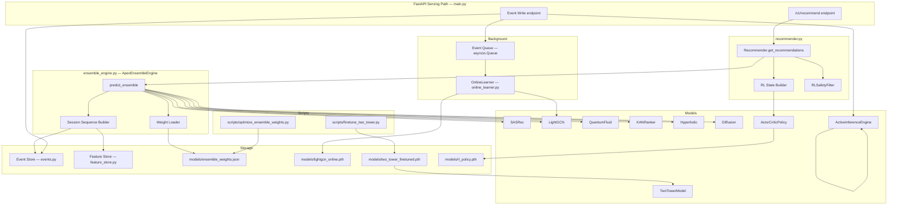

# Design Document: APEX Peak Capability

## Overview

This document describes the technical design for closing the five capability gaps that prevent the APEX recommendation system from operating at full production quality. The five gaps are:

1. **SASRec real sequences** — replace the zero-padded dummy sequence with the user's actual chronological interaction history.
2. **Tuned ensemble weights** — replace hard-coded constants with weights found by offline Dirichlet grid-search against NDCG@10.
3. **Online learning** — incrementally update LightGCN embeddings from live click/rating events in a background thread.
4. **Two-Tower fine-tuning** — periodically fine-tune the Two-Tower model on live interaction data using InfoNCE loss.
5. **RL + Active Inference wiring** — connect `ActorCriticPolicy` and `ActiveInferenceEngine` into the live serving path.

Each gap is addressed by a focused, minimal change to the existing codebase. No existing public interfaces are removed; all changes are additive or in-place replacements of stub logic.

---

## Architecture

### Component Diagram



### Data Flow Summary

| Gap | Trigger | Data Source | Output |
|-----|---------|-------------|--------|
| SASRec sequences | `predict_ensemble` call | `events.py` / Feature Store cache | `log_seqs` tensor for SASRec |
| Ensemble weights | Startup / `reload_weights` | `models/ensemble_weights.json` | 6 scalar blend coefficients |
| Online learning | `click`/`rating` event write | Event queue | Updated LightGCN embeddings |
| Two-Tower fine-tune | CLI script invocation | Event Store interaction pairs | `models/two_tower_finetuned.pth` |
| RL + Active Inference | Recommendation request / feedback event | User behavior profile | Score shift vector / prior update |

---

## Components and Interfaces

### Gap 1: Session Sequence Builder

**Location:** `backend/ensemble_engine.py` — new private method `_get_session_sequence`

**Responsibility:** Given a `user_id`, return a `torch.LongTensor` of shape `[1, 50]` representing the user's most recent interactions, left-padded with zeros.

**Interface:**

```python
def _get_session_sequence(
    self,
    user_id: int,
    override: list[int] | None = None,
) -> torch.LongTensor:
    """
    Returns a [1, 50] tensor of item indices for SASRec.
    Priority: override > Feature Store cache > Event Store > zero fallback.
    """
```

**Changes to `predict_ensemble`:**

```python
def predict_ensemble(
    self,
    user_id: int,
    candidate_item_ids: list[int],
    session_sequence: list[int] | None = None,   # NEW optional override
) -> dict[int, float]:
```

The existing `simulated_seq = torch.zeros((1, 50), dtype=torch.long)` line is replaced with a call to `_get_session_sequence(user_id, override=session_sequence)`.

**Feature Store cache key:** `session_seq:{user_id}` — TTL 60 seconds. The Feature Store's in-memory dict is extended with a `_session_cache: dict[str, tuple[float, list[int]]]` (timestamp, sequence) to avoid a Redis dependency.

### Gap 2: Ensemble Weight Loader

**Location:** `backend/ensemble_engine.py` — new method `_load_weights` called from `__init__` and `reload_weights`

**Weight file path:** `models/ensemble_weights.json`

**Schema:**
```json
{
  "lightgcn": 0.65,
  "quantum": 0.25,
  "sasrec": 0.10,
  "kan": 0.00,
  "hyperbolic": 0.00,
  "diffusion": 0.00,
  "evaluated_at": "2025-01-01T00:00:00Z",
  "ndcg_at_10": 0.412,
  "hit_rate_at_10": 0.631,
  "num_candidates_evaluated": 500
}
```

**Interface:**

```python
def _load_weights(self) -> dict[str, float]:
    """Load weights from JSON file; return hard-coded defaults on any failure."""

def reload_weights(self) -> dict[str, float]:
    """Public method: re-read ensemble_weights.json without restarting. Returns loaded weights."""
```

**New script:** `scripts/optimize_ensemble_weights.py`

```python
def run_dirichlet_grid_search(
    num_candidates: int = 500,
    k: int = 10,
    output_path: Path = MODELS_DIR / "ensemble_weights.json",
) -> dict[str, float]:
    """
    Sample weight vectors from Dirichlet(alpha=1), evaluate NDCG@10 and Hit_Rate@10
    on the validation split of the Event Store, persist the best vector.
    """
```

**FastAPI admin endpoint** (added to `main.py`):

```
POST /v1/admin/reload-ensemble-weights
```

Returns `{"status": "ok", "weights": {...}}`.

### Gap 3: Online Learner

**Location:** `backend/online_learner.py` — new module

**Class:** `OnlineLearner`

**Responsibility:** Consume events from an in-process queue, accumulate batches of up to 32 interactions, apply a BPR-style gradient step to the LightGCN user/item embeddings, checkpoint every 1000 events.

**Interface:**

```python
class OnlineLearner:
    def __init__(
        self,
        lightgcn: LightGCN,
        batch_size: int = 32,
        lr: float = 1e-4,
        checkpoint_interval: int = 1000,
        checkpoint_path: Path = MODELS_DIR / "lightgcn_online.pth",
    ): ...

    def enqueue(self, event: dict) -> None:
        """Thread-safe: push a normalized event onto the internal queue."""

    def start(self) -> None:
        """Start the background daemon thread."""

    def stop(self) -> None:
        """Signal the background thread to drain and stop."""

    def _run(self) -> None:
        """Main loop: drain queue, accumulate batch, apply gradient step."""

    def _apply_gradient_step(self, batch: list[dict]) -> None:
        """BPR loss on (user, pos_item, neg_item) triples derived from the batch."""

    def _checkpoint(self) -> None:
        """Persist current LightGCN embedding weights to checkpoint_path."""
```

**Event weight mapping** (used in `_apply_gradient_step`):

| Event type | Rating condition | Weight |
|-----------|-----------------|--------|
| `rating` | `>= 4.0` | `+1.0` (positive) |
| `rating` | `< 2.5` | `-0.5` (negative) |
| `click` | — | `+0.3` (weak positive) |

Negative interactions are treated as negative samples in BPR loss (swap pos/neg roles with reduced weight).

**Integration in `main.py`:** The `OnlineLearner` singleton is started in the `lifespan` context manager. The existing `append_event` call in the event-write endpoint is followed by `online_learner.enqueue(event)`.

### Gap 4: Two-Tower Fine-Tuning Script

**Location:** `scripts/finetune_two_tower.py` — new script (standalone CLI)

**Reuses:** `TwoTowerDataset`, `build_user_features`, `build_item_features`, `train` from `scripts/train_two_tower.py` (extracted to shared helpers or duplicated with modifications).

**Key differences from `train_two_tower.py`:**

| Aspect | `train_two_tower.py` | `finetune_two_tower.py` |
|--------|---------------------|------------------------|
| Data source | Gold Parquet ratings | Live Event Store |
| Positive threshold | `rating >= 3.5` | `rating >= 3.5` or `click` |
| Negatives per positive | 10 | 4 |
| Epochs | 30 | 5 (configurable) |
| Output path | `models/two_tower.pth` | `models/two_tower_finetuned.pth` |
| Min pairs guard | None | Exit with WARNING if < 100 pairs |
| Validation metric | None | Hit_Rate@10 on held-out 20% |

**CLI usage:**
```
python scripts/finetune_two_tower.py [--epochs N] [--lr LR] [--negatives K]
```

**Integration in `recommender.py`:** In `Recommender.load()`, after loading base Two-Tower weights, check for `models/two_tower_finetuned.pth` and load it in preference.

### Gap 5: RL Policy + Active Inference Wiring

**Location:** Changes to `backend/recommender.py` and `backend/main.py`

#### RL State Builder

**New function in `recommender.py`:**

```python
def _build_rl_state(
    behavior_profile: dict,
    als_user_embedding: np.ndarray | None,
    state_dim: int = 20,   # 4 behavior scalars + 16d ALS embedding
) -> torch.Tensor:
    """
    Constructs the fixed-length RL state vector:
      [total_ratings_norm, avg_rating_norm, click_count_norm, view_count_norm,
       als_embedding (16d)]
    Returns a [1, state_dim] tensor. Uses zeros for missing fields.
    """
```

**Note on state_dim:** The existing `train_rl_policy.py` uses `state_dim = 768 + 3 = 771`. The design uses a compact `state_dim = 20` (4 scalars + 16d ALS) to match the available live features without requiring SBERT at inference time. The `ActorCriticPolicy` is instantiated with `state_dim=20, action_dim=16` (matching `emb_dim`). If a pre-trained policy with `state_dim=771` exists, it is skipped and a DEBUG message is logged.

#### RL Score Application

In `Recommender.get_recommendations` (or the equivalent reranking step), after `predict_ensemble` returns normalized scores:

```python
action, _, _ = rl_policy.get_action(rl_state, deterministic=True)
# action shape: [1, action_dim=16]
# Project action to item score space via dot product with item embeddings
action_scores = lightgcn_item_embs @ action.squeeze().numpy()  # [num_candidates]
action_scores_norm = (action_scores - action_scores.min()) / (action_scores.ptp() + 1e-8)
final_scores = ensemble_scores + 0.1 * action_scores_norm   # small additive shift
```

The RL contribution is capped at 10% additive weight to prevent the untrained policy from dominating.

#### Active Inference Wiring

In the event-write endpoint (`POST /v1/events`), after persisting the event:

```python
if event.event_type == "rating":
    if event.rating >= 4.0:
        background_tasks.add_task(_trigger_active_inference, event.movie_id, +1.0)
    elif event.rating <= 2.0:
        background_tasks.add_task(_trigger_active_inference, event.movie_id, -1.0)
```

```python
async def _trigger_active_inference(movie_id: int, reward: float) -> None:
    engine = get_active_inference_engine()
    # Retrieve movie embedding from feature store or use random proxy
    movie_emb = _get_movie_embedding_for_ai(movie_id)
    engine.self_heal(movie_emb, reward)
```

#### RLSafetyFilter Application

At the end of the recommendation assembly in `main.py`, before serialising the response:

```python
from backend.rl_policy import RLSafetyFilter
negative_ids = set(behavior_profile.get("negative_movie_ids", []))
safe_candidates = RLSafetyFilter.apply_hard_constraints(candidate_ids, negative_ids)
```

---

## Data Models

### `models/ensemble_weights.json`

```json
{
  "lightgcn":   0.65,
  "quantum":    0.25,
  "sasrec":     0.10,
  "kan":        0.00,
  "hyperbolic": 0.00,
  "diffusion":  0.00,
  "evaluated_at": "2025-07-15T12:00:00Z",
  "ndcg_at_10": 0.412,
  "hit_rate_at_10": 0.631,
  "num_candidates_evaluated": 500
}
```

Required keys for loading: `lightgcn`, `quantum`, `sasrec`, `kan`, `hyperbolic`, `diffusion`. Metric keys are informational only. Missing metric keys are tolerated.

### Online Learner Event Queue Entry

Each entry pushed to the `OnlineLearner` queue is a normalized event dict from `events.normalize_event`, augmented with a computed `interaction_weight` field:

```python
{
  "event_id": "...",
  "event_type": "rating" | "click",
  "user_id": "123",
  "movie_id": 456,
  "rating": 4.5,           # present for rating events
  "interaction_weight": 1.0  # computed by OnlineLearner.enqueue
}
```

### Session Sequence Cache Entry (in-memory)

```python
_session_cache: dict[str, tuple[float, list[int]]] = {}
# key: str(user_id)
# value: (unix_timestamp_of_cache_write, [movie_id, ...])  # up to 50 items, chronological
```

### RL State Vector Schema

```
[
  total_ratings_norm,   # float32, log1p(count)/log1p(1000)
  avg_rating_norm,      # float32, avg_rating / 5.0
  click_count_norm,     # float32, log1p(count)/log1p(500)
  view_count_norm,      # float32, log1p(count)/log1p(500)
  als_emb[0..15],       # float32 x16, from feature_store.get_user_vector
]
# Total: 20 floats → torch.Tensor shape [1, 20]
```

---

## API Changes

### New Endpoint: Reload Ensemble Weights

```
POST /v1/admin/reload-ensemble-weights
Authorization: Bearer <admin_token>

Response 200:
{
  "status": "ok",
  "weights": {
    "lightgcn": 0.65,
    "quantum": 0.25,
    "sasrec": 0.10,
    "kan": 0.00,
    "hyperbolic": 0.00,
    "diffusion": 0.00
  },
  "source": "file" | "defaults"
}
```

### Modified Endpoint: Event Write

`POST /v1/events` — no schema change. Side effects added:
- Enqueues event to `OnlineLearner` if `event_type` is `click` or `rating`.
- Dispatches `ActiveInferenceEngine.self_heal` as a `BackgroundTask` if `event_type` is `rating` and `rating` is outside the neutral zone (< 2.0 or >= 4.0), or if `event_type` is a positive/negative feedback signal.

### Modified Endpoint: Recommendations

`GET /v1/recommend` — no schema change. Internal changes:
- `predict_ensemble` now accepts optional `session_sequence` query parameter (forwarded from the request if provided).
- RL score shift is applied before final ranking.
- `RLSafetyFilter` is applied before response serialisation.

---

## Correctness Properties

*A property is a characteristic or behavior that should hold true across all valid executions of a system — essentially, a formal statement about what the system should do. Properties serve as the bridge between human-readable specifications and machine-verifiable correctness guarantees.*

### Property 1: Session Sequence Length Invariant

*For any* user ID and any number of recorded interactions (0 to N), the session sequence tensor returned by `_get_session_sequence` SHALL always have shape `[1, 50]` with all values in `[0, num_items)`.

**Validates: Requirements 1.2, 1.3, 1.7**

### Property 2: Session Sequence Padding Correctness

*For any* user with fewer than 50 interactions, the session sequence tensor SHALL be left-padded with zeros such that the number of leading zeros equals `50 - len(interactions)` and the trailing values match the chronologically ordered interaction IDs (modulo-bounded).

**Validates: Requirements 1.2, 1.7**

### Property 3: Ensemble Weights Sum to One

*For any* weight vector produced or loaded by the `Weight_Optimizer` or `_load_weights`, the sum of all six weights SHALL equal 1.0 (within floating-point tolerance of 1e-6) and each individual weight SHALL be non-negative.

**Validates: Requirements 2.5**

### Property 4: Online Learner Interaction Weight Assignment

*For any* rating event with `rating >= 4.0`, the computed `interaction_weight` SHALL be `+1.0`. *For any* rating event with `rating < 2.5`, the computed `interaction_weight` SHALL be `-0.5`. *For any* click event without a rating, the computed `interaction_weight` SHALL be `+0.3`.

**Validates: Requirements 3.3, 3.4, 3.5**

### Property 5: Fine-Tuning Negative Ratio

*For any* set of positive interaction pairs extracted from the Event Store, the number of hard negatives constructed SHALL be exactly 4 times the number of positives (before any padding for insufficient negatives).

**Validates: Requirements 4.2**

### Property 6: Fine-Tuning Positive Pair Filter

*For any* event in the Event Store, it SHALL be included as a positive pair if and only if its `event_type` is `rating` with `rating >= 3.5`, or its `event_type` is `click`. No other event types SHALL produce positive pairs.

**Validates: Requirements 4.1**

### Property 7: RL State Vector Fixed Length

*For any* user behavior profile (including empty/missing profiles), the RL state vector constructed by `_build_rl_state` SHALL always have shape `[1, 20]` with all values being finite floats (no NaN or Inf).

**Validates: Requirements 5.8, 5.9**

### Property 8: RLSafetyFilter Exclusion Invariant

*For any* candidate list and any set of disliked item IDs, the output of `RLSafetyFilter.apply_hard_constraints` SHALL contain no item whose ID appears in the dislike set, provided the dislike set does not cover all candidates.

**Validates: Requirements 5.10**

---

## Error Handling

### Gap 1: Session Sequence Retrieval Failures

| Failure | Behaviour |
|---------|-----------|
| `Event_Store` I/O error | Log WARNING; return zero-padded tensor |
| `user_id` not found in Event Store | Return zero-padded tensor (no warning — cold start is normal) |
| Feature Store cache miss | Fall through to Event Store query |
| Feature Store cache stale (> 60s) | Evict and re-query Event Store |
| `override` parameter provided | Skip all lookups; use override directly |

### Gap 2: Ensemble Weight Loading Failures

| Failure | Behaviour |
|---------|-----------|
| `ensemble_weights.json` not found | Log WARNING; use hard-coded defaults |
| JSON parse error | Log WARNING with exception; use hard-coded defaults |
| Missing required key | Log WARNING; use hard-coded defaults for all keys |
| Weight sum != 1.0 (file written by external tool) | Log WARNING; re-normalise before use |
| `reload_weights` called during active inference | Acquire a threading.Lock before swapping weights dict |

### Gap 3: Online Learner Failures

| Failure | Behaviour |
|---------|-----------|
| Gradient step raises exception | Log ERROR; clear batch; continue loop |
| Queue full (> 10,000 pending events) | Drop oldest event; log WARNING |
| Checkpoint write fails | Log ERROR; continue (in-memory state preserved) |
| Background thread crashes | `main.py` lifespan detects dead thread; restarts it once; logs CRITICAL if restart fails |

### Gap 4: Two-Tower Fine-Tuning Failures

| Failure | Behaviour |
|---------|-----------|
| < 100 positive pairs | Log WARNING; exit 0 (no model written) |
| Training loss diverges (NaN) | Log ERROR; exit 1 (no model written) |
| `two_tower_finetuned.pth` write fails | Log ERROR; exit 1 |
| `two_tower_finetuned.pth` corrupt at load time | Log WARNING; fall back to base `two_tower.pth` |

### Gap 5: RL + Active Inference Failures

| Failure | Behaviour |
|---------|-----------|
| `rl_policy.pth` not found | Log DEBUG; skip RL adjustment; serve unmodified scores |
| `ActorCriticPolicy` state_dim mismatch | Log WARNING; skip RL adjustment |
| `get_action` raises exception | Log WARNING; serve unmodified scores |
| `self_heal` raises exception | Log WARNING; BackgroundTask swallows exception (does not affect response) |
| `RLSafetyFilter` removes all candidates | Log WARNING; revert to pre-filter list (existing behaviour) |
| User behavior profile unavailable | Use zero vector for RL state; no exception |

---

## Testing Strategy

### Unit Tests

Unit tests cover specific examples and edge cases for each gap. They live in `tests/` alongside existing tests.

- `tests/test_session_sequence.py` — padding, truncation, cache hit/miss, fallback on I/O error, override parameter
- `tests/test_ensemble_weights.py` — load from file, load defaults on missing/malformed file, reload_weights, weight normalisation
- `tests/test_online_learner.py` — interaction weight assignment, batch accumulation, gradient clipping, checkpoint trigger, exception recovery
- `tests/test_finetune_two_tower.py` — positive pair filter, negative ratio, min-pairs guard, output file creation
- `tests/test_rl_wiring.py` — state vector construction, zero-vector fallback, safety filter exclusion, active inference dispatch

### Property-Based Tests

Property tests use [Hypothesis](https://hypothesis.readthedocs.io/) and run a minimum of 100 iterations each. Each test is tagged with the feature and property number.

**Feature: apex-peak-capability**

- **Property 1 & 2: Session Sequence Length and Padding** — `tests/test_session_sequence.py::test_session_sequence_shape_and_padding`
  - Generate: random `user_id` (int), random list of 0–200 movie IDs with timestamps
  - Assert: output tensor shape is `[1, 50]`, all values in `[0, num_items)`, leading zeros count equals `max(0, 50 - len(interactions))`
  - Tag: `Feature: apex-peak-capability, Property 1 & 2: Session Sequence Length Invariant and Padding Correctness`

- **Property 3: Ensemble Weights Sum to One** — `tests/test_ensemble_weights.py::test_weights_sum_to_one`
  - Generate: random 6-element non-negative float vectors (via Dirichlet sampling in Hypothesis)
  - Assert: after normalisation by `_load_weights` or `Weight_Optimizer`, sum == 1.0 ± 1e-6, all >= 0
  - Tag: `Feature: apex-peak-capability, Property 3: Ensemble Weights Sum to One`

- **Property 4: Online Learner Interaction Weight Assignment** — `tests/test_online_learner.py::test_interaction_weight_assignment`
  - Generate: random rating values in [1.0, 5.0], random event types (`rating`, `click`)
  - Assert: weight is exactly `+1.0` for rating >= 4.0, `-0.5` for rating < 2.5, `+0.3` for click
  - Tag: `Feature: apex-peak-capability, Property 4: Online Learner Interaction Weight Assignment`

- **Property 5 & 6: Fine-Tuning Pair Construction** — `tests/test_finetune_two_tower.py::test_pair_construction`
  - Generate: random lists of events with varying types and ratings
  - Assert: only qualifying events produce positive pairs; negative count == 4 × positive count
  - Tag: `Feature: apex-peak-capability, Property 5 & 6: Fine-Tuning Negative Ratio and Positive Pair Filter`

- **Property 7: RL State Vector Fixed Length** — `tests/test_rl_wiring.py::test_rl_state_vector_shape`
  - Generate: random behavior profiles (missing fields, zero counts, extreme values)
  - Assert: output tensor shape is always `[1, 20]`, no NaN/Inf values
  - Tag: `Feature: apex-peak-capability, Property 7: RL State Vector Fixed Length`

- **Property 8: RLSafetyFilter Exclusion Invariant** — `tests/test_rl_wiring.py::test_safety_filter_exclusion`
  - Generate: random candidate lists (list of ints), random dislike sets (subset of candidates + extras)
  - Assert: when dislike set does not cover all candidates, output contains no item from dislike set
  - Tag: `Feature: apex-peak-capability, Property 8: RLSafetyFilter Exclusion Invariant`

### Integration Tests

- Verify `POST /v1/admin/reload-ensemble-weights` returns 200 and updated weights after writing a new `ensemble_weights.json`.
- Verify `POST /v1/events` with a `rating` event enqueues to `OnlineLearner` (mock queue assertion).
- Verify `GET /v1/recommend` returns results when `rl_policy.pth` is absent (RL skip path).
- Verify `scripts/finetune_two_tower.py` exits cleanly with a WARNING when the Event Store has < 100 pairs.
- Verify `scripts/optimize_ensemble_weights.py` produces a valid `ensemble_weights.json` on synthetic data.
