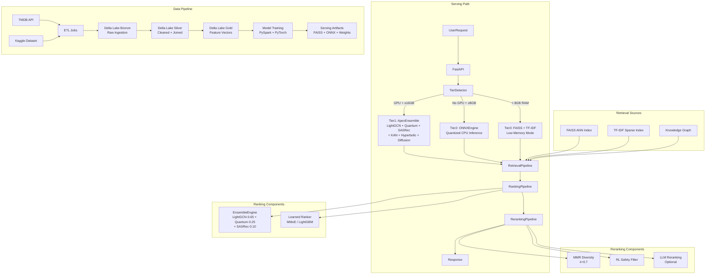

# Design Document: Architecture Design Perfection

## Overview

This feature closes the remaining 0.5-point gap in the APEX Movie Recommendation System's architecture and design score by addressing five structural deficiencies:

1. **Missing ADRs** — No documented rationale for the 6-model ensemble composition or blend weights
2. **No visual diagram** — README lacks a system-level architecture diagram
3. **No ablation evidence** — Ensemble composition is asserted, not empirically validated
4. **Monolithic recommender** — `recommender.py` at 2,528 lines conflates four distinct concerns
5. **Oversized main.py** — `main.py` at 1,328 lines exceeds the 800-line maintainability threshold

The deliverables are: `docs/ARCHITECTURE_DECISIONS.md`, a Mermaid diagram in `README.md`, `scripts/ablation_study.py`, four new backend pipeline modules, a refactored `recommender.py` under 600 lines, and a `main.py` under 800 lines.

---

## Architecture

### System Architecture Overview

The APEX system follows a 3-tier serving architecture with a 3-stage recommendation pipeline. The tier is auto-detected at startup based on hardware capabilities and determines which components are activated.



### Pipeline Decomposition

The monolithic `Recommender` class is decomposed into four focused modules plus a thin orchestrator:

```
backend/
├── pipeline_types.py        # Shared dataclasses: CandidateItem, RankedItem, FinalItem
├── retrieval_pipeline.py    # Stage 1: FAISS + TF-IDF + KG → CandidateItem list
├── ranking_pipeline.py      # Stage 2: Ensemble + Learned Ranker → RankedItem list
├── reranking_pipeline.py    # Stage 3: MMR + RL Safety + LLM → FinalItem list
├── artifact_validator.py    # SHA-256 checksum + row-alignment validation
└── recommender.py           # Thin orchestrator (<600 lines)
```

The `pipeline_types.py` module is the key to avoiding circular imports: all three pipeline modules import their input/output types from this single shared module rather than from each other.

---

## Components and Interfaces

### 1. `backend/pipeline_types.py` — Shared Type Definitions

All pipeline dataclasses are defined here to prevent circular imports between the three pipeline modules.

```python
from __future__ import annotations
from dataclasses import dataclass, field
from typing import Literal

@dataclass
class CandidateItem:
    movie_id: int
    retrieval_score: float
    retrieval_source: Literal["faiss", "tfidf", "knowledge_graph", "hybrid"]
    metadata: dict = field(default_factory=dict)

@dataclass
class RankedItem:
    movie_id: int
    retrieval_score: float
    retrieval_source: str
    ensemble_score: float
    ranker_score: float
    final_rank: int
    retrieval_signals: dict = field(default_factory=dict)
    metadata: dict = field(default_factory=dict)

@dataclass
class FinalItem:
    movie_id: int
    retrieval_score: float
    retrieval_source: str
    ensemble_score: float
    ranker_score: float
    final_rank: int
    diversity_score: float
    safety_passed: bool
    explanation: str | None
    retrieval_signals: dict = field(default_factory=dict)
    metadata: dict = field(default_factory=dict)
```

### 2. `backend/retrieval_pipeline.py` — Stage 1

```python
@dataclass
class RetrievalConfig:
    faiss_k: int = 100
    tfidf_k: int = 50
    kg_k: int = 20
    low_memory: bool = False
    enable_kg: bool = True

class RetrievalPipeline:
    def __init__(self, faiss_index, tfidf_index, kg_engine, movie_df, config: RetrievalConfig):
        ...

    def retrieve(self, query_embedding: np.ndarray, n: int) -> list[CandidateItem]:
        """
        1. FAISS ANN search → top-k candidates (always)
        2. TF-IDF sparse search → additional candidates (if not low_memory)
        3. KG traversal → additional candidates (if kg_engine available and enable_kg)
        4. Deduplicate by movie_id, merge scores (max-pool)
        5. Return top-n CandidateItems sorted by retrieval_score descending
        """
```

**Key invariants enforced by `retrieve()`:**
- Returns `[]` when `n == 0`
- Returns `len(result) <= n` always
- Returns `len(result) >= 1` when catalog is non-empty and `n >= 1`
- All returned `movie_id` values are unique (deduplication step 4)
- All returned items have a valid `retrieval_source` tag

### 3. `backend/ranking_pipeline.py` — Stage 2

```python
@dataclass
class RankingConfig:
    ensemble_weight: float = 0.7
    ranker_weight: float = 0.3
    use_neural_ensemble: bool = True   # False for Tier3
    use_learned_ranker: bool = True

class RankingPipeline:
    def __init__(self, ensemble_engine, learned_ranker, config: RankingConfig):
        ...

    def rank(self, candidates: list[CandidateItem], user_context: dict) -> list[RankedItem]:
        """
        1. Get ensemble scores for all candidates (or skip if use_neural_ensemble=False)
        2. Apply learned ranker (MMoE or LightGBM) if use_learned_ranker=True
        3. Blend: ensemble_weight * ensemble_score + ranker_weight * ranker_score
        4. Sort descending by blended score
        5. Assign final_rank (1-indexed, 1 = best)
        6. Return list[RankedItem] — same length as input candidates
        """
```

**Key invariants enforced by `rank()`:**
- `len(result) == len(candidates)` always (no items added or dropped)
- `set(r.movie_id for r in result) == set(c.movie_id for c in candidates)` (set-identity)
- Items are sorted descending by blended score (ordering invariant)
- Calling `rank()` twice with identical inputs produces identical scores (determinism)

### 4. `backend/reranking_pipeline.py` — Stage 3

```python
@dataclass
class RerankingConfig:
    mmr_lambda: float = 0.7
    enable_llm_reranking: bool = False
    enable_rl_safety: bool = True
    quality_threshold: float = 0.3

class RerankingPipeline:
    def __init__(self, rl_policy, llm_client, config: RerankingConfig):
        ...

    def rerank(self, ranked_items: list[RankedItem], constraints: dict) -> list[FinalItem]:
        """
        1. Apply RL safety filter (remove items in user's dislike list)
        2. Apply quality gate (filter items below quality_threshold)
        3. Apply MMR diversity (lambda=mmr_lambda, greedy selection)
        4. Optionally apply LLM reranking (if enable_llm_reranking=True)
        5. Return list[FinalItem] — subset of input ranked_items
        """
```

**Key invariants enforced by `rerank()`:**
- `set(f.movie_id for f in result) ⊆ set(r.movie_id for r in ranked_items)` (no hallucination)
- Returns `[]` when `ranked_items` is empty (empty-input safety)
- Calling `rerank()` twice with identical inputs produces identical results (determinism)

### 5. `backend/artifact_validator.py` — Integrity Validation

```python
class ArtifactValidator:
    def __init__(self, manifest_path: Path):
        self.manifest = self._load_manifest(manifest_path)

    def validate(self, artifact_path: Path) -> bool:
        """
        1. Check file exists (raises FileNotFoundError if not)
        2. Compute SHA-256 checksum of file contents
        3. Compare against manifest entry
        4. Raise ValueError on mismatch: "Checksum mismatch for {path}: expected {exp}, got {actual}"
        5. Return True on success
        """

    def validate_row_alignment(self, embeddings: np.ndarray, movie_df: pd.DataFrame) -> bool:
        """Assert embeddings.shape[0] == len(movie_df). Raises ValueError on mismatch."""

    def validate_all(self) -> dict[str, bool]:
        """Validate all artifacts listed in manifest. Returns {artifact_name: bool}."""
```

**Key invariants:**
- `validate()` is idempotent: calling it twice on the same unmodified file returns the same result
- `validate()` raises `ValueError` (not returns `False`) on checksum mismatch, to prevent silent failures

### 6. Refactored `backend/recommender.py` — Thin Orchestrator

The refactored `Recommender` is a pure coordinator. It contains no retrieval, ranking, or reranking logic — only artifact loading, tier detection, pipeline initialization, and delegation.

```python
class Recommender:
    """Thin orchestrator. Loads artifacts, initializes pipeline stages, delegates requests."""

    def __init__(self):
        self._retrieval: RetrievalPipeline | None = None
        self._ranking: RankingPipeline | None = None
        self._reranking: RerankingPipeline | None = None
        self._validator: ArtifactValidator | None = None
        self._movie_df: pd.DataFrame | None = None
        self._tier: str = "tier3"

    def load(self) -> "Recommender":
        """
        1. Detect serving tier via TierDetector
        2. Validate artifacts via ArtifactValidator
        3. Load movie_df from Gold layer
        4. Initialize RetrievalPipeline with tier-aware RetrievalConfig
        5. Initialize RankingPipeline with tier-aware RankingConfig
           (use_neural_ensemble=False for Tier3 unless NOVA_SERVING_PROFILE=full)
        6. Initialize RerankingPipeline
        7. Return self
        """

    # Public API — all signatures preserved from current recommender.py:
    def recommend_by_id(self, movie_id: int, n: int = 10) -> list[dict]: ...
    def recommend_by_index(self, movie_idx: int, n: int = 10) -> list[dict]: ...
    def search_movies(self, query: str, limit: int = 20) -> list[dict]: ...
    def semantic_search(self, query: str, n: int = 10) -> list[dict]: ...
    def kg_recommend(self, movie_id: int, n: int = 10) -> list[dict]: ...
    def visual_search(self, movie_id: int, n: int = 10) -> list[dict]: ...
    def get_movie_by_id(self, movie_id: int) -> dict | None: ...
    def get_all_titles(self, limit: int = 100000) -> list[dict]: ...
    def recommend_for_user_profile(self, profile: dict, n: int = 10) -> list[dict]: ...
```

**Tier-aware configuration:**

| Tier | `use_neural_ensemble` | `use_learned_ranker` | `low_memory` |
|------|----------------------|---------------------|--------------|
| Tier1 (GPU + ≥16GB) | `True` | `True` | `False` |
| Tier2 (No GPU + ≥8GB) | `True` | `True` | `False` |
| Tier3 (<8GB) | `False` | `False` | `True` |
| Tier3 + `NOVA_SERVING_PROFILE=full` | `True` | `True` | `False` |

### 7. `backend/main.py` Reduction Plan

Current: 1,328 lines → Target: <800 lines. Blocks to extract:

| Block | Destination | Rationale |
|-------|-------------|-----------|
| `AsyncLRUCache` class | `backend/cache.py` (new) | Generic utility, not route logic |
| `app_metadata()` + `public_base_url()` | `backend/app_info.py` (new) | App metadata helpers, not routing |
| `_recommendation_diagnostic_report()` + `_readiness_component()` | `backend/recommendation_routes.py` (consolidate) | Already partially there at 990 lines |
| `_serving_lineage()` + `_candidate_event_summary()` | `backend/recommendation_events.py` (consolidate) | Already exists, extend it |
| `_benchmark_readiness_component()` | `backend/platform_readiness.py` (consolidate) | Already exists at 257 lines |

All existing API endpoint paths, HTTP methods, request/response schemas, and authentication middleware are preserved without behavioral change.

### 8. `scripts/ablation_study.py` — Ablation Evidence

```python
@dataclass
class ModelAblationResult:
    model: str          # "lightgcn" | "quantum" | "sasrec" | "kan" | "hyperbolic" | "diffusion"
    ndcg_without: float | None   # None if model failed to load
    delta: float | None          # full_ndcg - ndcg_without; None if ndcg_without is None
    marginal_contribution_pct: float | None  # delta / full_ndcg * 100

@dataclass
class AblationReport:
    run_timestamp: str           # ISO 8601
    full_ensemble_ndcg: float
    models: list[ModelAblationResult]

class AblationStudy:
    def __init__(self, recommender, sample_size: int = 1000):
        self.recommender = recommender
        self.sample_size = sample_size

    def run_full_ensemble(self) -> float:
        """Evaluate NDCG@10 with all models active."""

    def run_leave_one_out(self, model_name: str) -> float | None:
        """Evaluate NDCG@10 with model_name removed. Returns None if model fails to load."""

    def run_all(self) -> AblationReport:
        """Run full ensemble + 6 leave-one-out evaluations. Returns AblationReport."""

    def print_table(self, report: AblationReport) -> None:
        """Print formatted table to stdout."""

    def save_report(self, report: AblationReport, output_path: Path) -> None:
        """Serialize report to JSON. Creates parent directory if needed."""
```

**CLI interface:**
```
python scripts/ablation_study.py [--sample-size N] [--output PATH]
```

### 9. `docs/ARCHITECTURE_DECISIONS.md` — ADR Document

The ADR document follows the standard Context → Decision → Consequences format with a table of contents. Six ADRs are defined:

| ADR | Title |
|-----|-------|
| ADR-001 | LightGCN as Primary Ensemble Component (weight: 0.65) |
| ADR-002 | Quantum-Fluid Neural ODE for Temporal Preference Drift (weight: 0.25) |
| ADR-003 | SASRec for Session-Level Sequential Patterns (weight: 0.10) |
| ADR-004 | KAN, Hyperbolic, and Diffusion at Zero Weight — Retained for Conditional Activation |
| ADR-005 | 3-Tier Serving Architecture with Hardware Auto-Detection |
| ADR-006 | Pipeline Decomposition: Monolith → Retrieval/Ranking/Reranking |

Each ADR entry includes a "Superseded By" field (empty for current ADRs) to support future decision evolution.

---

## Data Models

### Pipeline Type Hierarchy

```
CandidateItem
  └── movie_id: int
  └── retrieval_score: float
  └── retrieval_source: "faiss" | "tfidf" | "knowledge_graph" | "hybrid"
  └── metadata: dict

RankedItem (extends CandidateItem fields)
  └── movie_id: int
  └── retrieval_score: float
  └── retrieval_source: str
  └── ensemble_score: float
  └── ranker_score: float
  └── final_rank: int          # 1-indexed, 1 = best
  └── retrieval_signals: dict
  └── metadata: dict

FinalItem (extends RankedItem fields)
  └── movie_id: int
  └── retrieval_score: float
  └── retrieval_source: str
  └── ensemble_score: float
  └── ranker_score: float
  └── final_rank: int
  └── diversity_score: float   # MMR diversity contribution
  └── safety_passed: bool      # RL safety filter result
  └── explanation: str | None  # LLM-generated explanation (optional)
  └── retrieval_signals: dict
  └── metadata: dict
```

### AblationReport JSON Schema

```json
{
  "run_timestamp": "2024-01-15T10:30:00Z",
  "full_ensemble_ndcg": 0.847,
  "models": [
    {
      "model": "lightgcn",
      "ndcg_without": 0.731,
      "delta": 0.116,
      "marginal_contribution_pct": 13.7
    },
    {
      "model": "kan",
      "ndcg_without": null,
      "delta": null,
      "marginal_contribution_pct": null
    }
  ]
}
```

### Ensemble Weight Configuration (`models/ensemble_weights.json`)

```json
{
  "lightgcn": 0.65,
  "quantum": 0.25,
  "sasrec": 0.10,
  "kan": 0.00,
  "hyperbolic": 0.00,
  "diffusion": 0.00
}
```

Weights must sum to 1.0 (within 1e-6 tolerance). The `ApexEnsembleEngine` re-normalizes on load if they don't.

---

## Correctness Properties

*A property is a characteristic or behavior that should hold true across all valid executions of a system — essentially, a formal statement about what the system should do. Properties serve as the bridge between human-readable specifications and machine-verifiable correctness guarantees.*

The pipeline decomposition (Requirement 6) introduces well-defined interfaces with universal invariants that are amenable to property-based testing. The property-based testing library used is **Hypothesis** (Python), which is already present in the project (`.hypothesis/` directory exists).

### Property 1: Retrieval Bounds Guarantee

*For any* non-empty movie catalog, any query embedding, and any `n >= 1`, `RetrievalPipeline.retrieve(query_embedding, n)` SHALL return a list of length `L` where `1 <= L <= n`.

**Validates: Requirements 6.1, 6.2**

### Property 2: Retrieval Deduplication Invariant

*For any* query embedding and any `n`, all `movie_id` values in the list returned by `RetrievalPipeline.retrieve(query_embedding, n)` SHALL be unique — no two items in the result share the same `movie_id`.

**Validates: Requirements 6.8**

### Property 3: Retrieval Source Tagging

*For any* query embedding and any `n >= 1`, every `CandidateItem` in the result of `RetrievalPipeline.retrieve(query_embedding, n)` SHALL have a `retrieval_source` value that is one of `{"faiss", "tfidf", "knowledge_graph", "hybrid"}`.

**Validates: Requirements 4.5**

### Property 4: Ranking Count Preservation

*For any* list of `CandidateItem` objects `C` and any `user_context`, `RankingPipeline.rank(C, user_context)` SHALL return a list of exactly `len(C)` items — no items are added or dropped during ranking.

**Validates: Requirements 6.3**

### Property 5: Ranking Set-Identity Round-Trip

*For any* list of `CandidateItem` objects `C` and any `user_context`, the set of `movie_id` values in `RankingPipeline.rank(C, user_context)` SHALL equal the set of `movie_id` values in `C` — ranking is a bijection on the candidate set.

**Validates: Requirements 6.11**

### Property 6: Ranking Ordering Invariant

*For any* list of `CandidateItem` objects `C` and any `user_context`, the `RankedItem` list returned by `RankingPipeline.rank(C, user_context)` SHALL be sorted in descending order by blended score — `result[i].final_rank <= result[i+1].final_rank` for all valid `i`.

**Validates: Requirements 6.4**

### Property 7: Ranking Determinism

*For any* list of `CandidateItem` objects `C` and any `user_context`, calling `RankingPipeline.rank(C, user_context)` twice with identical inputs SHALL produce identical `ensemble_score` and `ranker_score` values for each item.

**Validates: Requirements 6.7**

### Property 8: Reranking No-Hallucination (Subset Property)

*For any* list of `RankedItem` objects `R` and any `constraints`, the set of `movie_id` values in `RerankingPipeline.rerank(R, constraints)` SHALL be a subset of the `movie_id` values in `R` — reranking cannot introduce items that were not in the input.

**Validates: Requirements 6.5**

### Property 9: Reranking Determinism

*For any* list of `RankedItem` objects `R` and any `constraints`, calling `RerankingPipeline.rerank(R, constraints)` twice with identical inputs SHALL produce identical ordered lists of `FinalItem` objects.

**Validates: Requirements 6.6**

### Property 10: Artifact Validator Idempotence

*For any* artifact file `F` that has not been modified between calls, calling `ArtifactValidator.validate(F)` twice in succession SHALL return the same boolean result both times — validation is a pure read operation with no side effects on the result.

**Validates: Requirements 6.12**

### Property 11: Ablation Report Serialization Round-Trip

*For any* `AblationReport` instance, serializing it to JSON via `save_report()` and deserializing the resulting file SHALL produce an `AblationReport` with identical `run_timestamp`, `full_ensemble_ndcg`, and per-model `ndcg_without` / `delta` / `marginal_contribution_pct` values.

**Validates: Requirements 3.4**

---

## Error Handling

### Pipeline Error Boundaries

Each pipeline stage is designed to fail fast and loudly rather than silently degrade:

| Component | Error Condition | Behavior |
|-----------|----------------|----------|
| `ArtifactValidator.validate()` | SHA-256 mismatch | Raises `ValueError` with path + expected/actual checksums |
| `ArtifactValidator.validate()` | File not found | Raises `FileNotFoundError` |
| `RetrievalPipeline.retrieve()` | FAISS index unavailable | Falls back to TF-IDF only; logs warning |
| `RetrievalPipeline.retrieve()` | All sources unavailable | Returns `[]` (empty list, no exception) |
| `RankingPipeline.rank()` | Ensemble engine unavailable | Falls back to retrieval score as ranking signal |
| `RankingPipeline.rank()` | Learned ranker unavailable | Uses ensemble score only (ranker_weight → 0) |
| `RerankingPipeline.rerank()` | Empty input | Returns `[]` immediately (no exception) |
| `RerankingPipeline.rerank()` | LLM client unavailable | Skips LLM step, returns MMR-diversified list |
| `AblationStudy.run_leave_one_out()` | Model weights missing | Logs warning, records `ndcg_without: null`, continues |
| `Recommender.load()` | Artifact validation fails | Logs error, continues with degraded mode |

### Tier3 Degradation Path

When `active_tier == "tier3"` and `NOVA_SERVING_PROFILE != "full"`:
- `RankingConfig.use_neural_ensemble = False` → ensemble scoring skipped
- `RankingConfig.use_learned_ranker = False` → learned ranker skipped
- `RetrievalConfig.low_memory = True` → TF-IDF vocabulary capped at 12,000 features
- `RetrievalConfig.enable_kg = False` → KG traversal skipped

This preserves the existing Tier3 behavior from the current `recommender.py`.

### Circular Import Prevention

The `pipeline_types.py` module has no imports from other `backend/` modules. The import graph is strictly acyclic:

```
pipeline_types.py  (no backend imports)
    ↑
retrieval_pipeline.py  (imports pipeline_types)
ranking_pipeline.py    (imports pipeline_types)
reranking_pipeline.py  (imports pipeline_types)
    ↑
recommender.py         (imports all three pipelines + artifact_validator)
    ↑
main.py                (imports recommender)
```

---

## Testing Strategy

### Dual Testing Approach

Both unit tests and property-based tests are used. Unit tests cover specific examples, integration points, and error conditions. Property tests verify universal invariants across arbitrary inputs.

### Property-Based Testing (Hypothesis)

The project already uses Hypothesis (`.hypothesis/` directory present). Property tests for the pipeline correctness properties (Requirement 6) go in `tests/test_pipeline_properties.py`.

**Configuration:**
- Minimum 100 iterations per property test (`@settings(max_examples=100)`)
- Each test tagged with a comment referencing the design property
- Tag format: `# Feature: architecture-design-perfection, Property N: <property_text>`

**Example property test structure:**

```python
# tests/test_pipeline_properties.py
from hypothesis import given, settings, strategies as st
from backend.pipeline_types import CandidateItem, RankedItem
from backend.pipeline.ranking_pipeline import RankingPipeline, RankingConfig

# Feature: architecture-design-perfection, Property 4: Ranking Count Preservation
@given(
    candidates=st.lists(
        st.builds(CandidateItem,
            movie_id=st.integers(min_value=1, max_value=100000),
            retrieval_score=st.floats(min_value=0.0, max_value=1.0, allow_nan=False),
            retrieval_source=st.sampled_from(["faiss", "tfidf", "knowledge_graph"]),
        ),
        min_size=0, max_size=200, unique_by=lambda c: c.movie_id
    )
)
@settings(max_examples=100)
def test_ranking_preserves_count(candidates):
    pipeline = RankingPipeline(
        ensemble_engine=None,
        learned_ranker=None,
        config=RankingConfig(use_neural_ensemble=False, use_learned_ranker=False)
    )
    result = pipeline.rank(candidates, user_context={})
    assert len(result) == len(candidates)
```

### Unit Tests

Unit tests cover:
- ADR document structure validation (section headers, TOC links)
- Ablation script CLI argument parsing
- Ablation script error handling (model load failure → null recording)
- `ArtifactValidator` checksum mismatch raises `ValueError`
- `Recommender.load()` tier-aware configuration (Tier3 → `use_neural_ensemble=False`)
- All public `Recommender` method signatures preserved
- `main.py` line count < 800

### Integration Tests

Integration tests (existing `backend/tests/`) must continue to pass after the refactor. The key integration test is that `main.py` routes produce identical responses before and after the decomposition, verified by running the existing test suite.

### Ablation Study Validation

The ablation script is validated by:
1. Running with `--sample-size 10` against a mock recommender in CI
2. Verifying the JSON output matches the `AblationReport` schema
3. Verifying the `reports/` directory is created if absent

### ADR Document Validation

A lightweight test parses `docs/ARCHITECTURE_DECISIONS.md` and verifies:
- All 6 model names appear in ADR entries
- Each ADR entry contains "Context", "Decision", and "Consequences" sections
- The table of contents contains links to all ADR entries
- The "Superseded By" field is present in the ADR template
