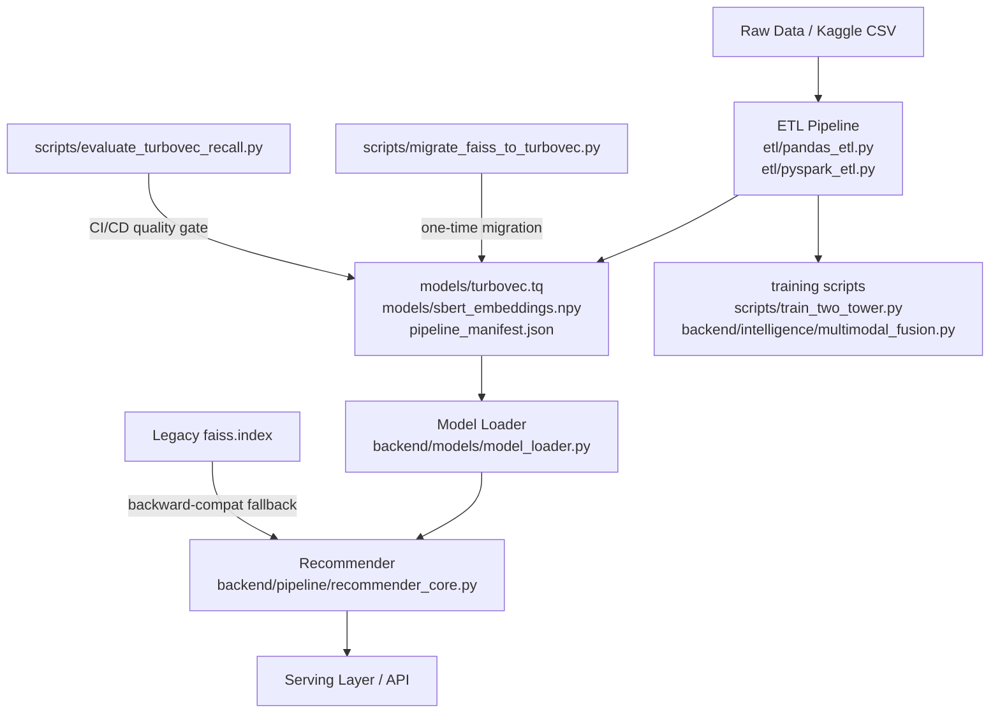

# Design Document: TurboVec Migration

## Overview

This document describes the technical design for migrating the Movie Recommendation System's
vector index engine from FAISS to TurboVec (`turbovec.TurboQuantIndex`). The migration
replaces every FAISS import and every index artifact reference with TurboVec equivalents
across all pipeline, serving, training, and validation layers. The key design goals are:

1. **Zero serving disruption** — backward-compatible fallback path when `turbovec.tq` is absent.
2. **Artifact contract continuity** — manifest schema evolves cleanly; no silent data loss.
3. **Quality preservation** — Recall@10 ≥ 0.92 and Recall@50 ≥ 0.97 on production embedding corpus.
4. **Clean codebase** — no `import faiss` remaining in any production or test file.

### TurboVec API Summary

```python
from turbovec import TurboQuantIndex

# Construction — no training step
index = TurboQuantIndex(dim, bit_width=4)

# Population
index.add(vectors_f32)         # vectors: np.ndarray, dtype=float32

# Persistence
index.write(path)              # path: str or Path
index = TurboQuantIndex.load(path)

# Search
scores, indices = index.search(query_f32, k)
# scores: np.ndarray shape (1, k)   — inner-product / cosine scores
# indices: np.ndarray shape (1, k)  — integer row indices

# Metadata
index.ntotal                   # int, number of indexed vectors
```

`TurboQuantIndex.search` returns the same `(scores, indices)` tuple shape as FAISS search,
making it a drop-in replacement for `faiss.Index.search`.

---

## Architecture

The migration follows a **layered replacement strategy**: each layer is updated in isolation
so that the artifact contract flows cleanly top-to-bottom.



### Artifact Flow

| Stage | Writes | Reads |
|-------|--------|-------|
| Pandas ETL | `models/turbovec.tq`, `pipeline_manifest.json` | embeddings |
| PySpark ETL | `models/turbovec.tq`, `pipeline_manifest.json` | embeddings |
| Two-Tower training | `models/two_tower_turbovec.tq` | item embeddings |
| Multimodal Fusion | `models/multimodal_turbovec.tq` | text + vision embeddings |
| Model Loader | — | `models/turbovec.tq`, `pipeline_manifest.json` |
| Recommender | — | `models/turbovec.tq` |
| Migration script | `models/turbovec.tq` | `models/faiss.index` |

---

## Components and Interfaces

### 1. `etl/pandas_etl.py` — Index Build Functions

**Remove:** `build_faiss_index`, `atomic_write_faiss_index`, `import faiss`

**Add:**

```python
from turbovec import TurboQuantIndex

def build_turbovec_index(vectors: np.ndarray) -> TurboQuantIndex:
    """Build a TurboQuantIndex from a float32 embedding matrix."""
    vectors = np.ascontiguousarray(vectors.astype(np.float32))
    n_samples, n_features = vectors.shape
    logger.info(f"Building TurboQuantIndex for {n_samples:,} x {n_features}d vectors...")
    index = TurboQuantIndex(n_features, bit_width=4)
    if n_samples > 0:
        index.add(vectors)
        if index.ntotal != n_samples:
            raise ValueError(
                f"TurboVec ntotal ({index.ntotal}) != vectors added ({n_samples})"
            )
    return index

def atomic_write_turbovec_index(index: TurboQuantIndex, output_path: Path | str) -> Path:
    """Write a TurboVec index atomically (write to temp, then rename)."""
    output_path = _ensure_local_path(output_path)
    output_path.parent.mkdir(parents=True, exist_ok=True)
    temp_path = _temp_artifact_path(output_path)
    try:
        index.write(str(temp_path))
        temp_path.replace(output_path)
    except Exception:
        _cleanup_temp_file(temp_path)
        raise
    return output_path
```

`build_serving_contract` and `assert_batch_invariants` replace `faiss_index_size` with
`turbovec_index_size`. `build_index` calls `build_turbovec_index` and
`atomic_write_turbovec_index`.

---

### 2. `etl/pyspark_etl.py` — Spark Indexing Stage

**Remove:** `import faiss`, `faiss.index_factory`, `index.train()`, `faiss.write_index`

**Replace** the indexing block in `run_spark_etl`:

```python
from turbovec import TurboQuantIndex

# ... (after collecting vectors to driver) ...
index = TurboQuantIndex(d, bit_width=4)
if len(vectors_f32) > 0:
    index.add(vectors_f32)
    if index.ntotal != len(movie_ids):
        raise ValueError(f"TurboVec ntotal ({index.ntotal}) != movie id rows ({len(movie_ids)})")

index.write(str(paths.models / "turbovec.tq"))
logger.info(f"Saved {paths.models / 'turbovec.tq'} ({index.ntotal} vectors)")

manifest = {
    # ...
    "artifacts": {
        # ...
        "turbovec_index": "turbovec.tq",   # replaces "faiss_index": "faiss.index"
    },
    "serving_contract": {
        # ...
        "turbovec_index_size": int(index.ntotal),   # replaces "faiss_index_size"
    },
}
```

---

### 3. `backend/pipeline/recommender_core.py` — `load_vector_artifacts`

**Remove:** `import faiss`, `faiss.read_index`

**Replace** the vector artifact loading block:

```python
from turbovec import TurboQuantIndex

turbovec_path = MODELS_DIR / "turbovec.tq"
faiss_path = MODELS_DIR / "faiss.index"

if rec._low_memory and not _env_truthy("NOVA_FORCE_VECTOR_ARTIFACTS"):
    logger.info("Skipping TurboVec index load in low-memory serving profile.")
elif turbovec_path.exists():
    rec._index = TurboQuantIndex.load(str(turbovec_path))
    logger.info("Loaded TurboVec index with %s vectors", f"{rec._index.ntotal:,}")
elif faiss_path.exists():
    logger.warning(
        "turbovec.tq not found at %s; faiss.index found but will not be loaded. "
        "Run scripts/migrate_faiss_to_turbovec.py to migrate. "
        "Falling back to metadata-only serving.",
        turbovec_path,
    )
    rec._artifact_status["vector_artifacts_ready"] = False
else:
    raise FileNotFoundError(
        f"turbovec.tq not found at {turbovec_path}. Run the ETL pipeline first."
    )
```

The selected artifacts list passed to `ensure_model_files` changes `"faiss.index"` →
`"turbovec.tq"`.

---

### 4. `backend/models/model_loader.py` — `MODEL_FILES`

**Remove** the `"faiss.index"` entry.

**Add:**

```python
MODEL_FILES = {
    # ...
    "turbovec.tq": {
        "url": os.getenv("TURBOVEC_INDEX_URL", ""),
        "dest": "turbovec.tq",
    },
    # ... (no "faiss.index" entry)
}
```

**Update** `_manifest_contract_matches` to handle `"turbovec.tq"`:

```python
if filename == "turbovec.tq":
    expected_rows = (
        manifest_contract.get("turbovec_index_size")
        or manifest_contract.get("faiss_index_size")   # backward-compat fallback
    )
    if expected_rows is None:
        return True, None
    from turbovec import TurboQuantIndex
    index = TurboQuantIndex.load(str(file_path))
    actual_rows = int(index.ntotal)
    if actual_rows != int(expected_rows):
        return (
            False,
            f"manifest turbovec_index_size ({expected_rows}) != local rows ({actual_rows})",
        )
    return True, None
```

`_load_manifest_contract` fallback loop adds `"turbovec_index_size"` alongside legacy keys.

`default_artifacts_for_serving_profile` returns `"turbovec.tq"` in the full profile and
excludes it from the lite/low-memory profile (same exclusion rule as the former `"faiss.index"`).

---

### 5. `backend/intelligence/multimodal_fusion.py`

**Remove:** `import faiss`, `faiss.IndexFlatIP`, `faiss.write_index`, `faiss.read_index`

**Replace** in `build_fusion_index`:

```python
from turbovec import TurboQuantIndex

self.index = TurboQuantIndex(self.total_dim, bit_width=4)
self.index.add(fused_vectors)
self.index.write(str(MODELS_DIR / "multimodal_turbovec.tq"))
```

**Replace** in `load_fusion_index`:

```python
from turbovec import TurboQuantIndex

index_path = MODELS_DIR / "multimodal_turbovec.tq"
if not index_path.exists() or not ids_path.exists():
    return False
self.index = TurboQuantIndex.load(str(index_path))
self.movie_ids = np.load(ids_path)
return True
```

`search()` call site is identical — `index.search(fused_query, top_k)` returns
`(distances, indices)` with the same shape as before.

---

### 6. `scripts/train_two_tower.py`

**Remove:** `import faiss`, `faiss.IndexFlatIP`, `faiss.write_index`

**Replace** `export_to_faiss` with `export_to_turbovec`:

```python
from turbovec import TurboQuantIndex

def export_to_turbovec(
    model: TwoTowerModel,
    item_features: dict[int, np.ndarray],
    output_path: Path,
    id_map_path: Path,
) -> None:
    """Encode all items and build a TurboVec index for ANN retrieval."""
    logger.info("Exporting item embeddings to TurboVec index...")
    # ... (same encoding logic) ...
    dim = all_embeddings.shape[1]
    index = TurboQuantIndex(dim, bit_width=4)
    index.add(all_embeddings)
    index.write(str(output_path))
    np.save(str(id_map_path), np.array(item_ids))
    logger.info(f"  TurboVec index: {index.ntotal} items, {dim}d → {output_path}")
    logger.info(f"  ID map: {id_map_path}")
```

Output path in `main()`: `MODELS_DIR / "two_tower_turbovec.tq"`.

---

### 7. `scripts/validate_serving_artifacts.py`

```python
REQUIRED_FILES = {
    "movies_transformed.parquet",
    "sbert_embeddings.npy",
    "turbovec.tq",              # replaces "faiss.index"
    "movie_ids.npy",
    "pipeline_manifest.json",
    "semantic_twins.parquet",
    "semantic_twin_summary.json",
}

HEAVY_ARTIFACT_CONTRACTS = {
    "embedding_rows": "sbert_embeddings.npy",
    "turbovec_index_size": "turbovec.tq",   # replaces "faiss_index_size": "faiss.index"
}
```

In `validate()`, the `expected_index_size` lookup uses
`contract_value(manifest, "turbovec_index_size") or contract_value(manifest, "faiss_index_size")`
to support manifests produced before the migration.

---

### 8. `scripts/backfill_serving_metadata_artifacts.py`

**Remove:** `describe_faiss_artifact`, `import faiss`

**Add:**

```python
def describe_turbovec_artifact(path: Path) -> dict[str, Any]:
    from turbovec import TurboQuantIndex
    index = TurboQuantIndex.load(str(path))
    return {
        **describe_file(path),
        "rows": int(index.ntotal),
    }
```

In `build_backfill_artifacts`, the `turbovec_path` parameter replaces `faiss_path`. The
manifest uses `"turbovec_index": "turbovec.tq"` and `serving_contract["turbovec_index_size"]`.

---

### 9. `scripts/rebuild_serving_artifacts.py`

**Replace** imports from `etl.pandas_etl`:

```python
from etl.pandas_etl import (
    atomic_save_npy,
    atomic_write_turbovec_index,   # replaces atomic_write_faiss_index
    build_turbovec_index,           # replaces build_faiss_index
    movie_id_vector,
)
```

The `turbovec_path` local variable replaces `faiss_path`. The `build_backfill_artifacts`
call passes `turbovec_path=turbovec_path`.

---

### 10. `scripts/migrate_faiss_to_turbovec.py` (new)

```python
"""One-time migration utility: converts faiss.index → turbovec.tq."""

import argparse
import sys
from pathlib import Path
import numpy as np
import faiss
from turbovec import TurboQuantIndex

def migrate(faiss_path: Path, output_path: Path) -> dict:
    logger.info("Loading FAISS index from %s", faiss_path)
    faiss_index = faiss.read_index(str(faiss_path))
    n = faiss_index.ntotal
    dim = faiss_index.d
    logger.info("FAISS index: %d vectors, %d dimensions", n, dim)

    logger.info("Extracting raw vectors via reconstruct_n ...")
    vectors = np.zeros((n, dim), dtype=np.float32)
    faiss_index.reconstruct_n(0, n, vectors)

    logger.info("Building TurboQuantIndex (bit_width=4)...")
    tq_index = TurboQuantIndex(dim, bit_width=4)
    tq_index.add(vectors)

    if tq_index.ntotal != n:
        raise ValueError(f"Row count mismatch: faiss={n}, turbovec={tq_index.ntotal}")

    tq_index.write(str(output_path))

    return {
        "source_path": str(faiss_path),
        "source_size_bytes": faiss_path.stat().st_size,
        "output_path": str(output_path),
        "output_size_bytes": output_path.stat().st_size,
        "row_count": n,
        "dimensions": dim,
    }
```

---

### 11. `scripts/evaluate_turbovec_recall.py` (new)

```python
"""Recall@K evaluation for the TurboVec production index."""

def evaluate_recall(
    turbovec_path: Path,
    embeddings_path: Path,
    n_queries: int = 1000,
    k_values: tuple[int, ...] = (10, 50),
) -> dict[int, float]:
    """Measure Recall@K vs brute-force numpy inner product baseline."""
    vectors = np.load(embeddings_path, mmap_mode="r").astype(np.float32)
    rng = np.random.default_rng(42)
    query_indices = rng.choice(len(vectors), size=n_queries, replace=False)
    queries = vectors[query_indices]

    index = TurboQuantIndex.load(str(turbovec_path))
    recall = {}
    for k in k_values:
        _, tq_indices = index.search(queries, k)        # shape (n_queries, k)
        # brute-force baseline
        scores_bf = queries @ vectors.T                 # (n_queries, N)
        bf_indices = np.argsort(scores_bf, axis=1)[:, ::-1][:, :k]
        hits = sum(
            len(set(tq_indices[i]) & set(bf_indices[i])) / k
            for i in range(n_queries)
        )
        recall[k] = hits / n_queries
    return recall
```

Exit codes: 0 if Recall@10 ≥ 0.90, 1 otherwise. Logs all K values.

---

### 12. `manage.py` — Required Artifacts List

```python
artifacts = [
    "data/processed/movies_transformed.parquet",
    "models/sbert_embeddings.npy",
    "models/turbovec.tq",       # replaces "models/faiss.index"
]
```

---

## Data Models

### Pipeline Manifest Schema (updated)

```jsonc
{
  "run_id": "...",
  "artifacts": {
    "movies": "movies_transformed.parquet",
    "embeddings": "sbert_embeddings.npy",
    "turbovec_index": "turbovec.tq",     // NEW — replaces "faiss_index": "faiss.index"
    "movie_ids": "movie_ids.npy"
  },
  "artifact_checksums": {
    "turbovec.tq": { "sha256": "...", "size_bytes": 12345678 }
  },
  "serving_contract": {
    "version": 1,
    "model_name": "all-mpnet-base-v2",
    "movie_rows": 50000,
    "embedding_rows": 50000,
    "turbovec_index_size": 50000,        // NEW — replaces "faiss_index_size"
    "movie_id_map_rows": 50000,
    "movie_id_sha256": "..."
  }
}
```

**Backward-compatibility rule:** Where reading `turbovec_index_size` returns `None`,
fall back to `faiss_index_size`. This is implemented in `_load_manifest_contract` and
`_validate_heavy_artifact_contract`.

### `_artifact_status` Dictionary (Recommender)

The `vector_artifacts_ready` key in `_artifact_status` is set to `False` when:
- `turbovec.tq` is absent on disk (regardless of whether `faiss.index` is present).
- `index.ntotal` does not equal `len(catalog)`.

### Mock Index Interface (Tests)

```python
class MockTurboVecIndex:
    def __init__(self, n: int, dim: int):
        self.ntotal = n
        self._dim = dim

    def search(self, query: np.ndarray, k: int) -> tuple[np.ndarray, np.ndarray]:
        """Return (scores, indices) both shaped (1, k)."""
        scores = np.ones((1, k), dtype=np.float32)
        indices = np.arange(k, dtype=np.int64).reshape(1, k)
        return scores, indices
```

This replaces every `MockFaissIndex` in the test suite.

---

## Correctness Properties

*A property is a characteristic or behavior that should hold true across all valid executions of a system — essentially, a formal statement about what the system should do. Properties serve as the bridge between human-readable specifications and machine-verifiable correctness guarantees.*

---

### Property 1: Index Build Preserves Vector Count

*For any* float32 embedding matrix with `n >= 1` rows and `dim` columns,
`build_turbovec_index(vectors)` shall return a `TurboQuantIndex` where `index.ntotal == n`.

**Validates: Requirements 1.1, 1.6, 1.7, 2.1, 6.1, 7.1**

---

### Property 2: Write-then-Load Round Trip Preserves ntotal

*For any* `TurboQuantIndex` with `n` vectors, writing it to disk with `index.write(path)` and
then loading it with `TurboQuantIndex.load(path)` shall produce an index where `ntotal == n`.

**Validates: Requirements 1.3, 2.3, 6.3, 6.4, 7.3**

---

### Property 3: Manifest Turbovec Index Size Matches ntotal

*For any* vector batch of size `n`, the `pipeline_manifest.json` produced by the ETL pipeline
shall have `serving_contract["turbovec_index_size"] == n` and shall not contain the keys
`"faiss_index_size"` or `"faiss_index"`.

**Validates: Requirements 2.5, 3.1, 3.4**

---

### Property 4: Search Returns Correct Output Shape

*For any* `TurboQuantIndex` or `MockTurboVecIndex` with `ntotal >= k`, calling
`index.search(query, k)` where `query` has shape `(1, dim)` shall return a tuple
`(scores, indices)` where both arrays have shape `(1, k)`.

**Validates: Requirements 5.2, 5.3, 6.5, 10.1, 10.2**

---

### Property 5: Missing turbovec.tq Disables Vector Artifacts

*For any* recommender startup where `models/turbovec.tq` is absent from disk,
`_artifact_status["vector_artifacts_ready"]` shall be `False` and no attempt shall be made
to load any vector index file.

**Validates: Requirements 5.4, 8.1, 8.2, 8.3**

---

### Property 6: Catalog Row Count Invariant

*For any* loaded `TurboQuantIndex` and serving catalog `DataFrame`, if
`index.ntotal != len(catalog)`, then `_disable_vector_artifacts` shall be called with a
descriptive reason string, and dense retrieval shall remain disabled for the request lifetime.

**Validates: Requirements 5.5, 5.6**

---

### Property 7: Migration Preserves Row Count

*For any* `faiss.index` file containing `n` vectors (with `reconstruct_n` support),
`migrate_faiss_to_turbovec` shall produce a `turbovec.tq` where `ntotal == n`.

**Validates: Requirements 8.5**

---

### Property 8: Recall@K Meets Quality Threshold

*For any* `TurboQuantIndex` built from the SBERT production corpus with `bit_width=4`,
for a random sample of 1,000 query vectors drawn from the same corpus:
- Recall@10 shall be ≥ 0.92
- Recall@50 shall be ≥ 0.97

Recall is measured against a brute-force inner-product baseline (`queries @ corpus.T`).

**Validates: Requirements 9.1, 9.2**

---

### Property 9: Retrieval Source Generator Includes TurboVec

*For any* execution of a property-based test that generates `retrieval_source` values,
the sampled value shall be drawn from a set that includes `"turbovec"`.

**Validates: Requirements 10.6**

---

## Error Handling

| Scenario | Handling |
|----------|----------|
| `turbovec.tq` absent, `faiss.index` present | Log warning with `"turbovec.tq not found"` and the expected path; set `vector_artifacts_ready = False`; serve metadata-only |
| `turbovec.tq` absent, no `faiss.index` either | Raise `FileNotFoundError` with a clear message pointing to the ETL pipeline |
| `index.ntotal != len(catalog)` | Call `_disable_vector_artifacts`; log descriptive reason; serve metadata-only |
| `TURBOVEC_INDEX_URL` not set | Log warning; set download result for `turbovec.tq` to `False` |
| `atomic_write_turbovec_index` interrupted | Temp file cleaned up; output path unchanged; exception propagated |
| `build_turbovec_index` ntotal mismatch | Raise `ValueError("TurboVec ntotal ({}) != vectors added ({})".format(...))` |
| Migration script `reconstruct_n` fails | Propagate exception with clear message; do not write partial output |
| Recall@10 < 0.90 in evaluate script | `sys.exit(1)` with logged recall values |
| Empty vector batch (`n == 0`) | Build empty index (ntotal == 0); write to disk without raising |

---

## Testing Strategy

### Property-Based Tests (Hypothesis)

Use the [Hypothesis](https://hypothesis.readthedocs.io/) library for all property-based tests.
Each property test runs a minimum of **100 iterations**.

Tag format for each test:
`# Feature: turbovec-migration, Property N: <property text>`

| Property | Test module | Generator strategy |
|----------|-------------|-------------------|
| P1 — Build preserves vector count | `tests/test_turbovec_etl.py` | `st.integers(1, 500)` for n; `st.integers(16, 1024)` for dim |
| P2 — Write-then-load round trip | `tests/test_turbovec_etl.py` | Same as P1 |
| P3 — Manifest turbovec_index_size | `tests/test_turbovec_etl.py` | Same as P1; mock filesystem |
| P4 — Search output shape | `tests/test_turbovec_mock.py` | `st.integers(1, 100)` for k |
| P5 — Missing file disables artifacts | `tests/test_recommender_core.py` | Filesystem fixture with no `turbovec.tq` |
| P6 — Catalog row count invariant | `tests/test_recommender_core.py` | Random ntotal, random catalog size |
| P7 — Migration preserves ntotal | `tests/test_migrate_script.py` | `st.integers(1, 200)` for n |
| P8 — Recall@K threshold | `tests/test_turbovec_recall.py` | Fixed seed; 1,000 queries from SBERT corpus |
| P9 — Retrieval source generator | `tests/test_retrieval_generators.py` | `st.sampled_from(RETRIEVAL_SOURCES)` |

### Unit / Example Tests

- `test_manifest_fallback_key` — manifest with only `faiss_index_size` is read by loader without error
- `test_atomic_write_no_temp_file_left` — successful write leaves no `.tmp` file
- `test_missing_url_returns_false` — `TURBOVEC_INDEX_URL` not set → result is `False`, warning logged
- `test_lite_profile_excludes_turbovec` — `default_artifacts_for_serving_profile` in lite mode excludes `turbovec.tq`
- `test_backward_compat_manifest` — manifest with `faiss_index_size` passes validation without error
- `test_recall_script_exits_nonzero` — when Recall@10 < 0.90, script exits with code 1
- `test_migration_summary_output` — migration prints source/output sizes and row count

### Integration Tests

- `test_recommender_loads_turbovec_tq` — create `turbovec.tq` in temp dir; Recommender loads it; dense retrieval enabled
- `test_rebuild_produces_turbovec_tq` — `rebuild_serving_artifacts` writes `turbovec.tq` and correct manifest
- `test_backfill_records_turbovec_key` — `build_backfill_artifacts` with turbovec_path writes `turbovec_index_size`

### Smoke Tests (Static Checks)

- No `import faiss` in `etl/pandas_etl.py`, `etl/pyspark_etl.py`, `backend/pipeline/recommender_core.py`,
  `backend/intelligence/multimodal_fusion.py`, `scripts/train_two_tower.py`
- `MODEL_FILES` does not contain `"faiss.index"`
- `REQUIRED_FILES` in `validate_serving_artifacts.py` contains `"turbovec.tq"`
- `scripts/migrate_faiss_to_turbovec.py` and `scripts/evaluate_turbovec_recall.py` exist

### MockTurboVecIndex

All existing tests that create `MockFaissIndex` are updated to use `MockTurboVecIndex`:

```python
class MockTurboVecIndex:
    """Test double for turbovec.TurboQuantIndex with the same (1,k) search interface."""

    def __init__(self, n: int, dim: int):
        self.ntotal = n
        self._dim = dim

    def search(self, query: np.ndarray, k: int) -> tuple[np.ndarray, np.ndarray]:
        # Feature: turbovec-migration, Property 4: search returns correct output shape
        k_actual = min(k, self.ntotal)
        scores = np.ones((1, k_actual), dtype=np.float32)
        indices = np.arange(k_actual, dtype=np.int64).reshape(1, k_actual)
        return scores, indices
```

### `retrieval_source` Generator

Property-based tests that sample `retrieval_source` values update their strategy:

```python
RETRIEVAL_SOURCES = st.sampled_from([
    "turbovec",          # Feature: turbovec-migration, Property 9
    "sbert_hnsw",
    "sparse_tfidf",
    "semantic_twin",
    "content_fallback",
])
```
