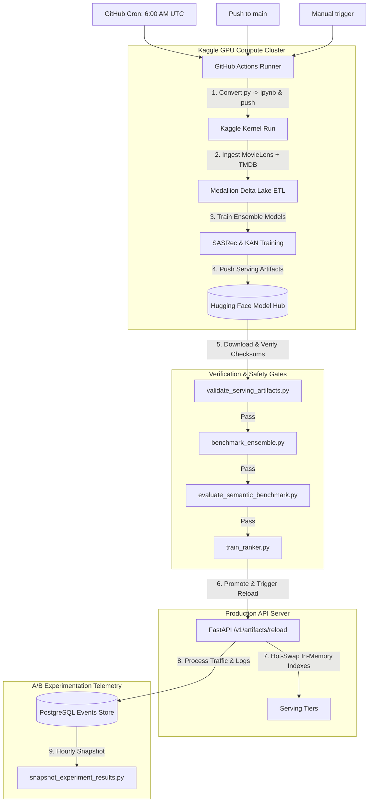

# 🔄 APEX Automated Daily Data Refresh & Model Promotion Guide

This document describes how the automated daily data refresh, model training, evaluation, and zero-downtime serving redeployment operate in the APEX platform.

---

## 📅 Architecture Overview

The system is configured with a fully automated, cloud-hybrid ETL and model promotion pipeline. Because training the full PyTorch ensemble and calculating dense Movie/User embeddings are compute-intensive, the pipeline offloads heavy execution to a remote Kaggle kernel equipped with free GPU compute, then synchronizes weights back to Hugging Face and triggers a zero-downtime hot-reload of the active API server.



---

## ⚡ Setup & Secrets Configuration

To run the automated refresh successfully, you must configure secrets in both **GitHub Secrets** (for the orchestrator runner) and **Kaggle Secrets** (for the background kernel executor).

### 1. GitHub Repository Secrets
Navigate to **Settings** → **Secrets and variables** → **Actions** in your GitHub repository, and add:

| Secret Name | Required | Purpose |
| :--- | :---: | :--- |
| `KAGGLE_KEY` | Yes | Kaggle API Token (content of `kaggle.json`). |
| `HF_TOKEN` | Yes | Hugging Face Write Token for model registry upload. |
| `NOVA_ADMIN_TOKEN` | Yes | Bearer token for triggering `/v1/artifacts/reload` on Render. |
| `NOVA_RENDER_API_URL` | No | Production URL of FastAPI backend. Defaults to `https://movie-recs-api-5qvy.onrender.com`. |
| `NOVA_EVENT_DATABASE_URL`| No | Connection string to PostgreSQL events database. |
| `NOVA_EVENTS_URL` | No | HTTP events logger endpoint fallback if PostgreSQL is unset. |

### 2. Kaggle Secrets
To allow the Kaggle GPU container to upload model checkpoints to Hugging Face, you must configure a Hugging Face credential inside Kaggle:
1. Log in to [Kaggle](https://www.kaggle.com).
2. Go to **Add-ons** → **Secrets** inside the notebook interface.
3. Click **Add a new secret**.
4. Set the label to `HF_TOKEN` and input your Hugging Face Write Token as the value.
5. Click **Save**.

---

## 🛠 Manual Execution

If you need to trigger the data refresh pipeline manually, you have two options:

### Option A: Trigger via GitHub Actions (Recommended)
1. Go to the **Actions** tab of your GitHub repository.
2. Select the **Daily Data Refresh** workflow.
3. Click **Run workflow** and select the target branch (usually `main`).

### Option B: Local Stage-by-Stage CLI Execution
You can run the verification, benchmarking, and training components locally in your dev shell:

```powershell
# 1. Validate serving artifacts from Hugging Face hub
python scripts/validate_serving_artifacts.py --repo pavanbadempet/movie-recs-models

# 2. Run ensemble model validation benchmark
python scripts/benchmark_ensemble.py

# 3. Evaluate semantic recommendation search thresholds
python scripts/evaluate_semantic_benchmark.py `
  --download-movies-from-hf `
  --hf-repo pavanbadempet/movie-recs-models `
  --output reports/semantic_benchmark_report.json `
  --fail-on-threshold

# 4. Train the APEX Ranker classifier using event logs
python scripts/train_ranker.py `
  --download-movies-from-hf `
  --upload-to-hf `
  --promotion-gate `
  --hf-repo pavanbadempet/movie-recs-models

# 5. Trigger reload on your API server
Invoke-RestMethod -Method Post `
  -Uri "https://your-api.onrender.com/v1/artifacts/reload?force_download=true&load=true" `
  -Headers @{ "X-Nova-Admin-Token" = "YOUR_ADMIN_TOKEN" }
```

---

## 📋 Safety Gates & Promotion Thresholds

The pipeline enforces strict quality thresholds. A failure in any stage halts the promotion of new models and prevents server reloading:

1. **Artifact Validation Gate** (`validate_serving_artifacts.py`):
   - Verifies the existence of all 6 ensemble components (SASRec, KAN, LightGCN, ODE, Hyperbolic, Diffusion).
   - Validates model file integrity using SHA-256 checksums.
2. **Model Validation Gate** (`benchmark_ensemble.py`):
   - Checks that predictions don't contain `NaN` or infinite values.
   - Evaluates basic prediction consistency.
3. **Semantic Recommendation Benchmark** (`evaluate_semantic_benchmark.py`):
   - Tests model relevance against 17 predefined complex query concepts (e.g., "mind-bending heist").
   - **Enforced Thresholds**: `Hit Rate@10 >= 0.95`, `NDCG@10 >= 0.25`, and `Bad Match Rate <= 0.05`.
4. **Ranker Promotion Gate** (`train_ranker.py`):
   - Compares the newly trained ranker against the active model on validation sets.
   - Requires a statistically significant accuracy lift or equivalence before promoting the model to production.
