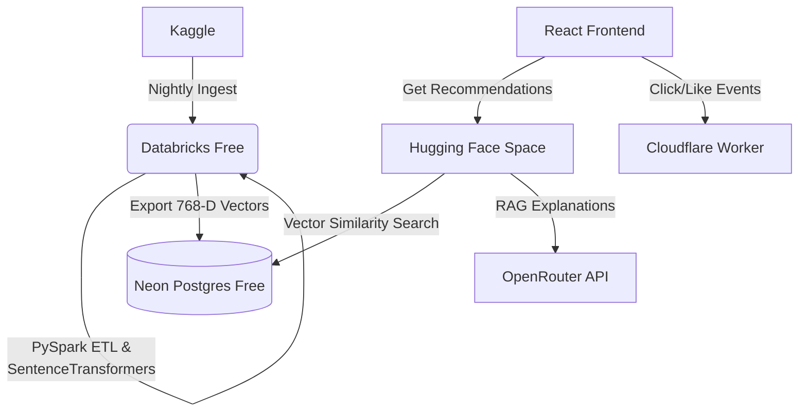

# The "Zero-Cost SOTA" Deployment Guide

This guide details how to deploy the entire APEX architecture using 100% free-tier services. This is the optimal setup for a portfolio project, interview showcase, or hackathon.

## Architecture Topology



---

## 1. Neon Postgres (Vector Database)
*Neon provides a fully managed, serverless Postgres database with `pgvector` pre-installed on their free tier.*

1. Go to [Neon.tech](https://neon.tech) and create a free project.
2. Under your project settings, copy the **Connection String** (it starts with `postgresql://`).
3. Go to the Neon SQL Editor and run the following command to enable the extension:
   ```sql
   CREATE EXTENSION IF NOT EXISTS vector;
   ```
4. Save your `DATABASE_URL`—you will need this for both Databricks and Hugging Face!

---

## 2. Databricks Community Edition (Data Platform & AI)
*Databricks Free Edition gives you a free ML environment to run Apache Spark. We use this to run the nightly Medallion ETL and generate Hugging Face embeddings.*

1. Sign up for the [Databricks Free Edition / Free Trial](https://databricks.com/try-databricks).
2. Log into your Databricks Workspace URL (e.g. `https://<your-workspace-id>.cloud.databricks.com`).
2. Go to **Compute** and create a cluster (use the default 15GB ML runtime).
3. Go to **Workspace**, click on your user profile, and select **Create Git folder**. 
4. Paste your GitHub repository URL.
5. Create a new **Job** to sequence the notebooks located in `databricks_notebooks/`:
   - **Task 1: `00_kaggle_download`** (Parameters: `KAGGLE_USERNAME`, `KAGGLE_KEY`)
   - **Task 2: `01_pyspark_etl`** (Depends on Task 1)
   - **Task 3: `02_export_to_neon`** (Depends on Task 2, Parameters: `DATABASE_URL`)
6. Set the Job Trigger to run nightly.

---

## 3. Hugging Face Spaces (FastAPI Backend)
*Hugging Face Spaces provides free Docker hosting. We use this to host the live Python FastAPI backend which serves real-time recommendations.*

1. Go to [Hugging Face Spaces](https://huggingface.co/spaces) and create a new Space.
2. Select **Docker** as the Space SDK.
3. Link your GitHub repository.
4. Go to the Space **Settings** -> **Variables and secrets**. Add your secrets:
   - `DATABASE_URL`: (Your Neon Postgres connection string)
   - `OPENROUTER_API_KEY`: (Your free/low-cost OpenRouter API key for LLM RAG)
5. Hugging Face will automatically read the `Dockerfile` in the root of the repo, build it, and expose your API!

---

## 4. Cloudflare Workers (Event Ingest / Edge)
*Cloudflare Workers gives you 100,000 free requests per day on the edge. This is perfect for capturing live streaming user events (clicks, likes, watch time).*

1. Install the Cloudflare CLI: `npm install -g wrangler`
2. Authenticate: `npx wrangler login`
3. Navigate to the frontend/worker directory (or wherever your `wrangler.toml` is stored).
4. Run: `npx wrangler deploy`
5. The Worker will now act as a globally distributed ingest endpoint for the `events_routes.py` logic, ensuring zero latency for user feedback.

---

## Conclusion
With this setup, you have deployed a true **Modern Data Stack + Generative AI** pipeline for **$0/month**. 
- Databricks handles the big data and heavy machine learning compute.
- Neon handles the vector mathematics.
- Hugging Face handles the real-time API.
- Cloudflare handles the high-volume streaming telemetry.
