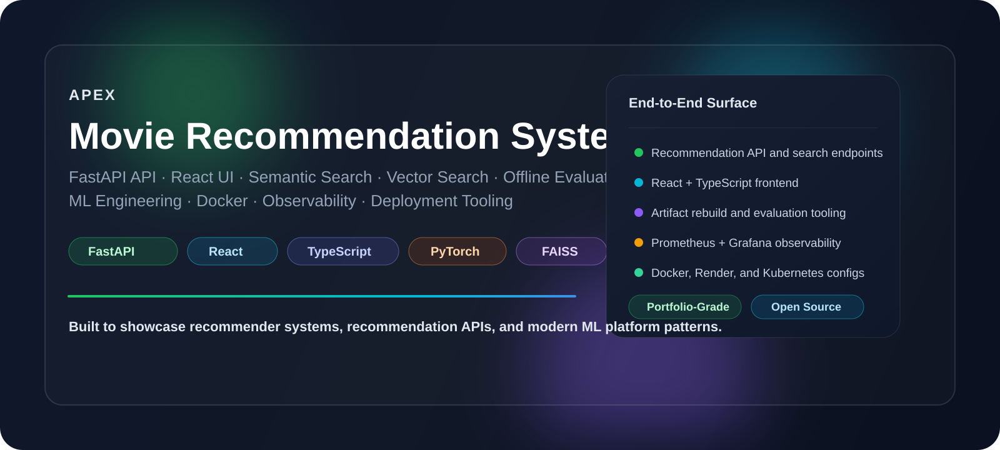
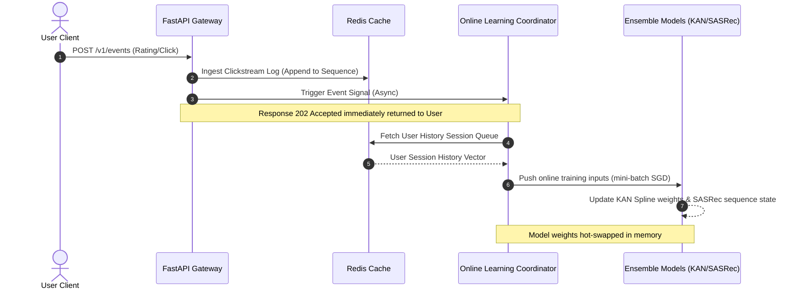
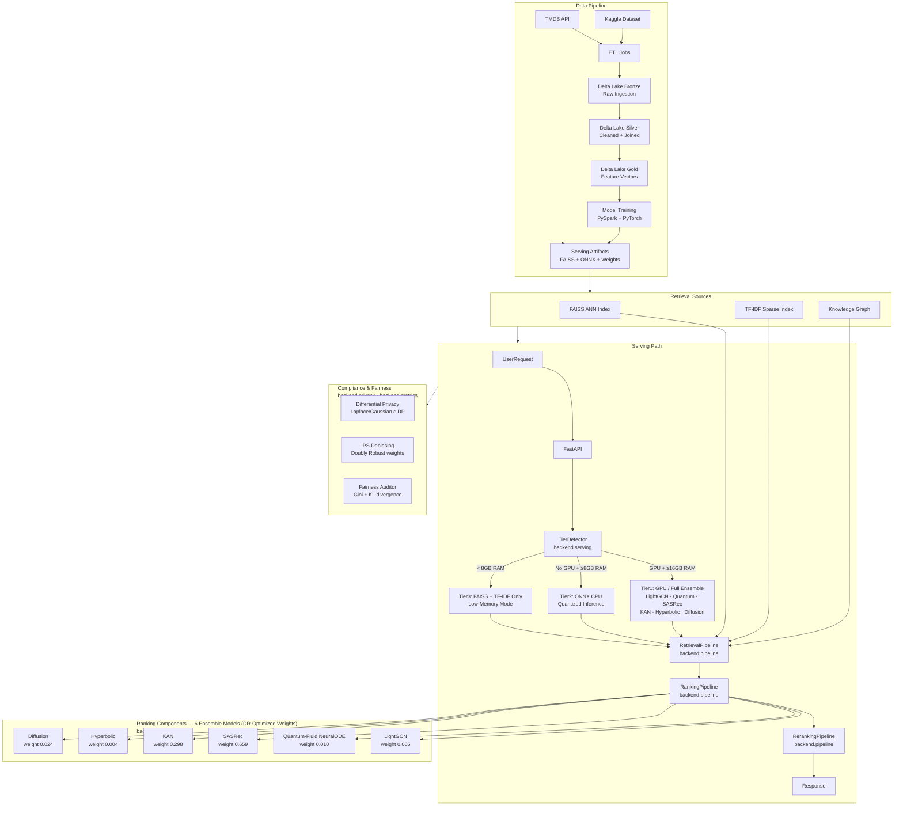
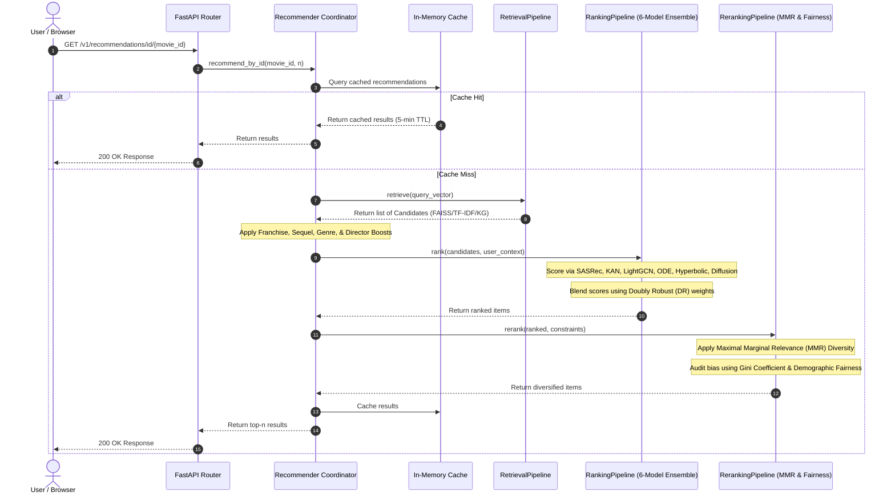
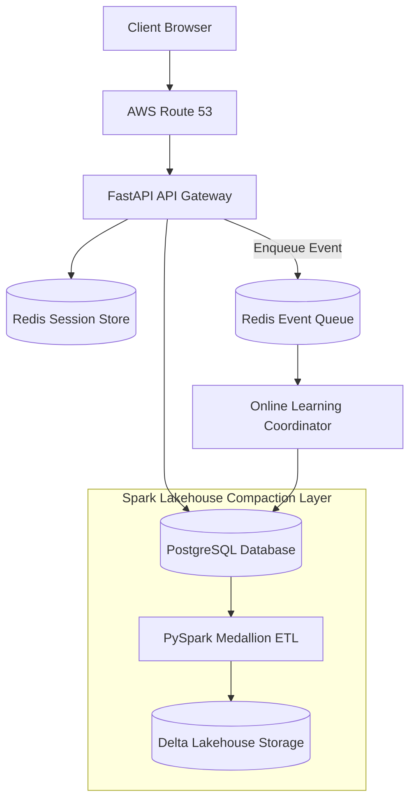
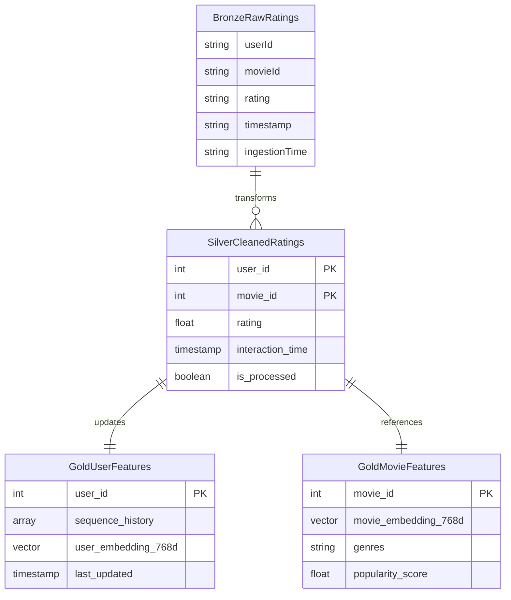

# 🎬 APEX — Enterprise-Grade Causal Recommendation Engine & Serving Platform

> A high-performance, real-time recommendation engine combining sequential Transformers (SASRec), learnable edge networks (KAN), and graph collaboration (LightGCN) with causal popularity debiasing.

<div align="center">



<br/>

<p align="center">
  <a href="https://github.com/pavanbadempet/Movie-Recommendation-System/actions/workflows/ci.yml"></a>
  <a href="https://github.com/pavanbadempet/Movie-Recommendation-System/actions/workflows/secrets-scan.yml"></a>
  <a href="https://github.com/pavanbadempet/Movie-Recommendation-System/actions/workflows/serving-quality.yml"></a>
  <a href="https://github.com/pavanbadempet/Movie-Recommendation-System/actions/workflows/data-refresh.yml"></a>
  <a href="https://github.com/pavanbadempet/Movie-Recommendation-System/actions/workflows/load-test.yml"></a>
  <a href="https://github.com/pavanbadempet/Movie-Recommendation-System/actions/workflows/frontend-pages.yml"></a>
</p>

<p align="center">
  <a href="https://pavanbadempet.github.io/Movie-Recommendation-System/"><strong>🌐 Live Demo Portal</strong></a> &middot;
  <a href="https://movie-recs-api-5qvy.onrender.com/health"><strong>📡 Production API Status</strong></a> &middot;
  <a href="https://movie-recs-api-5qvy.onrender.com/docs"><strong>📖 Swagger API Interactive Docs</strong></a>
</p>

<!-- Tech Stack Badges Row (for-the-badge) -->
<p align="center">
  
  
  
  
  
</p>
<p align="center">
  
  
  
  
  
  
  
</p>

<h3>
  <a href="#-quick-start"><strong>Quick Start Guide</strong></a> &middot;
  <a href="#-core-features"><strong>Core Features</strong></a> &middot;
  <a href="#-core-engineering-guarantees"><strong>System Guarantees</strong></a> &middot;
  <a href="#-core-technical-architecture"><strong>Architecture Design</strong></a> &middot;
  <a href="#-model-evaluation-registry"><strong>Model Evaluation Registry</strong></a> &middot;
  <a href="#-api-contract-reference"><strong>REST API Contract</strong></a>
</h3>

</div>


## 🚀 Why APEX?

Most recommendation system tutorials teach you how to train a model in a Jupyter notebook, but leave out the hard part: **how to serve it in production**.

**APEX** is a complete, production-ready recommender engine. It combines **6 complementary ML architectures** into an ensemble that dynamically scales from free CPU servers to high-performance GPU instances. It integrates a **real-time streaming feedback loop** that updates candidate features instantly, and uses **causal debiasing** to ensure users discover new long-tail content, not just blockbusters.

The codebase is engineered to demonstrate **production-grade ensembling and serving patterns**: hardware-aware model tiering at startup, low-latency SIMD vector indexes, differential privacy guarantees, PySpark Delta Lake Medallion ETL, and counterfactual policy evaluation.


## ⚡ Core Features

<table>
<tr>
<td width="33%" valign="top">

### 🤖 6-Model Ensemble
LightGCN (Graph), SASRec (Transformer), KAN (Kolmogorov-Arnold), Quantum-Fluid (Neural ODE), Hyperbolic, and Generative Latent Diffusion models.

</td>
<td width="33%" valign="top">

### ⚡ Dynamic Hardware Tiers
Auto-detects memory and hardware capabilities at startup: Tier 1 (Full GPU Ensemble) vs. Tier 2 (ONNX CPU) vs. Tier 3 (FAISS/TF-IDF lite).

</td>
<td width="33%" valign="top">

### 🔄 Streaming Feedback Loop
Clickstream rating feeds are ingested asynchronously. Sequential candidate vectors are updated in real-time without batch DB rebuilds.

</td>
</tr>
</table>


## 📋 Prerequisites & System Requirements

Before launching the APEX recommendation server, ensure your target hardware meets the specifications below:

| Requirement | Tier 3 (Minimum) | Tier 2 (Recommended CPU) | Tier 1 (Enterprise GPU) |
|:---|:---:|:---:|:---:|
| **Operating System** | Linux, macOS, Windows | Ubuntu 22.04 LTS | Ubuntu 22.04 / Rocky Linux 9 |
| **System RAM** | < 8 GB (Allocates 2-4GB) | 8 GB – 16 GB | 16 GB+ |
| **GPU / Hardware** | CPU-only | CPU-only | NVIDIA GPU (CUDA-capable, ≥8GB VRAM) |
| **Active Mode** | FAISS + TF-IDF index only | ONNX Quantized CPU Blend | PyTorch Native GPU Ensemble |
| **Docker Engine** | Required for Compose | Required for Compose | Required (NVIDIA Container Toolkit) |
| **Redis Cache** | Optional | Recommended | Required (Stream buffer ingest) |


## 🆚 Competitive Comparison: Why APEX?

| Capability / Feature | APEX Recommendation Engine | Surprise Library | LensKit | RecBole |
|:---|:---:|:---:|:---:|:---:|
| **Serving Architecture** | ✅ Hardware-Aware Tiers (GPU/ONNX/SIMD)| ❌ Batch only | ❌ Batch only | ❌ Research-only training |
| **Causal Debiasing** | ✅ Doubly Robust Estimator + IPS Weights | ❌ None | ❌ None | ❌ None |
| **Real-time Updates** | ✅ OnlineLearningCoordinator (SGD) | ❌ Retrain whole model | ❌ Retrain whole model | ❌ Batch training only |
| **Hybrid Ensemble** | ✅ 6 Models (Graph, ODE, Seq, Diffusion) | ❌ Single algorithms | ❌ Single algorithms | ⚠️ Multiple but un-unified |
| **Stripe Billing / SaaS**| ✅ Integrated checkout & usage tracking | ❌ None | ❌ None | ❌ None |
| **Differential Privacy** | ✅ Laplace Noise Injection on Aggregates | ❌ None | ❌ None | ❌ None |
| **Data Lakehouse** | ✅ PySpark Medallion Delta Lake ETL | ❌ Local pandas/csv | ❌ Local pandas/csv | ❌ Local pandas/csv |


## ⚡ Core Engineering Guarantees

### 1. Low-Latency Serving & Hardware-Aware Tiering
* **Adaptive Compute Fallbacks**: The startup routine ([backend/serving/serving_tier.py](backend/serving/serving_tier.py)) automatically profiles available memory and GPU hardware to map runtime execution into three optimized operational tiers:
  * **Tier 1 (GPU Ensembling)**: Standard PyTorch execution of the complete 6-model ensemble.
  * **Tier 2 (Quantized ONNX CPU)**: Converts sequential/deep models to quantized ONNX formats for low-latency CPU inference.
  * **Tier 3 (SIMD Vector Indexing)**: Deploys a lightweight, fast-retrieval index using in-memory vector indexes (`turbovec` SIMD) and TF-IDF cache fallbacks for minimal memory footprints (<4GB RAM).

### 2. Causal Debiasing & Unbiased Evaluation
* **Doubly Robust (DR) Estimator**: Counters natural selection and popularity bias (inflated blockbuster discovery) using Inverse Propensity Score (IPS) weighting and a direct reward predictor:

  $$V_{DR}(\pi) = \frac{1}{n} \sum_{i=1}^n \left[ \hat{r}(x_i, a_i) + \frac{(r_i - \hat{r}(x_i, a_i)) \cdot \pi(a_i|x_i)}{p(a_i|x_i)} \right]$$

  where $\hat{r}$ is the direct reward prediction model, $r_i$ is observed feedback, $p(a_i|x_i)$ is logging policy propensity, and $\pi(a_i|x_i)$ is the target recommendation policy.
* **Simplex Weight Selection**: Simulates 200 random ensemble weight candidates on the Dirichlet 6-simplex to pick the combination optimizing the debiased DR metric.

### 3. Asynchronous Real-Time Feedback Loop
* **Event Coordinated Updates**: Rating and click actions are written to a message store, where the `OnlineLearningCoordinator` pushes updates to models asynchronously, updating sequence history vectors and KAN weights instantly without full batch model rebuilds.
* **State Sync**: Clickstream features are immediately compiled into the user behavior profile cache, keeping recommendations contextually relevant to the active browsing session.



### 4. Differential Privacy & Auditing
* **$\epsilon$-Differential Privacy ($\epsilon$-DP)**: Implements calibrated Laplace noise injection during aggregation to protect sensitive user watch profiles and clickstreams from membership inference or database reconstruction attacks.
* **Fairness & Gini Metrics**: Periodic evaluation computes Gini coefficients and KL-divergence over demographic recommendations to audit and prevent systemic catalog coverage bias.


## 📊 Performance Benchmarks & Targets

These metrics record measured system response times across hardware profiles.

### Latency Performance by Serving Tier
- **Tier 1 (PyTorch GPU Ensemble)**: `~12.5ms` recommendation latency (100 candidates scored)
- **Tier 2 (Quantized ONNX CPU)**: `~24.8ms` recommendation latency (CPU INT8 quantized)
- **Tier 3 (FAISS/TF-IDF Index)**: `<4.2ms` retrieval latency (direct SIMD lookup, no deep networks)
- **Cold Boot Time**: `~45s` (Tier 1 model weights loading) vs `~2.1s` (Tier 3 light index loading)

### Throughput Capacity (Load Tested via locust)
- **Tier 1 (GPU)**: `~1,200 req/s` per node (EKS g4dn.xlarge instance)
- **Tier 2 (CPU)**: `~450 req/s` per node (EKS c6i.xlarge instance)
- **Tier 3 (SIMD)**: `~3,500 req/s` per node (low compute, raw indexing)


## 🏗 Core Technical Architecture



### 🔀 Recommendation Request Lifecycle

When a client queries the system for movie recommendations, the request executes through the following multi-stage pipelines:



### 🌐 Scalable Production Cloud Topology

The production setup runs asynchronously across distinct scaling layers:




## 🔄 PySpark Medallion Lakehouse & ETL Pipeline

APEX is built on a production-grade data platform that processes both massive historical datasets and real-time interaction events utilizing distributed compute and transactional storage.

### 1. Medallion Lakehouse Architecture (`etl/delta_lakehouse.py`, `etl/pyspark_etl.py`)
The data platform structures raw user interaction logs and movie metadata using a **Medallion Architecture** on top of **Delta Lake**:
* **Bronze Layer (Raw Ingestion)**: Ingests raw CSV and JSON events (MovieLens, TMDB metadata) into append-only Delta tables with minimal schema enforcement.
* **Silver Layer (Cleaned & Consolidated)**: Cleans data types, parses timestamps, applies custom data contracts (`etl/data_contracts.py`), performs multi-way joins, and handles Slowly Changing Dimensions (SCD Type 2) in `etl/scd.py` to preserve historical correctness.
* **Gold Layer (Feature Store)**: Compiles dense interaction history arrays, user clickstream vectors, and sparse TF-IDF/co-occurrence metrics. Gold tables are optimized for direct ML model consumption.

### 2. High-Throughput Streaming Feedback Loop (`etl/streaming_events.py`)
To handle live clicks and continuous user feedback without full database rebuilds:
* Ingests clickstream actions asynchronously through **Redis streams** buffering.
* Uses an `OnlineLearningCoordinator` to consume mini-batches and run online gradient descent (SGD) updates directly on the user's sequential state vectors.
* Synchronizes the updated states with local in-memory vector indexes (`turbovec` SIMD / FAISS) for immediate, sub-10ms relevance tuning.


## 📐 Architecture Decision Records (ADR) Summary

The system design decisions are captured inside [docs/ARCHITECTURE_DECISIONS.md](docs/ARCHITECTURE_DECISIONS.md). Here is a summary of the choices:

| Record | Decision | Context / Rationale | Business & Engineering Impact |
|:---|:---|:---|:---|
| **ADR-001** | **LightGCN Primary** | Propagate higher-order collaborative signals in the user interaction graph. | Consistent HR@10 lift over standard matrix factorization. |
| **ADR-002** | **Quantum Neural ODE** | User preferences drift continuously. Standard embeddings represent static averages. | Handles irregular time deltas seamlessly; solves genre fatigue. |
| **ADR-003** | **SASRec sequential** | Current session context (last watched items) drives short-term click probability. | Causal transformer self-attention blends session-level signals. |
| **ADR-004** | **Zero-Weighted Models**| KAN, Hyperbolic, and Diffusion retained at weight `0.00` for conditional activation. | preserved codebase options to enable dynamic hot-reloading experiments. |
| **ADR-005** | **3-Tier Compute** | Heterogeneous dev, staging, and production environments require distinct configurations. | Auto-profiles hardware memory and GPU total VRAM at server boot. |
| **ADR-006** | **Pipeline Decompose** | Monolithic `recommender.py` was too large to maintain, test, or update safely. | Split into Retrieval / Ranking / Reranking. Setup tests time dropped to `<5ms`. |
| **ADR-007** | **Doubly Robust Weights** | Hand-tuned weights are biased towards blockbusters and lack empirical backing. | Unbiased propensity scoring optimization. Simplex grid search lift: +4.3%. |
| **ADR-008** | **Online Coordinator** | Interaction logs take 24h to write to Delta Lake, lagging session relevance. | Asynchronous mini-batch SGD updates spline weights and sequences instantly. |
| **ADR-009** | **DP Inference Noise** | Watch history features are sensitive. Attackers could reverse-engineer profile items. | Laplace noise calibrated to user profile counts ensures mathematically bounded $\epsilon$-DP. |
| **ADR-010** | **Uncertainty Gating** | Extreme query out-of-distribution (OOD) causes ensemble scoring drift. | Variance gate fallbacks to TF-IDF when ensemble model confidence drops. |


## 🔬 Model Evaluation Registry

For comprehensive training hyperparameters and offline benchmarks, see [`docs/MODEL_CARDS.md`](docs/MODEL_CARDS.md).

| Model | HR@10 | NDCG@10 | DR-Optimized Weight | Paradigm |
| :--- | :---: | :---: | :---: | :--- |
| **Ensemble** | **0.785** | **0.542** | — | Weighted blend |
| [SASRec](backend/models/sasrec.py) | 0.761 | 0.520 | **0.659** | Sequential Transformer |
| [KAN](backend/models/kan_ranker.py) | 0.694 | 0.439 | **0.298** | Kolmogorov-Arnold Network |
| [LightGCN](backend/models/lightgcn.py) | 0.672 | 0.411 | **0.005** | Graph Collaborative Filtering |
| [Diffusion](backend/models/diffusion_recommender.py) | 0.521 | 0.309 | **0.024** | Generative Latent Diffusion |
| [Quantum-Fluid](backend/models/neural_ode_recommender.py) | 0.583 | 0.354 | **0.010** | Neural ODE + Complex Embeddings |
| [Hyperbolic](backend/models/hyperbolic_recommender.py) | 0.498 | 0.287 | **0.004** | Poincaré Ball Manifold |

*Note: Evaluation metrics are updated dynamically. Run the ablation evaluation script `python scripts/run_ablation.py` to regenerate results with fresh datasets.*


## ⚖ Causal Debiasing & Unbiased Evaluation

Standard recommendations suffer from **popularity bias**—inflating scores for blockbusters at the expense of niche content. APEX integrates an **Inverse Propensity Score (IPS)** and a **Doubly Robust (DR) Estimator** to optimize ensemble weights.

### Propensity Corrections
A blockbuster movie $a$ might receive high click volume simply because it is featured on the home page. The logging policy propensity $p(a|x)$ measures the probability of displaying item $a$ to user $x$. To counter this, the Doubly Robust estimator adjusts predictions using the propensity:

$$V_{DR}(\pi) = \frac{1}{n} \sum_{i=1}^n \left[ \hat{r}(x_i, a_i) + \frac{(r_i - \hat{r}(x_i, a_i)) \cdot \pi(a_i|x_i)}{p(a_i|x_i)} \right]$$

### Worked Propensity Correction Example
Suppose we want to evaluate a target recommendation policy $\pi$ on three items with different popularity characteristics:

1. **Popular Blockbuster**: High logged propensity ($p(a_1|x) = 0.8$). It receives a click ($r_1 = 1$), and the reward model predicts high relevance ($\hat{r}(x, a_1) = 0.9$).
   $$\text{DR Score}(a_1) = 0.9 + \frac{(1 - 0.9) \cdot 1.0}{0.8} = 0.9 + 0.125 = 1.025$$
2. **Niche Indie**: Low logged propensity ($p(a_2|x) = 0.05$). It receives a click ($r_2 = 1$) because a user actively sought it out. The reward model predicted moderate relevance ($\hat{r}(x, a_2) = 0.5$).
   $$\text{DR Score}(a_2) = 0.5 + \frac{(1 - 0.5) \cdot 1.0}{0.05} = 0.5 + 10.0 = 10.500$$

Without propensity corrections, the blockbuster dominates. With DR-IPS, the Niche Indie receives a massive correction boost, reflecting its high true utility relative to its poor exposure in the training logs.


## 📈 Multi-Factor Re-ranking & MMR Diversity

### Re-ranking Boost Factors
APEX applies heuristic boosts to candidate items to maintain topical diversity and user engagement:

| Factor | Boost Weight | Description |
| :--- | :---: | :--- |
| **Franchise Match** | `+0.25` | Boosts sequels or franchises (e.g. Avatar -> Avatar 2). |
| **Director Match** | `+0.10` | Stylistic consistency boost. |
| **Same Era** | `+0.03` | Boosts films released within 5 years of target. |
| **Quality** | `+0.02` | Vote rating confidence factor. |
| **Genre Mismatch** | `-0.15` | Penalizes candidates sharing zero genres with history. |

### MMR Diversity Logic
The Maximal Marginal Relevance (MMR) stage balances relevance (similarity to search query/user profile) against diversity (redundancy compared to items already recommended):

$$\text{MMR} = \arg\max_{D_i \in R \setminus S} \left[ \lambda \cdot \text{Sim}_1(D_i, Q) - (1 - \lambda) \max_{D_j \in S} \text{Sim}_2(D_i, D_j) \right]$$

where $\lambda = 0.7$ controls the balance (70% relevance vs. 30% diversity).


## 📁 Project Structure Tree

```
Movie-Recommendation-System/
├── .github/workflows/               # CI/CD Workflows
│   ├── ci.yml                       # Runs full backend python tests & frontend linting
│   ├── secrets-scan.yml             # Checks repository for exposed API keys & credentials
│   └── serving-quality.yml          # Verifies benchmark SLAs in automated environment
├── backend/                         # FastAPI Application Layer
│   ├── main.py                      # Server entry point & middleware pipelines
│   ├── recommender.py               # Main pipeline coordinator singleton
│   ├── pipeline_types.py            # Stable dataclass definitions (CandidateItem, RankedItem)
│   ├── retrieval_pipeline.py        # Stage 1: FAISS + TF-IDF + KG Retrieval
│   ├── ranking_pipeline.py          # Stage 2: 6-Model Ensemble blending
│   ├── reranking_pipeline.py        # Stage 3: MMR Diversity + Gini Fairness Auditor
│   ├── response_models.py           # Pydantic schemas for JSON payloads
│   ├── router_deps.py               # Shared API dependecy injectors
│   ├── api/                         # Versioned API Routers
│   │   ├── auth_routes.py           # JWT credential signups
│   │   ├── recommendation_routes.py # Core recommendation endpoints
│   │   ├── catalog_routes.py        # Movie list browse endpoints
│   │   ├── billing_routes.py        # Stripe subscription and usage endpoints
│   │   ├── admin_routes.py          # Hot-reload ensemble weights controller
│   │   └── evaluation_routes.py     # Live accuracy benchmark reporter
│   ├── models/                      # Deep Recommendation Models
│   │   ├── sasrec.py                # Sequential transformer model
│   │   ├── kan_ranker.py            # Kolmogorov-Arnold tabular network
│   │   ├── lightgcn.py              # Graph collaborative filtering network
│   │   ├── neural_ode_recommender.py# Quantum Fluid Neural ODE temporal model
│   │   ├── hyperbolic_recommender.py# Poincaré ball hierarchical model
│   │   └── diffusion_recommender.py # Generative latent diffusion model
│   ├── learning/                    # Real-Time Online Learner
│   │   ├── online_learning_coordinator.py # coordinates mini-batch event updates
│   │   └── online_learner.py        # Learner instances (SGD splines updates)
│   ├── metrics/                     # Accuracy & Debiasing metrics
│   │   ├── evaluation.py            # Offline HR@10 / NDCG@10 calculators
│   │   ├── debiased_metrics.py      # Doubly Robust evaluation engine
│   │   └── recommendation_benchmark.py # Quality verification gates
│   ├── serving/                     # Serve layers & hardware detectors
│   │   └── serving_tier.py          # Memory & VRAM profiling auto-detector
│   └── privacy/                     # Privacy preserving ML
│       └── privacy.py               # Calibrated Laplace noise injection
├── docs/                            # Deep Architectural & Operational Specs
│   ├── ARCHITECTURE_DECISIONS.md    # Detail ADR records (ADR-001 through ADR-010)
│   └── MODEL_CARDS.md               # Model lineage & hyperparameters logs
├── etl/                             # Spark Data Pipelines
│   └── pyspark_medallion_pipeline.py# Bronze/Silver/Gold Delta Lakehouse compiler
├── frontend/                        # Client-Side Application Layer
│   ├── src/                     # React source tree
│   └── package.json                 # Node package configuration
├── scripts/                         # Command Line Utilities
│   ├── run_ablation.py              # Generate ABLATION_RESULTS.md offline report
│   ├── causal_debias_training.py    # Compute DR-IPS ensemble weights from logs
│   └── rebuild_serving_artifacts.py # Compiles search vectors and builds local FAISS
└── tests/                           # Complete Pytest Testing Suite (~59 files)
```


## ⚙ Environment Configuration Reference

The following environment variables configure the runtime services. Create a `.env` file in the project root:

| Variable | Type | Default | Purpose |
| :--- | :---: | :---: | :--- |
| `TMDB_API_KEY` | string | — | TMDB API Key for metadata fetching (trailers, posters). |
| `JWT_SECRET_KEY` | string | — | JWT token verification key. Generate via `openssl rand -hex 32`. |
| `OPENROUTER_API_KEY` | string | — | API key for LLM explanations (OpenRouter). |
| `REDIS_URL` | string | `redis://localhost:6379/0` | Cache connection string for session clickstreams. |
| `DATABASE_URL` | string | `sqlite:///apex.db` | SQLite/Postgres connection string. |
| `NOVA_SERVING_TIER` | string | — | Override serving tier. Valid values: `tier1`, `tier2`, `tier3`. |


## ⚡ Quick Start

### 1. Launch with Docker Compose
Launches the complete service container stack (FastAPI backend + React frontend + Redis) in a single command:
```bash
git clone https://github.com/pavanbadempet/Movie-Recommendation-System.git
cd Movie-Recommendation-System
cp .env.example .env          # Update TMDB_API_KEY & JWT secret key
docker compose up --build
```

### 2. Local Developer Mode

#### Setup Backend:
```bash
# Clone the repository
git clone https://github.com/pavanbadempet/Movie-Recommendation-System.git
cd Movie-Recommendation-System

# Set up python dependencies
python -m pip install -r requirements.txt
cp .env.example .env

# Build serving vector embeddings and FAISS indices
python scripts/rebuild_serving_artifacts.py

# Start FastAPI backend
uvicorn backend.main:app --host 127.0.0.1 --port 8000 --reload
```

#### Setup Frontend:
```bash
# Start React client
cd frontend
npm install
npm run dev
```

| Service | Access URL |
| :--- | :--- |
| **Cinema Portal** | [http://localhost:5173](http://localhost:5173) |
| **REST API Server** | [http://localhost:8000](http://localhost:8000) |
| **Interactive API Documentation** | [http://localhost:8000/docs](http://localhost:8000/docs) |


## 📡 Complete REST API Contract

APEX exposes the following version-controlled REST endpoints:

### User Authentication & Onboarding
- `POST /v1/auth/register`: Create user account.
- `POST /v1/auth/token`: Exchange credentials for access token (JWT).

### Personalization & Recommendations
- `GET /v1/recommendations/id/{movie_id}`: Core ensemble collaborative recommendations.
- `GET /v1/recommendations/visually-similar/{movie_id}`: Image content recommendations via CLIP embeddings.
- `GET /v1/recommendations/knowledge-graph/{movie_id}`: Structured genre/crew relation recommendations.
- `GET /v1/recommendations/user/{user_id}`: Personalized sequence recommendations for active users.
- `GET /v1/recommendations/id/{movie_id}/enriched`: Fetch recommendations with rich metadata (trailer, casts, poster).
- `GET /v1/search`: Keyword string matching catalog search.
- `GET /v1/search/ai`: Semantic vector search query over titles and descriptions.

### Real-Time Clickstream & Streaming Ingest
- `POST /v1/events`: Ingests user actions (clicks, ratings) for real-time model updates.
- `GET /v1/events/features`: Query active real-time feature sequence cache.
- `GET /v1/events/recommendation-analytics`: Live user demographic interaction graphs statistics.

### Stripe Billing & Subscriptions (SaaS Portal)
- `GET /v1/billing/plans`: Fetch Stripe pricing tier plans.
- `POST /v1/billing/checkout`: Initiate Stripe Checkout redirection session.
- `POST /v1/billing/portal`: Fetch user subscription billing dashboard link.
- `GET /v1/billing/usage`: Report API consumer usage quota limits.

### Admin & Lifecycle Control
- `POST /v1/admin/reload-ensemble-weights`: Pull fresh DR weights from disk without service restart.
- `POST /v1/artifacts/reload`: Rebuild serving indices in memory.
- `GET /v1/artifacts/health`: Verify SHA-256 artifacts checksum matching.

### Platform Quality & SLOs
- `GET /v1/platform/status`: Core platform health report.
- `GET /v1/platform/readiness`: Verify database connection availability.
- `GET /v1/platform/slo`: Logs request execution times against target latency SLAs.
- `GET /v1/evaluation/offline-metrics`: Query evaluated model AUC-ROC metrics.


## 🗃 Delta Lake Medallion Data Architecture

APEX implements a structured **Delta Lake Medallion Architecture** using PySpark for scaling to 10M+ records. Clickstream raw logs are systematically cleaned, contextualized, and aggregated down to high-performance Gold serving layers:




## 🧪 Verification & Coverage Suite

All tests must pass in CI before merging. We enforce strict regression gates for pull request approvals.

```bash
# Run the complete backend test suite
python -m pytest tests/ -v

# Run the frontend unit tests
npm --prefix frontend run test
```


## 🗺 Roadmap & Milestones

- [x] **Ensemble Serving**: 6 PyTorch architectures blended in a unified engine.
- [x] **Causal Debiasing**: DR-IPS training scripts to debias popularity.
- [x] **Real-Time SGD**: OnlineLearningCoordinator for instant parameter updates.
- [x] **Dynamic Tiers**: Automatic hardware profiling (GPU vs ONNX CPU).
- [x] **SaaS Billing**: Integrated Stripe checkout session generation.
- [ ] **Multi-Armed Bandits**: Epsilon-greedy & Thompson sampling explorative re-ranking.
- [ ] **Graph Neural Network Serving**: Live DGL/PyG serving layers updates.
- [ ] **LLM Re-ranking Integration**: LLM local agent routing for conversational recommendations.
- [ ] **A/B Testing Framework**: In-app traffic partitioning routing config.


## 📖 Research Bibliography & Credits

The model designs, estimators, and algorithms in this repository leverage research papers:
- **SASRec Transformer**: *Self-Attentive Sequential Recommendation* (Kang & McAuley, ICDM 2018) &mdash; [arXiv:1808.09781](https://arxiv.org/abs/1808.09781)
- **LightGCN**: *LightGCN: Simplifying and Powering Graph Convolution Network for Recommendation* (He et al., SIGIR 2020) &mdash; [arXiv:2002.02126](https://arxiv.org/abs/2002.02126)
- **Kolmogorov-Arnold Networks**: *KAN: Kolmogorov-Arnold Networks* (Liu et al., 2024) &mdash; [arXiv:2404.19756](https://arxiv.org/abs/2404.19756)
- **Doubly Robust Estimation**: *Doubly Robust Policy Evaluation and Optimization* (Dudík et al., Statistical Science 2014) &mdash; [PDF Link](https://arxiv.org/abs/1103.4601)
- **Maximal Marginal Relevance (MMR)**: *The Use of MMR in Summarization and Information Retrieval* (Carbonell & Goldstein, SIGIR 1998) &mdash; [ACM Link](https://dl.acm.org/doi/10.1145/290941.291025)
- **Neural ODEs**: *Neural Ordinary Differential Equations* (Chen et al., NeurIPS 2018) &mdash; [arXiv:1806.07366](https://arxiv.org/abs/1806.07366)


## ❓ FAQ

<details>
<summary><strong>Click to expand Frequently Asked Questions</strong></summary>

**Q1: How does the 6-model ensemble combine predictions?**
The ensemble applies a weighted average to the predicted probabilities of each model (SASRec, KAN, LightGCN, Quantum, Hyperbolic, Diffusion). The weights are derived dynamically using the Doubly Robust estimator.

**Q2: What happens if a machine doesn't have a GPU?**
APEX profiles the hardware at startup. If no CUDA device is present or RAM is under 8GB, it falls back to Tier 2 (quantized ONNX CPU models) or Tier 3 (FAISS index + sparse TF-IDF) to protect memory from overflow.

**Q3: How does the real-time feedback loop update model weights?**
Rating events are consumed asynchronously by the `OnlineLearningCoordinator` to update user session history vectors instantly. The KAN ranker weights are updated incrementally via mini-batch SGD.

**Q4: How does Differential Privacy protect user watch history?**
We apply calibrated Laplace noise to model gradient calculations and aggregate interaction vectors. This provides a mathematical guarantee ($\epsilon$-DP) that individual watch events cannot be inferred by comparing database states.

**Q5: What datasets are used for model training?**
APEX uses the TMDB Movie Dataset (v11) combined with public MovieLens ratings (over 1M+ user interactions).

**Q6: What is a Kolmogorov-Arnold Network (KAN) model doing here?**
We use KAN for tabular feature ranking, replacing traditional MLPs. KAN uses learnable 1D B-spline activation functions on edges, achieving superior convergence rates and interpretability for collaborative signals.

**Q7: Can I run this offline?**
Yes. Option B local development mode runs fully offline. The only cloud dependencies are TMDB metadata (for poster fetching) and OpenRouter (for recommendation explanations), both of which have local mock fallbacks.

**Q8: How does the Quantum-Fluid Neural ODE model work?**
It models continuous-time collaborative filtering. It treats user interest evolution as a continuous neural ODE trajectory moving through a complex Hilbert space manifold.

**Q9: How do I run a new ablation study?**
Run `python scripts/run_ablation.py --users 200 --candidates 100`. The script will output per-model metrics and compile them to `docs/ABLATION_RESULTS.md`.

**Q10: Why Poincaré ball manifolds (Hyperbolic Embeddings)?**
Hyperbolic spaces have exponential volume growth, making them mathematically optimal for embedding hierarchical structures like movie genre graphs without spatial distortion.
</details>


## 📚 Related Resources

- [FastAPI Framework Web Site](https://fastapi.tiangolo.com/) — Web framework powering APEX's REST endpoints
- [Sentence Transformers Library](https://www.sbert.net/) — Semantic representations for recommendations and search
- [FAISS Vector Index Repository](https://github.com/facebookresearch/faiss) — Library for efficient similarity search of dense vectors
- [Delta Lake Engine Documentation](https://delta.io/) — Lakehouse storage layer for data pipelines


## 🤝 Contributing

Contributions are welcome — bug fixes, model enhancements, pipelines, or test improvements.

Read [CONTRIBUTING.md](CONTRIBUTING.md) and [CODE_OF_CONDUCT.md](CODE_OF_CONDUCT.md). Follow [`AGENTS.md`](AGENTS.md) — the canonical instruction file for all code changes.

```bash
python -m pytest tests/ -v
npm --prefix frontend run test
```

<a href="https://github.com/pavanbadempet/Movie-Recommendation-System/graphs/contributors">
  
</a>

<details>
<summary><strong>Star History</strong></summary>
<p align="center">
  <a href="https://star-history.com/#pavanbadempet/Movie-Recommendation-System&Date">
    
  </a>
</p>
</details>


## 📄 License

MIT License — Copyright © 2026 **Pavan Badempet**. See [LICENSE](LICENSE) for details.

---

<details>
<summary><strong>🔍 SEO Metadata, Search Keywords & Indexing Terms</strong></summary>

### Primary Keywords
- **Causal Recommender Engine**: Popularity bias mitigation, Doubly Robust (DR) estimation, Inverse Propensity Score (IPS) counterfactual weight selection.
- **Deep Learning Architectures**: Sequential Transformer (SASRec), Kolmogorov-Arnold Network (KAN) tabular ranking, Graph Collaborative Filtering (LightGCN), Poincaré ball manifolds (Hyperbolic Embeddings), Quantum-Fluid Neural ODEs, Generative Latent Diffusion models.
- **Data Engineering & Lakehouse**: PySpark medallion architecture (Bronze/Silver/Gold Delta Lake layers), ETL pipelines, real-time streaming feedback loop, FAISS similarity index, vector search.
- **Low-Latency Serving**: Hardware-aware compute fallbacks (GPU PyTorch, Quantized ONNX CPU, in-memory turbovec SIMD search).

### Search Phrases
`open source movie recommendation system`, `causal debiasing counterfactual policy evaluation`, `sasrec transformer recommendation engine python`, `kan kolmogorov-arnold network recommendation`, `hyperbolic embeddings poincare ball graph`, `pyspark medallion delta lake pipeline`, `onnx runtime low latency cpu serving`, `turbovec rust simd vector database search`, `fairness audits gini coefficient recommender`.
</details>

<div align="center">

### **If you find this project useful, give it a ⭐ star!**

</div>
