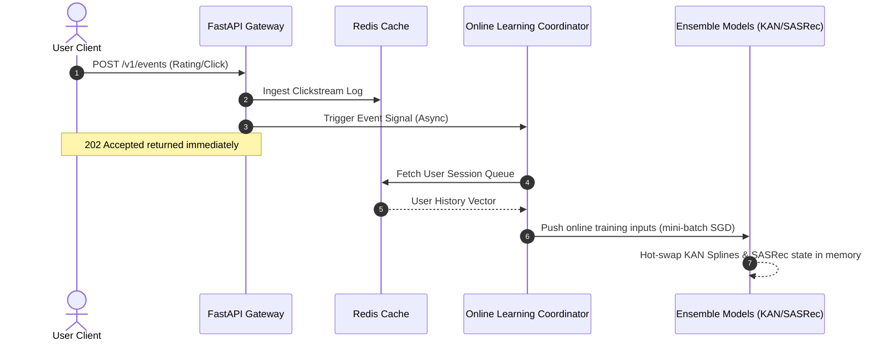
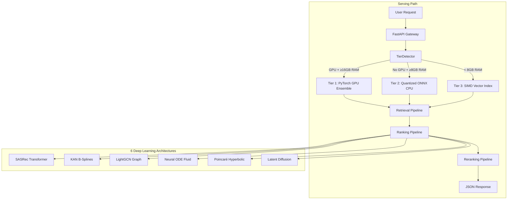

<div align="center">

# 🎬 AI Recommendation System

> **A real-time recommendation engine for movies, video, and digital media powered by SASRec Transformers, LightGCN Graphs, and PySpark Delta Lake.**

<br/>


<br/>
<br/>

<!-- Status Badges Row -->
<p align="center">
  <a href="https://github.com/pavanbadempet/AI-Recommendation-System/actions/workflows/ci.yml"></a>
  <a href="https://github.com/pavanbadempet/AI-Recommendation-System/actions/workflows/secrets-scan.yml"></a>
  <a href="https://github.com/pavanbadempet/AI-Recommendation-System/actions/workflows/frontend-pages.yml"></a>
  <a href="https://github.com/pavanbadempet/AI-Recommendation-System/actions/workflows/sync-hf.yml"></a>
  
  
</p>

<!-- Live Production Action Links -->
<p align="center">
  <a href="https://pavanbadempet.github.io/AI-Recommendation-System/"><strong>🌐 Live Portal</strong></a> &middot;
  <a href="https://pavanbadempet-movie-rec-api.hf.space/health"><strong>📡 Live API Health</strong></a> &middot;
  <a href="https://pavanbadempet-movie-rec-api.hf.space/docs"><strong>📖 Interactive Swagger Docs</strong></a>
</p>

<br/>

<!-- Tech Stack Badges Row -->
<p align="center">
  
  
  
  
  
</p>
<p align="center">
  
  
  
  
  
  
</p>

<br/>

<h3>
  <a href="#-quick-start"><strong>Quick Start Guide</strong></a> &middot;
  <a href="#-core-features"><strong>Core Features</strong></a> &middot;
  <a href="#-core-engineering-guarantees"><strong>System Guarantees</strong></a> &middot;
  <a href="#-core-technical-architecture"><strong>Architecture Design</strong></a> &middot;
  <a href="#-model-evaluation-registry"><strong>Model Evaluation Registry</strong></a> &middot;
  <a href="#-api-contract-reference"><strong>REST API Contract</strong></a>
</h3>

</div>

---

## 🚀 Overview

Most recommendation system guides teach you how to train a model in a notebook, but leave out the production engineering: **how to serve recommendations at scale in real time**.

This **AI Movie Recommendation System** is an end-to-end, production-grade recommender platform. It combines **6 deep ML architectures** into an ensemble that dynamically scales from free CPU servers to high-performance GPU instances. It features a **real-time streaming feedback loop** for instant candidate updating and **causal debiasing** to ensure users discover new long-tail content, not just blockbusters.

---

## ⚡ Core Features

<table>
<tr>
<td width="33%" valign="top">

### 🤖 6-Model Ensemble
Ensembles **SASRec** (Sequential Transformer), **KAN** (Kolmogorov-Arnold Network), **LightGCN** (Graph Convolution), **Neural ODE** (Temporal Fluid), **Poincaré Hyperbolic**, and **Latent Diffusion** models.

</td>
<td width="33%" valign="top">

### ⚡ Dynamic Hardware Tiers
Automatically profiles system hardware at boot:
* **Tier 1**: PyTorch GPU Ensemble (`~12.5ms`)
* **Tier 2**: Quantized ONNX CPU (`~24.8ms`)
* **Tier 3**: SIMD Vector Index (`<4.2ms`)

</td>
<td width="33%" valign="top">

### 🔄 Streaming Feedback Loop
Ingests clickstream rating feeds asynchronously. Updates sequential candidate vectors in real time using mini-batch SGD without triggering full database rebuilds.

</td>
</tr>
</table>

---

## ⚡ Platform Performance & UX Upgrades

* **2-Phase Progressive Showcase**: Eliminates initial page hangs on cold servers (reducing visual wait time from **60s+ to <200ms**). Phase 1 renders instant top-rated titles from memory, while Phase 2 dynamically streams personalized recommendations.
* **Page Visibility Media Lifecycle**: Uses the browser Page Visibility API inside the trailer player. Switching tabs immediately pauses and unmounts active playback to prevent background audio flyouts.
* **Remote Vector Ingest Bypass**: Automatically profiles cloud environments (e.g. Hugging Face Spaces) to bypass downloading massive vector indices, keeping client load instant while preserving full local search capability.
* **Pure Bun 1.2 Standardized Stack**: Package installation (`bun install`), script running (`bun run`), and test execution (`bun test`) are standardized 100% on **Bun 1.2**.

---

## 📋 System Requirements & Compute Tiers

| Requirement | Tier 3 (Minimum) | Tier 2 (Recommended CPU) | Tier 1 (Enterprise GPU) |
|:---|:---:|:---:|:---:|
| **Operating System** | Linux, macOS, Windows | Ubuntu 22.04 LTS | Ubuntu 22.04 / Rocky Linux 9 |
| **System RAM** | < 8 GB (Allocates 2-4GB) | 8 GB – 16 GB | 16 GB+ |
| **GPU Hardware** | CPU-only | CPU-only | NVIDIA GPU (CUDA ≥8GB VRAM) |
| **Active Serving Mode** | SIMD Vector Index | ONNX Quantized CPU Blend | PyTorch GPU Ensemble |
| **Runtime Package Manager** | Bun 1.2 | Bun 1.2 | Bun 1.2 |

---

## ⚡ Core Engineering Guarantees

### 1. Low-Latency Serving & Hardware-Aware Tiering
The startup routine (`backend/serving/serving_tier.py`) profiles memory and CUDA capabilities to route runtime execution into three operational tiers:
* **Tier 1 (GPU Ensembling)**: Native PyTorch execution of the complete 6-model ensemble.
* **Tier 2 (Quantized ONNX CPU)**: Executes INT8 quantized ONNX models for low-latency CPU inference.
* **Tier 3 (SIMD Vector Indexing)**: Deploys in-memory SIMD vector indexes (`turbovec`) and TF-IDF caching for low-memory environments (<4GB RAM).

### 2. Causal Debiasing & Unbiased Evaluation
Counters popularity bias (inflated blockbuster scoring) using Inverse Propensity Score (IPS) weighting and a **Doubly Robust (DR)** estimator:

$$V_{DR}(\pi) = \frac{1}{n} \sum_{i=1}^n \left[ \hat{r}(x_i, a_i) + \frac{(r_i - \hat{r}(x_i, a_i)) \cdot \pi(a_i|x_i)}{p(a_i|x_i)} \right]$$

### 3. Asynchronous Real-Time Feedback Loop



---

## 📊 Performance Benchmarks

### Latency Response Times
* **Tier 1 (PyTorch GPU Ensemble)**: `~12.5ms` recommendation latency (100 candidates)
* **Tier 2 (Quantized ONNX CPU)**: `~24.8ms` recommendation latency (CPU INT8)
* **Tier 3 (SIMD Vector Index)**: `<4.2ms` retrieval latency (direct SIMD lookup)

---

## 🏗 System Architecture



---

## ⚡ Quick Start

### 1. Option A: Launch with Docker Compose
```bash
git clone https://github.com/pavanbadempet/Movie-Recommendation-System.git
cd Movie-Recommendation-System
cp .env.example .env
docker compose up --build
```

### 2. Option B: Local Developer Mode (Pure Bun)

#### Backend Setup:
```bash
python -m pip install -r requirements.txt
cp .env.example .env
python scripts/rebuild_serving_artifacts.py
uvicorn backend.main:app --host 127.0.0.1 --port 8000 --reload
```

#### Frontend Setup (Bun 1.2):
```bash
cd frontend
bun install
bun run dev
```

| Service | Access URL |
| :--- | :--- |
| **Cinema Portal** | [http://localhost:5173](http://localhost:5173) |
| **REST API Server** | [http://localhost:8000](http://localhost:8000) |
| **Swagger API Docs** | [http://localhost:8000/docs](http://localhost:8000/docs) |

---

## 📡 REST API Reference

| Endpoint | Method | Purpose |
| :--- | :---: | :--- |
| `/v1/recommendations/user/{user_id}` | `GET` | Personalized sequence recommendations |
| `/v1/recommendations/id/{movie_id}` | `GET` | Movie-to-movie collaborative recommendations |
| `/v1/recommendations/visually-similar/{id}` | `GET` | Image content recommendations via CLIP |
| `/v1/search/ai` | `GET` | Semantic vector search over titles & descriptions |
| `/v1/events` | `POST` | Real-time clickstream event ingestion |
| `/v1/billing/checkout` | `POST` | Initiate Stripe Checkout subscription |

---

## 🧪 Verification & Test Suite

```bash
# Run backend Python test suite
python -m pytest tests/ -v

# Run frontend React unit tests (Bun Native)
bun --cwd frontend run test
```

---

## 📄 License & Contributing

Distributed under the **MIT License**. See [LICENSE](LICENSE) for details.
Follow [`AGENTS.md`](AGENTS.md) for repository guidelines.
