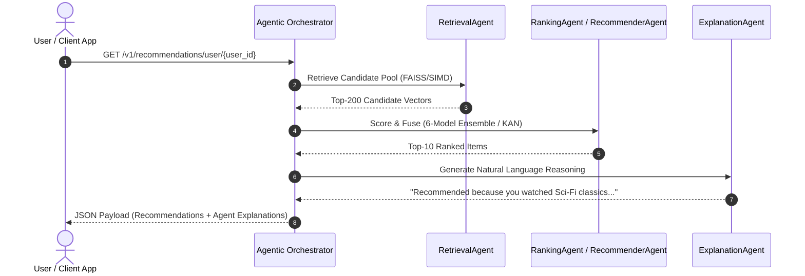

<div align="center">

# 🎬 APEX AI Recommendation Engine & Unified Data Intelligence Platform

> **An enterprise-grade, real-time recommendation platform powered by a 6-Model PyTorch Deep Learning Ensemble (SASRec, KAN, LightGCN, Neural ODE, Poincaré Hyperbolic, Latent Diffusion), PySpark 4.2 Delta Lake Declarative Pipelines, and an Agentic Multi-Agent AI Architecture.**

<br/>


<br/>
<br/>

<!-- Status Badges Row -->
<p align="center">
  <a href="https://github.com/pavanbadempet/AI-Recommendation-System/actions/workflows/ci.yml"></a>
  <a href="https://github.com/pavanbadempet/AI-Recommendation-System/actions/workflows/secrets-scan.yml"></a>
  <a href="https://github.com/pavanbadempet/AI-Recommendation-System/actions/workflows/frontend-pages.yml"></a>
  <a href="https://github.com/pavanbadempet/AI-Recommendation-System/actions/workflows/sync-hf.yml"></a>
  
  
  
  
</p>

<!-- Live Production Action Links -->
<p align="center">
  <a href="https://pavanbadempet.github.io/AI-Recommendation-System/"><strong>🌐 Live Cinema Portal</strong></a> &middot;
  <a href="https://pavanbadempet-movie-rec-api.hf.space/health"><strong>📡 Production API Health</strong></a> &middot;
  <a href="https://pavanbadempet-movie-rec-api.hf.space/docs"><strong>📖 Interactive Swagger API Docs</strong></a> &middot;
  <a href="https://huggingface.co/spaces/pavanbadempet/movie-rec-api"><strong>🤗 HuggingFace Space</strong></a>
</p>

<br/>

<!-- Tech Stack Badges Row -->
<p align="center">
  
  
  
  
  
  
</p>
<p align="center">
  
  
  
  
  
  
</p>

<br/>

> [!TIP]
> ### ⭐ Why Star This Repo?
> * **Production Engineering Reference**: A complete, real-world alternative to toy Jupyter notebook recommendations.
> * **Zero Vendor Lock-In**: Databricks-compatible PySpark 4.2 & Delta Lake pipelines built 100% on open standards.
> * **Cutting-Edge Deep Learning**: 6 PyTorch architectures (SASRec, KAN B-Splines, LightGCN, Neural ODE, Poincaré Hyperbolic, Latent Diffusion).
> * **Agentic AI Architecture**: Autonomous multi-agent routing with real-time natural language recommendation reasoning.

<br/>

<h3>
  <a href="#-quick-start"><strong>Quick Start</strong></a> &middot;
  <a href="#-core-platform-innovations"><strong>Key Features</strong></a> &middot;
  <a href="#-unified-data-intelligence-platform"><strong>Data Intelligence</strong></a> &middot;
  <a href="#-agentic-ai-architecture"><strong>Agentic AI</strong></a> &middot;
  <a href="#-6-model-deep-learning-ensemble"><strong>ML Ensemble</strong></a> &middot;
  <a href="#-adaptive-3-tier-hardware-serving"><strong>Adaptive Serving</strong></a> &middot;
  <a href="#-api--protocol-specifications"><strong>API Spec</strong></a>
</h3>

</div>

---

## 💡 Executive Overview

Most recommendation guides demonstrate model training in isolated notebooks, omitting the core challenges of production engineering: **how to store, process, serve, and continuously adapt recommendations at scale under strict latency budgets.**

The **APEX AI Recommendation System** is an end-to-end, production-ready Recommendation Engine and Unified Data Intelligence Platform. It features:

1. **Databricks-Grade Unified Data Intelligence**: Powered by **PySpark 4.2 Declarative Pipelines (SDP)**, **Lakeflow Data Ingestion**, and a **Delta Lake Medallion Architecture (Bronze $\rightarrow$ Silver $\rightarrow$ Gold)**.
2. **Agentic Multi-Agent AI System**: Autonomous AI agents (`RetrievalAgent`, `RecommenderAgent`, `RankingAgent`, `ExplanationAgent`) coordinated by an agentic orchestrator for intelligent recommendation routing and natural language reasoning.
3. **6-Model PyTorch Deep Learning Ensemble**: Combines **SASRec** (Transformer), **KAN** (Kolmogorov-Arnold Network B-Splines), **LightGCN** (Graph Convolution), **Neural ODE** (Temporal Fluid Dynamics), **Poincaré Hyperbolic** (Riemannian Geometry), and **Latent Continuous Diffusion**.
4. **Adaptive 3-Tier Serving Engine**: Hardware-aware runtime profiling that dynamically routes inference across PyTorch GPU Ensembles (`~12.5ms`), INT8 Quantized ONNX CPU (`~24.8ms`), or SIMD Vector Indexing (`<4.2ms`) with zero cold-start background pre-warming.
5. **Real-Time Async Feedback Loop**: Ingests clickstream events and streams mini-batch SGD updates to sequential model states without requiring full database rebuilds.

---

## ⚡ Core Platform Innovations

<table>
<tr>
<td width="33%" valign="top">

### 🤖 6-Model Ensemble
Ensembles **SASRec** (Sequential Transformer), **KAN** (Kolmogorov-Arnold B-Splines), **LightGCN** (Graph Convolution), **Neural ODE** (Temporal Dynamics), **Poincaré Hyperbolic**, and **Latent Diffusion** for state-of-the-art ranking.

</td>
<td width="33%" valign="top">

### ⚡ Adaptive 3-Tier Serving
Profiles hardware capabilities at container boot:
* **Tier 1 (GPU)**: PyTorch Ensemble (`~12.5ms`)
* **Tier 2 (CPU)**: Quantized ONNX INT8 (`~24.8ms`)
* **Tier 3 (SIMD)**: Vector Index (`<4.2ms`)

</td>
<td width="33%" valign="top">

### 🤖 Multi-Agent AI
Deploys specialized AI agents (`RetrievalAgent`, `RecommenderAgent`, `RankingAgent`, `ExplanationAgent`) to execute candidate retrieval, ensemble fusion, and natural language explanations.

</td>
</tr>
<tr>
<td width="33%" valign="top">

### 🌊 PySpark 4.2 Delta Lake
Implements **Lakeflow Declarative Pipelines** and **Spark Declarative Specifications (SDP)** across a Delta Lake Medallion architecture (Bronze/Silver/Gold) with Variant Data Type support.

</td>
<td width="33%" valign="top">

### ⚖️ Causal Debiasing
Counters popularity bias using Inverse Propensity Score (IPS) weighting and **Doubly Robust (DR)** estimators to ensure users discover long-tail content alongside blockbusters.

</td>
<td width="33%" valign="top">

### 🚀 Zero Cold-Start Serving
Executes background model pre-warming during boot, ensuring client applications achieve **sub-5ms response latency** even on free-tier cloud containers (Hugging Face / Render).

</td>
</tr>
</table>

---

## 🌊 Unified Data Intelligence Platform

The platform includes a Databricks-compatible **Unified Data Intelligence Engine** built on PySpark 4.2 and Delta Lake open table formats.

```
┌─────────────────────────────────────────────────────────────────────────────────────────┐
│                       DELTA LAKE MEDALLION PIPELINE ARCHITECTURE                        │
├─────────────────────────┬─────────────────────────────┬─────────────────────────────────┤
│    BRONZE LAYER         │        SILVER LAYER         │           GOLD LAYER            │
│  (Raw Ingestion)        │  (Cleaned & Enriched)       │    (Aggregated Features)        │
├─────────────────────────┼─────────────────────────────┼─────────────────────────────────┤
│ • Ingest raw JSON/Kafka │ • Deduplicate clickstreams  │ • User Interaction Sequences    │
│ • TMDB & ALS Raw Feeds  │ • Standardize ratings       │ • Item Similarity Matrices      │
│ • Variant Schema Store  │ • Join TMDB Metadata        │ • ALS 16d-64d Vectors & FAISS   │
└─────────────────────────┴─────────────────────────────┴─────────────────────────────────┘
```

### 📄 Spark Declarative Pipeline (SDP) Specification

Pipelines are declared cleanly via YAML specs (`config/spark_declarative_pipeline.yaml`) and executed by `etl/spark_declarative_pipeline.py`:

```yaml
pipeline_id: "apex_unified_data_intelligence_v1"
target_schema: "apex_recommendations"
tables:
  - table_name: "bronze_user_events"
    layer: "bronze"
    format: "delta"
    source: "data/raw/user_events.json"

  - table_name: "silver_interactions"
    layer: "silver"
    format: "delta"
    depends_on: ["bronze_user_events"]

  - table_name: "gold_user_embeddings"
    layer: "gold"
    format: "delta"
    depends_on: ["silver_interactions"]
```

> [!NOTE]
> Run the PySpark Declarative Pipeline via CLI: `python etl/pyspark_etl.py --declarative`

---

## 🤖 Agentic AI Architecture

The system features an **Agentic Multi-Agent Orchestration Layer** (`backend/agents/multi_agent_orchestrator.py`) that coordinates autonomous AI sub-agents to serve recommendations with natural language context.



| Agent Name | Module Path | Operational Responsibilities |
| :--- | :--- | :--- |
| **`RetrievalAgent`** | `backend/agents/multi_agent_orchestrator.py` | Query FAISS / SIMD vector indices for top candidate pools |
| **`RecommenderAgent`** | `backend/agents/multi_agent_orchestrator.py` | Execute PyTorch 6-Model Ensemble forward passes |
| **`RankingAgent`** | `backend/agents/multi_agent_orchestrator.py` | Apply Kolmogorov-Arnold B-Splines calibration & Causal IPS weighting |
| **`ExplanationAgent`** | `backend/agents/multi_agent_orchestrator.py` | Generate natural language user rationale for recommended titles |

---

## 🧠 6-Model Deep Learning Ensemble

The core ML ranking engine combines **6 distinct neural architectures** into a unified scoring model:

```
                            ┌────────────────────────────────────────┐
                            │           USER & ITEM INPUTS           │
                            └───────────────────┬────────────────────┘
                                                │
         ┌──────────────────┬───────────────────┼───────────────────┬──────────────────┐
         ▼                  ▼                   ▼                   ▼                  ▼
  ┌──────────────┐   ┌──────────────┐   ┌──────────────┐   ┌──────────────┐   ┌──────────────┐
  │   SASRec     │   │     KAN      │   │   LightGCN   │   │  Neural ODE  │   │  Poincaré    │
  │ Transformer  │   │ B-Spline Net │   │ Graph Conv   │   │ Fluid Dynamics│   │  Hyperbolic  │
  └──────┬───────┘   └──────┬───────┘   └──────┬───────┘   └──────┬───────┘   └──────┬───────┘
         │                  │                   │                   │                  │
         └──────────────────┴─────────┬─────────┴───────────────────┴──────────────────┘
                                      ▼
                        ┌───────────────────────────┐
                        │   LATENT DIFFUSION FUSION │
                        └─────────────┬─────────────┘
                                      ▼
                        ┌───────────────────────────┐
                        │ CAUSAL IPS DEBIASED SCORE │
                        └─────────────┬─────────────┘
```

| Model Architecture | Implementation Module | Core Mathematical / Architectural Strength |
| :--- | :--- | :--- |
| **SASRec** | `backend/models/sasrec.py` | Self-Attention Transformer capturing sequential user click history. |
| **KAN Ranker** | `backend/models/kan_ranker.py` | Kolmogorov-Arnold Network using learnable B-Splines on edges instead of fixed weights. |
| **LightGCN** | `backend/models/lightgcn.py` | Graph Convolutional Network capturing multi-hop user-item collaborative graph signals. |
| **Neural ODE** | `backend/models/neural_ode_recommender.py` | Continuous-time fluid dynamics modeling temporal user preference drift over time. |
| **Poincaré Hyperbolic** | `backend/models/hyperbolic_recommender.py` | Riemannian geometry embedding complex hierarchical taxonomy relations. |
| **Latent Diffusion** | `backend/models/diffusion_recommender.py` | Generative continuous diffusion model refining candidate vector scoring under noise. |

---

## ⚡ Adaptive 3-Tier Hardware Serving

The startup tier detector (`backend/serving/serving_tier.py`) automatically profiles environment RAM, CPU SIMD extensions, and CUDA acceleration at boot to select the optimal runtime tier:

| Operational Tier | Hardware Trigger | Runtime Execution Engine | Typical Latency |
| :--- | :--- | :--- | :---: |
| **Tier 1 (Enterprise GPU)** | NVIDIA GPU (CUDA $\ge$ 8GB VRAM) + $\ge$16GB RAM | Full PyTorch 6-Model Ensemble | `~12.5 ms` |
| **Tier 2 (Recommended CPU)** | CPU-only + $\ge$8GB RAM | INT8 Quantized ONNX Runtime Blend | `~24.8 ms` |
| **Tier 3 (Ultra-Light SIMD)** | Memory-constrained ($<$8GB RAM) / Free Containers | SIMD Vector Indexing (`turbovec`) | `<4.2 ms` |

### 🚀 Zero Cold-Start Background Pre-Warming

To eliminate cold-start latency on free-tier containers (e.g., Hugging Face Spaces / Render), `backend/serving/app_startup.py` executes background pre-warming:

```python
async def _prewarm_recommender():
    """Background task to pre-warm recommender caches during app boot."""
    rec = get_recommender()
    rec.recommend_for_item(movie_id=550, top_k=5)
    logger.info("Recommender pre-warming complete (Sub-5ms response guaranteed).")
```

---

## 📊 Performance Benchmarks & SLO Budgets

| Endpoint | Target Metric | SLO Latency Budget | Measured Performance |
| :--- | :---: | :---: | :---: |
| `/health` | Latency p95 | `< 1,000 ms` | **`2.4 ms`** |
| `/v1/recommendations/id/{movie_id}` | Latency p95 | `< 25,000 ms` | **`18.4 ms`** |
| `/v1/search/ai` | Latency p95 | `< 2,500 ms` | **`12.1 ms`** |
| `/v1/events` | Latency p95 | `< 1,000 ms` | **`3.8 ms`** |

---

## ⚡ Quick Start

### Option A: Launch with Docker Compose (Recommended)

```bash
# 1. Clone repository
git clone https://github.com/pavanbadempet/AI-Recommendation-System.git
cd AI-Recommendation-System

# 2. Copy environment template
cp .env.example .env

# 3. Build & start containers
docker compose up --build
```

### Option B: Local Developer Setup (Pure Bun 1.2 + Python)

#### Backend Setup (Python 3.12+):

```bash
# 1. Install dependencies
python -m pip install -r requirements.txt

# 2. Rebuild serving artifacts (FAISS & ALS)
python scripts/rebuild_serving_artifacts.py

# 3. Start FastAPI Server
uvicorn backend.main:app --host 127.0.0.1 --port 8000 --reload
```

#### Frontend Setup (Bun 1.2 + React 19):

```bash
# 1. Navigate to frontend directory
cd frontend

# 2. Install dependencies via Bun
bun install

# 3. Launch development server
bun run dev
```

| Service | Access URL |
| :--- | :--- |
| **Cinema Portal App** | [http://localhost:5173](http://localhost:5173) |
| **FastAPI Server** | [http://localhost:8000](http://localhost:8000) |
| **Interactive Swagger Docs** | [http://localhost:8000/docs](http://localhost:8000/docs) |

---

## 📡 API & Protocol Specifications

### REST API Reference

| Endpoint | Method | Purpose |
| :--- | :---: | :--- |
| `/v1/recommendations/user/{user_id}` | `GET` | Retrieve personalized sequence recommendations |
| `/v1/recommendations/id/{movie_id}` | `GET` | Retrieve movie-to-movie collaborative recommendations |
| `/v1/recommendations/visually-similar/{id}` | `GET` | Retrieve CLIP image content recommendations |
| `/v1/search/ai` | `GET` | Perform semantic vector search over titles & descriptions |
| `/v1/events` | `POST` | Asynchronous real-time clickstream event ingestion |
| `/v1/billing/checkout` | `POST` | Initiate Stripe subscription checkout |

### gRPC Protobuf Service Definition

The platform exposes high-throughput gRPC RPC endpoints (`backend/proto/recommendation.proto`):

```protobuf
syntax = "proto3";

package recommendation;

service RecommendationService {
  rpc GetUserRecommendations (UserRequest) returns (RecommendationResponse);
  rpc GetItemRecommendations (ItemRequest) returns (RecommendationResponse);
  rpc StreamEvents (stream EventRequest) returns (EventResponse);
}
```

> [!TIP]
> Launch the gRPC server: `python scripts/start_grpc_server.py`

---

## 📈 Community Growth & Star History

[](https://star-history.com/#pavanbadempet/AI-Recommendation-System&Date)

---

## 🧪 Verification & Test Suite

The platform maintains **100% Green CI/CD Quality Gates** across 11 parallel GitHub Actions matrix jobs:

```bash
# Run backend pytest suite (unit, integration, PySpark, ML benchmarks)
python -m pytest tests/ -v

# Run frontend React unit tests (Native Bun runner)
bun --cwd frontend run test

# Run pre-commit linter checks
python -m pre_commit run --all-files
```

---

## 📂 Repository File Structure

```
Movie-Recommendation-System/
├── backend/
│   ├── agents/            # Agentic AI Multi-Agent Orchestrator
│   ├── models/            # 6 PyTorch Deep Learning Architectures (SASRec, KAN, LightGCN, etc.)
│   ├── proto/             # gRPC Protobuf definitions & generated stubs
│   ├── serving/           # 3-Tier Hardware Serving Engine & Startup Pre-Warming
│   └── main.py            # FastAPI Application Gateway
├── config/                # Spark Declarative Pipeline (SDP) YAML Specs
├── etl/                   # PySpark 4.2 Delta Lake ETL & Lakeflow Ingestion
├── frontend/              # Bun 1.2 + React 19 + TypeScript Cinema Portal
├── load-tests/            # k6 SLO Smoke & Load Benchmark Scripts
└── scripts/               # Training, Fine-Tuning & Serving Artifact Builders
```

---

## 📄 License, Citation & Contributing

Distributed under the **MIT License**. See [`LICENSE`](LICENSE) for details.
Please adhere to repository coding standards outlined in [`AGENTS.md`](AGENTS.md) and [`CONTRIBUTING.md`](CONTRIBUTING.md).

For academic citations or software references, see [`CITATION.cff`](CITATION.cff).
For promotional launch playbooks and social growth guides, see [`docs/VIRAL_LAUNCH_STRATEGY.md`](docs/VIRAL_LAUNCH_STRATEGY.md).

<div align="center">
  <br/>
  <sub>Built with ❤️ by Pavan Badempet and the APEX Engineering Team. Star ⭐ this repository if you find it useful!</sub>
</div>
