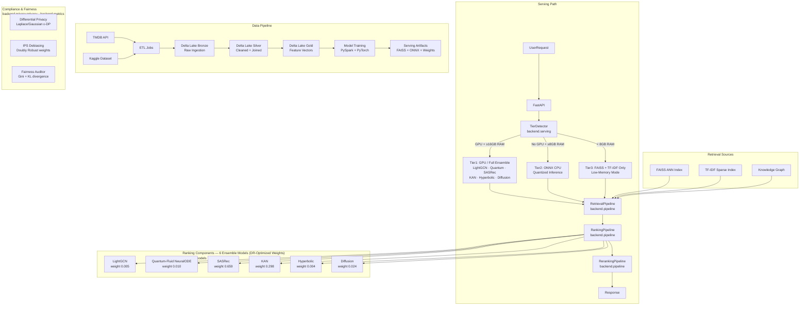

# APEX — Open-Source Movie Recommendation System
> Recommendation engine · FastAPI · React 19 · TypeScript · PyTorch · FAISS · Semantic search · Vector search · Docker · Prometheus · Grafana

<div align="center">


<p>
  <a href="https://github.com/pavanpajjuri/Movie-Recommendation-System/stargazers"></a>
  <a href="https://github.com/pavanpajjuri/Movie-Recommendation-System/network/members"></a>
  <a href="https://github.com/pavanpajjuri/Movie-Recommendation-System/commits/main"></a>
  <a href="LICENSE"></a>
</p>
<p>
  
  
  
  
  
  
</p>
<p>
  <a href="docs/INSTALLATION.md"><strong>Install Locally</strong></a> &middot;
  <a href="docs/QUICKSTART.md"><strong>API Quickstart</strong></a> &middot;
  <a href="docs/API_REFERENCE.md"><strong>API Reference</strong></a> &middot;
  <a href="docs/ARCHITECTURE.md"><strong>Architecture</strong></a> &middot;
  <a href="DEPLOYMENT.md"><strong>Deployment</strong></a>
</p>
</div>


An open-source movie recommendation system and recommendation engine built with FastAPI, React, TypeScript, PyTorch, and FAISS.

It combines a recommendation API, semantic search, vector search, offline evaluation, and full-stack ML engineering patterns in a single portfolio-grade repository.

Built as a production-style reference project for movie recommendations, recommender systems, recommendation APIs, and applied ML engineering workflows.

## Highlights

- FastAPI API for recommendations, search, health, and platform endpoints
- React + TypeScript frontend
- Offline evaluation pipeline with benchmark reporting
- Backend and frontend automated tests
- Docker Compose setup with Prometheus and Grafana
- Deployment configs for local, Docker, and hosted environments

## Project Status

This repository includes both fully working local components and reference-style architecture for advanced serving, online learning, and platform integrations.

The default local workflow focuses on the core API, frontend, and recommendation artifacts.

## What Works End-To-End Today

- run the FastAPI backend locally
- run the React frontend locally
- query recommendation and semantic search endpoints
- generate natural-language explanations when `OPENROUTER_API_KEY` is configured
- run backend and frontend automated tests
- launch the local observability stack with Docker Compose

```bash
# Clone and run locally (see Quick Start below)
git clone https://github.com/pavanpajjuri/Movie-Recommendation-System.git
cd Movie-Recommendation-System
pip install -r requirements.txt
uvicorn backend.main:app --host 0.0.0.0 --port 8000

# Then call the API
curl "http://localhost:8000/v1/recommendations/id/550?n=10&explain=true"
```

> **Getting Started:** Use the [Installation Guide](docs/INSTALLATION.md) for local setup, the [API Quickstart](docs/QUICKSTART.md) for example requests, or [DEPLOYMENT.md](DEPLOYMENT.md) for hosted environments.

---

## Why This Project Stands Out

| Capability | This project | Typical recommendation demo |
|---|:---:|:---:|
| FastAPI API plus React frontend | ✅ | ⚠️ often API-only |
| Semantic search and vector search | ✅ | ⚠️ often one retrieval path |
| Offline evaluation and model documentation | ✅ | ❌ |
| Observability with Prometheus and Grafana | ✅ | ❌ |
| Docker and hosted deployment configs | ✅ | ⚠️ limited |
| Backend and frontend automated tests | ✅ | ⚠️ partial |
| Architecture docs and package-level documentation | ✅ | ❌ |

---

## Architecture Summary

The system combines:

- a FastAPI serving layer
- retrieval, ranking, and reranking pipelines
- offline artifact generation and evaluation
- optional advanced modules for observability, online learning, and multi-tier serving

For the full design, see [docs/ARCHITECTURE.md](docs/ARCHITECTURE.md).

## Quick Start

### Requirements

- Python 3.11+
- Node.js 20+
- `pip`
- TMDB API key for metadata-backed features

### Optional

- OpenRouter API key for natural-language recommendation explanations
- Redis for caching and real-time state features

### 1. Clone and install

```bash
git clone https://github.com/pavanpajjuri/Movie-Recommendation-System.git
cd Movie-Recommendation-System

python -m venv venv
# Windows
venv\Scripts\activate
# macOS / Linux
# source venv/bin/activate

pip install -r requirements.txt
```

### 2. Configure environment

Create a `.env` file in the project root:

```ini
TMDB_API_KEY=your_tmdb_key_here
JWT_SECRET_KEY=generate_a_strong_random_secret
OPENROUTER_API_KEY=your_openrouter_key_here
REDIS_URL=redis://localhost:6379/0
```

### 3. Build recommendation artifacts

```bash
python scripts/rebuild_serving_artifacts.py
```

Skip this step if artifacts already exist.

### 4. Run the backend

```bash
uvicorn backend.main:app --host 0.0.0.0 --port 8000 --reload
```

### 5. Run the frontend

```bash
cd frontend
npm install
npm run dev
```

---

## Core API Endpoints

| Endpoint | Method | Description |
|----------|--------|-------------|
| `/v1/recommendations/id/{movie_id}` | `GET` | Recommend related movies from a movie ID |
| `/v1/recommendations/visually-similar/{movie_id}` | `GET` | Return visually similar movie recommendations |
| `/v1/recommendations/knowledge-graph/{movie_id}` | `GET` | Return graph-based recommendation results |
| `/v1/search/semantic` | `GET` | Perform semantic search across the catalog |

*Append `?explain=true` to supported recommendation endpoints to generate natural-language explanations when `OPENROUTER_API_KEY` is configured.*

---

## Evaluation Snapshot

Current offline benchmark:

- `HR@10 = 0.785`
- `NDCG@10 = 0.542`

Evaluation protocol:

- leave-one-out evaluation
- 200 sampled users
- 100 candidate items per user

See [docs/MODEL_CARDS.md](docs/MODEL_CARDS.md) for model details, benchmark context, and limitations.

---

<details>
<summary>Architecture Diagram</summary>



</details>

---

## 🚀 Deployment Tiers

APEX auto-detects hardware at startup and selects the appropriate serving tier. The live demo runs in **Tier 3** (free Render plan), and higher-capability tiers require a paid plan.

| Tier | Plan | Profile | Active Models | Latency |
|------|------|---------|---------------|---------|
| **Tier 1** | Paid (GPU) | `full` | 6-model ensemble + RL + Active Inference | 50–200 ms |
| **Tier 2** | Paid (CPU) | `full` | ONNX-accelerated ensemble | 200–800 ms |
| **Tier 3** | Free | `lite` | FAISS + TF-IDF only | 800–2000 ms |

### Live Demo (Current: Tier 3)

The Render deployment uses `plan: free` with `NOVA_SERVING_PROFILE=lite`, which activates Tier 3 (degraded mode). This is intentional for cost reasons, and the project is structured to support all three tiers.

### Upgrading to Tier 1 or Tier 2

To enable the full ensemble on a paid Render plan, update `render.yaml`:

```yaml
# Tier 2 (CPU ONNX — Standard plan)
envVars:
  - key: NOVA_SERVING_PROFILE
    value: full
  - key: NOVA_SERVING_TIER
    value: tier2

# Tier 1 (GPU — Pro plan with GPU instance)
envVars:
  - key: NOVA_SERVING_PROFILE
    value: full
  - key: NOVA_SERVING_TIER
    value: tier1
```

---

## Fairness And Compliance Tooling

APEX includes fairness, privacy, and evaluation-related components intended to support safer recommendation workflows.

These components are designed to help with:

1. popularity-bias analysis
2. calibration and distribution checks
3. recommendation safety constraints

---

## Observability And Monitoring

APEX ships a complete production observability stack that starts automatically with `docker compose up`.

### Prometheus + Grafana

| Service | URL | Credentials |
|---|---|---|
| Prometheus | http://localhost:9090 | — |
| Grafana | http://localhost:3000 | admin / admin |

The **APEX Overview** dashboard is provisioned automatically and shows:
- Request rate, error rate, and p50/p95/p99 latency per endpoint
- SLO burn rate for recommendations (<25s p95) and search (<2.5s p95)
- Real-time error rate gauge with 1%/3% threshold coloring

### Alerting Rules (`prometheus.rules.yml`)

| Alert | Condition | Severity |
|---|---|---|
| `HighErrorRate` | 5xx rate > 3% for 2 min | critical |
| `RecommendationLatencyHigh` | rec p95 > 25s for 3 min | warning |
| `SearchLatencyHigh` | search p95 > 2.5s for 3 min | warning |
| `NoTraffic` | 0 requests for 10 min | warning |
| `RecommendationEndpointErrors` | rec 5xx > 0.01/s for 2 min | critical |

### In-Process SLO Tracking

Every request is tracked by `RequestSloTracker` in `backend/slo.py`. The `/v1/platform/slo` endpoint returns the current SLO window (error rate, p95 latency, request counts per route) without requiring Prometheus.

### Sentry Error Monitoring

Set `SENTRY_DSN` in `.env` to enable full error tracking with stack traces, performance profiling, and release tracking. Gracefully disabled when not configured.

---

## 🧪 Testing

APEX maintains a rigorous testing suite covering neural network bounds, safety constraints, mathematical normalization, and offline replay evaluation.

```bash
python -m pytest backend/tests/ tests/ -v
```

---

## 🧬 Mutation Testing

APEX uses [mutmut](https://mutmut.readthedocs.io/) to verify that property-based tests actually detect logic errors in the serving tier and ONNX engine modules. A weekly GitHub Actions workflow runs this automatically.

To run locally:

```bash
pip install mutmut
mutmut run --paths-to-mutate backend/serving/serving_tier.py,backend/serving/onnx_engine.py
mutmut results
```

The weekly CI workflow (`.github/workflows/mutation-tests.yml`) runs every Monday at 10:00 UTC and prints the mutation score automatically.

---
*Built as a reference architecture for production-style applied AI engineering.*

---

## 📚 Documentation Index

| Document | Description |
|---|---|
| [CONTRIBUTING.md](CONTRIBUTING.md) | Local setup, code standards, PR process, adding new ML models |
| [DEPLOYMENT.md](DEPLOYMENT.md) | Full deployment guide — Render, Cloudflare Pages, Docker Compose, env vars |
| [CHANGELOG.md](CHANGELOG.md) | Version history and breaking changes |
| [docs/API_REFERENCE.md](docs/API_REFERENCE.md) | Complete API endpoint reference with request/response schemas |
| [docs/API_CHANGELOG.md](docs/API_CHANGELOG.md) | API version history and deprecation notices |
| [docs/openapi.json](docs/openapi.json) | Machine-readable OpenAPI 3.1 spec (52 endpoints, 19 schemas) |
| [docs/swagger-ui.html](docs/swagger-ui.html) | Static Swagger UI — browse the full API without running the server |
| [docs/MODEL_CARDS.md](docs/MODEL_CARDS.md) | Model cards for all 6 ensemble models (architecture, metrics, online learning, limitations) |
| [docs/ONLINE_LEARNING.md](docs/ONLINE_LEARNING.md) | Online learning coordinator — SASRec + KAN + LightGCN live feedback loop |
| [docs/ARCHITECTURE_DECISIONS.md](docs/ARCHITECTURE_DECISIONS.md) | Architecture Decision Records (ADRs 001–010) — why the system is built this way |
| [docs/ARCHITECTURE.md](docs/ARCHITECTURE.md) | High-level system architecture overview |
| [docs/PACKAGE_STRUCTURE.md](docs/PACKAGE_STRUCTURE.md) | Complete module map, subpackage API surfaces, contribution guide |
| [docs/ENTERPRISE_GUIDE.md](docs/ENTERPRISE_GUIDE.md) | Multi-tenancy, B2B SaaS features, and enterprise deployment |
| [docs/APEX_WHITEPAPER.md](docs/APEX_WHITEPAPER.md) | Technical whitepaper — full system design and research context |
| [docs/TROUBLESHOOTING.md](docs/TROUBLESHOOTING.md) | Common issues and diagnostic runbook |
| [frontend/README.md](frontend/README.md) | Frontend setup, test coverage, deployment |
