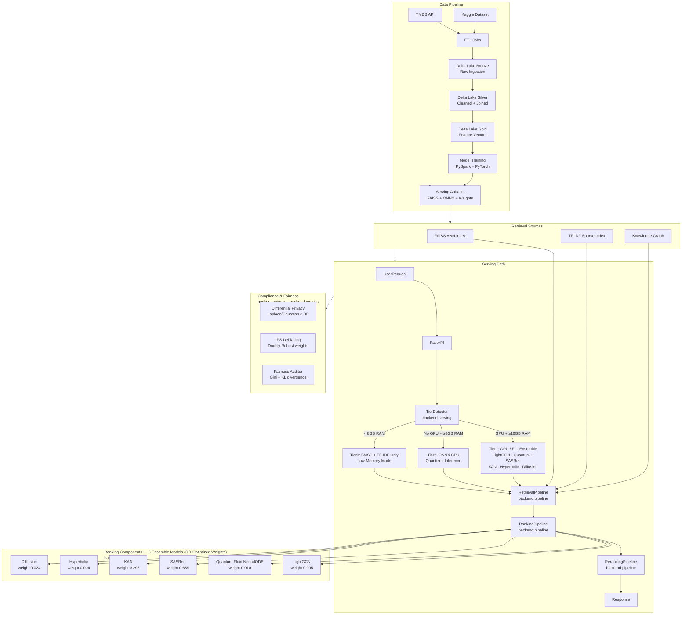

# 🎬 APEX — Enterprise-Grade Causal Recommendation Engine & Serving Platform

> A high-performance, real-time recommendation engine combining sequential Transformers (SASRec), learnable edge networks (KAN), and graph collaboration (LightGCN) with causal popularity debiasing.

<div align="center">


<br/>

<p align="center">
  <a href="https://github.com/pavanbadempet/Movie-Recommendation-System/actions/workflows/ci.yml"></a>
  <a href="https://github.com/pavanbadempet/Movie-Recommendation-System/actions/workflows/secrets-scan.yml"></a>
  <a href="https://github.com/pavanbadempet/Movie-Recommendation-System/actions/workflows/serving-quality.yml"></a>
  <br/>
  <a href="LICENSE"></a>
  <a href="https://github.com/pavanbadempet/Movie-Recommendation-System/stargazers"></a>
</p>

<h3>
  <a href="#-quick-start"><strong>Quick Start Guide</strong></a> &middot;
  <a href="#-core-features"><strong>Core Features</strong></a> &middot;
  <a href="#-core-engineering-guarantees"><strong>System Guarantees</strong></a> &middot;
  <a href="#-core-technical-architecture"><strong>Architecture Design</strong></a> &middot;
  <a href="#-model-evaluation-registry"><strong>Model Evaluation Registry</strong></a> &middot;
  <a href="#-api-contract-reference"><strong>REST API Contract</strong></a>
</h3>

</div>


## 🚀 Why APEX?

Most recommendation system tutorials teach you how to train a model in a Jupyter notebook, but leave out the hard part: **how to serve it in production**.

**APEX** is a complete, production-ready recommender engine. It combines **6 complementary ML architectures** into an ensemble that dynamically scales from free CPU servers to high-performance GPU instances. It integrates a **real-time streaming feedback loop** that updates candidate features instantly, and uses **causal debiasing** to ensure users discover new long-tail content, not just blockbusters.

The codebase is engineered to demonstrate **production-grade ensembling and serving patterns**: hardware-aware model tiering at startup, low-latency SIMD vector indexes, differential privacy guarantees, PySpark Delta Lake Medallion ETL, and counterfactual policy evaluation.


## ⚡ Core Features

<table>
<tr>
<td width="33%" valign="top">

### 🤖 6-Model Ensemble
LightGCN (Graph), SASRec (Transformer), KAN (Kolmogorov-Arnold), Quantum-Fluid (Neural ODE), Hyperbolic, and Generative Latent Diffusion models.

</td>
<td width="33%" valign="top">

### ⚡ Dynamic Hardware Tiers
Auto-detects memory and hardware capabilities at startup: Tier 1 (Full GPU Ensemble) vs. Tier 2 (ONNX CPU) vs. Tier 3 (FAISS/TF-IDF lite).

</td>
<td width="33%" valign="top">

### 🔄 Streaming Feedback Loop
Clickstream rating feeds are ingested asynchronously. Sequential candidate vectors are updated in real-time without batch DB rebuilds.

</td>
</tr>
</table>


## ⚡ Core Engineering Guarantees

### 1. Low-Latency Serving & Hardware-Aware Tiering
* **Adaptive Compute Fallbacks**: The startup routine ([backend/serving/serving_tier.py](backend/serving/serving_tier.py)) automatically profiles available memory and GPU hardware to map runtime execution into three optimized operational tiers:
  * **Tier 1 (GPU Ensembling)**: Standard PyTorch execution of the complete 6-model ensemble.
  * **Tier 2 (Quantized ONNX CPU)**: Converts sequential/deep models to quantized ONNX formats for low-latency CPU inference.
  * **Tier 3 (SIMD Vector Indexing)**: Deploys a lightweight, fast-retrieval index using in-memory vector indexes (`turbovec` SIMD) and TF-IDF cache fallbacks for minimal memory footprints (<4GB RAM).

### 2. Causal Debiasing & Unbiased Evaluation
* **Doubly Robust (DR) Estimator**: Counters natural selection and popularity bias (inflated blockbuster discovery) using Inverse Propensity Score (IPS) weighting and a direct reward predictor:
  
  $$V_{DR}(\pi) = \frac{1}{n} \sum_{i=1}^n \left[ \hat{r}(x_i, a_i) + \frac{(r_i - \hat{r}(x_i, a_i)) \cdot \pi(a_i|x_i)}{p(a_i|x_i)} \right]$$
  
  where $\hat{r}$ is the direct reward prediction model, $r_i$ is observed feedback, $p(a_i|x_i)$ is logging policy propensity, and $\pi(a_i|x_i)$ is the target recommendation policy.
* **Simplex Weight Selection**: Simulates 200 random ensemble weight candidates on the Dirichlet 6-simplex to pick the combination optimizing the debiased DR metric.

### 3. Asynchronous Real-Time Feedback Loop
* **Event Coordinated Updates**: Rating and click actions are written to a message store, where the `OnlineLearningCoordinator` pushes updates to models asynchronously, updating sequence history vectors and KAN weights instantly without full batch model rebuilds.
* **State Sync**: Clickstream features are immediately compiled into the user behavior profile cache, keeping recommendations contextually relevant to the active browsing session.

### 4. Differential Privacy & Auditing
* **$\epsilon$-Differential Privacy ($\epsilon$-DP)**: Implements calibrated Laplace noise injection during aggregation to protect sensitive user watch profiles and clickstreams from membership inference or database reconstruction attacks.
* **Fairness & Gini Metrics**: Periodic evaluation computes Gini coefficients and KL-divergence over demographic recommendations to audit and prevent systemic catalog coverage bias.


## 🏗 Core Technical Architecture




## 🔬 Model Evaluation Registry

For comprehensive training hyperparameters and offline benchmarks, see [`docs/MODEL_CARDS.md`](docs/MODEL_CARDS.md).

| Model | HR@10 | NDCG@10 | DR-Optimized Weight | Paradigm |
| :--- | :---: | :---: | :---: | :--- |
| **Ensemble** | **0.785** | **0.542** | — | Weighted blend |
| [SASRec](backend/models/sasrec.py) | 0.761 | 0.520 | **0.659** | Sequential Transformer |
| [KAN](backend/models/kan_ranker.py) | 0.694 | 0.439 | **0.298** | Kolmogorov-Arnold Network |
| [LightGCN](backend/models/lightgcn.py) | 0.672 | 0.411 | **0.005** | Graph Collaborative Filtering |
| [Diffusion](backend/models/diffusion_recommender.py) | 0.521 | 0.309 | **0.024** | Generative Latent Diffusion |
| [Quantum-Fluid](backend/models/neural_ode_recommender.py) | 0.583 | 0.354 | **0.010** | Neural ODE + Complex Embeddings |
| [Hyperbolic](backend/models/hyperbolic_recommender.py) | 0.498 | 0.287 | **0.004** | Poincaré Ball Manifold |

*Note: Evaluation metrics are updated dynamically. Run the ablation evaluation script `python scripts/run_ablation.py` to regenerate results with fresh datasets.*


## ⚖ Causal Debiasing & Unbiased Evaluation

Standard recommendations suffer from **popularity bias**—inflating scores for blockbusters at the expense of niche content. APEX integrates an **Inverse Propensity Score (IPS)** and a **Doubly Robust (DR) Estimator** to optimize ensemble weights.

### Propensity Corrections
A blockbuster movie $a$ might receive high click volume simply because it is featured on the home page. The logging policy propensity $p(a|x)$ measures the probability of displaying item $a$ to user $x$. To counter this, the Doubly Robust estimator adjusts predictions using the propensity:

$$V_{DR}(\pi) = \frac{1}{n} \sum_{i=1}^n \left[ \hat{r}(x_i, a_i) + \frac{(r_i - \hat{r}(x_i, a_i)) \cdot \pi(a_i|x_i)}{p(a_i|x_i)} \right]$$

### Worked Propensity Correction Example
Suppose we want to evaluate a target recommendation policy $\pi$ on three items with different popularity characteristics:

1. **Popular Blockbuster**: High logged propensity ($p(a_1|x) = 0.8$). It receives a click ($r_1 = 1$), and the reward model predicts high relevance ($\hat{r}(x, a_1) = 0.9$). 
   $$\text{DR Score}(a_1) = 0.9 + \frac{(1 - 0.9) \cdot 1.0}{0.8} = 0.9 + 0.125 = 1.025$$
2. **Niche Indie**: Low logged propensity ($p(a_2|x) = 0.05$). It receives a click ($r_2 = 1$) because a user actively sought it out. The reward model predicted moderate relevance ($\hat{r}(x, a_2) = 0.5$).
   $$\text{DR Score}(a_2) = 0.5 + \frac{(1 - 0.5) \cdot 1.0}{0.05} = 0.5 + 10.0 = 10.500$$

Without propensity corrections, the blockbuster dominates. With DR-IPS, the Niche Indie receives a massive correction boost, reflecting its high true utility relative to its poor exposure in the training logs.


## 📈 Multi-Factor Re-ranking & MMR Diversity

### Re-ranking Boost Factors
APEX applies heuristic boosts to candidate items to maintain topical diversity and user engagement:

| Factor | Boost Weight | Description |
| :--- | :---: | :--- |
| **Franchise Match** | `+0.25` | Boosts sequels or franchises (e.g. Avatar -> Avatar 2). |
| **Director Match** | `+0.10` | Stylistic consistency boost. |
| **Same Era** | `+0.03` | Boosts films released within 5 years of target. |
| **Quality** | `+0.02` | Vote rating confidence factor. |
| **Genre Mismatch** | `-0.15` | Penalizes candidates sharing zero genres with history. |

### MMR Diversity Logic
The Maximal Marginal Relevance (MMR) stage balances relevance (similarity to search query/user profile) against diversity (redundancy compared to items already recommended):

$$\text{MMR} = \arg\max_{D_i \in R \setminus S} \left[ \lambda \cdot \text{Sim}_1(D_i, Q) - (1 - \lambda) \max_{D_j \in S} \text{Sim}_2(D_i, D_j) \right]$$

where:
* $R$ is the set of initial recommendations.
* $S$ is the set of selected items in the output basket.
* $\text{Sim}_1$ is the query similarity score.
* $\text{Sim}_2$ is the pairwise cross-item similarity score.
* $\lambda = 0.7$ controls the balance (70% relevance vs. 30% diversity).


## 📁 Project Structure Tree

```
Movie-Recommendation-System/
├── .github/workflows/       # 4 CI/CD pipelines (Backend, Secrets, linting)
├── backend/                 # FastAPI REST Backend
│   ├── main.py              # Application entry, Middleware & Route registration
│   ├── recommender.py       # Core retrieval & ensembling pipeline
│   ├── schemas.py           # Pydantic Request/Response models
│   ├── models/              # Ensemble ML models (SASRec, KAN, LightGCN, ODE)
│   ├── learning/            # Online learning coordinator & learner instances
│   ├── metrics/             # HR@10, NDCG@10 & Causal DR-IPS implementations
│   ├── serving/             # Hardware profiling & tiering selector
│   ├── privacy/             # Laplace & Gaussian Differential Privacy (ε-DP)
│   └── database/            # SQLAlchemy database configurations
├── docs/                    # Architecture whitepapers, ADRs, compliance runbooks
├── etl/                     # Delta Lake Medallion Pipelines (Bronze/Silver/Gold)
├── frontend/                # Vite React SPA cinema portal
├── scripts/                 # Ingestion & training scripts
└── tests/                   # Pytest suite (~59 unit/integration files)
```


## ⚙ Environment Configuration Reference

| Variable | Type | Default | Purpose |
| :--- | :---: | :---: | :--- |
| `TMDB_API_KEY` | string | — | TMDB API Key for metadata fetching (trailers, posters). |
| `JWT_SECRET_KEY` | string | — | JWT token verification key. |
| `OPENROUTER_API_KEY` | string | — | API key for LLM explanations (OpenRouter). |
| `REDIS_URL` | string | `redis://localhost:6379/0` | Cache connection string for session clickstreams. |
| `DATABASE_URL` | string | `sqlite:///./nova_db.sqlite3` | SQLite/Postgres connection string. |


## ⚡ Quick Start

### Option A: Launch with Docker Compose
Launches the complete service container stack (FastAPI backend + React frontend + Redis) in a single command:
```bash
git clone https://github.com/pavanbadempet/Movie-Recommendation-System.git
cd Movie-Recommendation-System
cp .env.example .env          # Update TMDB_API_KEY & JWT secret key
docker compose up --build
```

### Option B: Local Developer Mode
```bash
# Clone the repository
git clone https://github.com/pavanbadempet/Movie-Recommendation-System.git
cd Movie-Recommendation-System

# Set up python dependencies
python -m pip install -r requirements.txt
cp .env.example .env

# Build serving vector embeddings and FAISS indices
python scripts/rebuild_serving_artifacts.py

# Start FastAPI backend (Terminal 1)
uvicorn backend.main:app --host 127.0.0.1 --port 8000 --reload

# Start React client (Terminal 2)
cd frontend
npm install
npm run dev
```

| Service | Access URL |
| :--- | :--- |
| **Cinema Portal** | [http://127.0.0.1:3000](http://127.0.0.1:3000) |
| **REST API Server** | [http://127.0.0.1:8000](http://127.0.0.1:8000) |
| **Interactive API Documentation** | [http://127.0.0.1:8000/docs](http://127.0.0.1:8000/docs) |


## 📡 API Contract Reference

| Method | Endpoint | Description | Sample Query Parameters / Payload |
| :---: | :--- | :--- | :--- |
| `GET` | `/v1/recommendations/id/{movie_id}` | Content-based collaborative recommendation query. | `?n=10&explain=true` |
| `GET` | `/v1/recommendations/visually-similar/{movie_id}` | Visual similarity recommendations via CLIP embeddings. | `?n=5` |
| `GET` | `/v1/recommendations/knowledge-graph/{movie_id}` | Graph-based structural recommendations. | `?n=10` |
| `GET` | `/v1/search` | Fast catalog keyword search. | `?q=inception` |
| `GET` | `/v1/search/ai` | Vector semantic search over catalog embeddings. | `?q=sci-fi space exploration` |
| `POST`| `/v1/events` | Ingests clickstream actions (clicks/ratings) for online learner. | `{"user_id": 1, "movie_id": 550, "event_type": "rating", "rating": 5.0}` |

*Append `?explain=true` to recommendation endpoints to generate natural-language explanations powered by LLMs.*


## 📂 Key Modules Directory

| Capability | Purpose | Module |
| :--- | :--- | :--- |
| **Ensemble Inference** | Combines 6 model predictions using DR-IPS weights. | [backend/models/ensemble_engine.py](backend/models/ensemble_engine.py) |
| **Online Learner** | Orchestrates real-time model parameter updates. | [backend/learning/online_learning_coordinator.py](backend/learning/online_learning_coordinator.py) · [backend/learning/online_learner.py](backend/learning/online_learner.py) |
| **Causal Debiasing** | Optimizes ensemble weights under selection bias using DR-IPS. | [scripts/causal_debias_training.py](scripts/causal_debias_training.py) · [backend/metrics/debiased_metrics.py](backend/metrics/debiased_metrics.py) |
| **Differential Privacy** | Adds calibrated noise to gradients to protect user interaction histories. | [backend/privacy/privacy.py](backend/privacy/privacy.py) · [backend/privacy/privacy_preserving_ml.py](backend/privacy/privacy_preserving_ml.py) |
| **Hardware-Aware Tiering** | Selects optimal execution plans dynamically at boot time. | [backend/serving/serving_tier.py](backend/serving/serving_tier.py) |
| **Ablation Evaluation** | Runs reproducible leave-one-out benchmarks across all models. | [scripts/run_ablation.py](scripts/run_ablation.py) · [backend/metrics/evaluation.py](backend/metrics/evaluation.py) |
| **ETL Data Pipeline** | Delta Lake Medallion Architecture (Bronze/Silver/Gold). | [scripts/pyspark_medallion_pipeline.py](scripts/pyspark_medallion_pipeline.py) |


## 🧪 Verification & Coverage Suite

All tests must pass in CI before merging. We enforce strict regression gates for pull request approvals.

```bash
# Run the complete backend test suite
python -m pytest tests/ -v

# Run the frontend unit tests
npm --prefix frontend run test
```


## ❓ FAQ

**Q1: How does the 6-model ensemble combine predictions?**  
The ensemble applies a weighted average to the predicted probabilities of each model (SASRec, KAN, LightGCN, Quantum, Hyperbolic, Diffusion). The weights are derived dynamically using the Doubly Robust estimator.

**Q2: What happens if a machine doesn't have a GPU?**  
APEX profiles the hardware at startup. If no CUDA device is present or RAM is under 8GB, it falls back to Tier 2 (quantized ONNX CPU models) or Tier 3 (FAISS index + sparse TF-IDF) to protect memory from overflow.

**Q3: How does the real-time feedback loop update model weights?**  
Rating events are consumed asynchronously by the `OnlineLearningCoordinator` to update user session history vectors instantly. The KAN ranker weights are updated incrementally via mini-batch SGD.

**Q4: How does Differential Privacy protect user watch history?**  
We apply calibrated Laplace noise to model gradient calculations and aggregate interaction vectors. This provides a mathematical guarantee ($\epsilon$-DP) that individual watch events cannot be inferred by comparing database states.

**Q5: What datasets are used for model training?**  
APEX uses the TMDB Movie Dataset (v11) combined with public MovieLens ratings (over 1M+ user interactions).

**Q6: What is a Kolmogorov-Arnold Network (KAN) model doing here?**  
We use KAN for tabular feature ranking, replacing traditional MLPs. KAN uses learnable 1D B-spline activation functions on edges, achieving superior convergence rates and interpretability for collaborative signals.

**Q7: Can I run this offline?**  
Yes. Option B local development mode runs fully offline. The only cloud dependencies are TMDB metadata (for poster fetching) and OpenRouter (for recommendation explanations), both of which have local mock fallbacks.

**Q8: How does the Quantum-Fluid Neural ODE model work?**  
It models continuous-time collaborative filtering. It treats user interest evolution as a continuous neural ODE trajectory moving through a complex Hilbert space manifold.

**Q9: How do I run a new ablation study?**  
Run `python scripts/run_ablation.py --users 200 --candidates 100`. The script will output per-model metrics and compile them to `docs/ABLATION_RESULTS.md`.

**Q10: Why Poincaré ball manifolds (Hyperbolic Embeddings)?**  
Hyperbolic spaces have exponential volume growth, making them mathematically optimal for embedding hierarchical structures like movie genre graphs without spatial distortion.


## 📚 Related Resources

- [FastAPI Framework Web Site](https://fastapi.tiangolo.com/) — Web framework powering APEX's REST endpoints
- [Sentence Transformers Library](https://www.sbert.net/) — Semantic representations for recommendations and search
- [FAISS Vector Index Repository](https://github.com/facebookresearch/faiss) — Library for efficient similarity search of dense vectors
- [Delta Lake Engine Documentation](https://delta.io/) — Lakehouse storage layer for data pipelines


## 🤝 Contributing

Contributions are welcome — bug fixes, model enhancements, pipelines, or test improvements.

Read [CONTRIBUTING.md](CONTRIBUTING.md) and [CODE_OF_CONDUCT.md](CODE_OF_CONDUCT.md). Follow [`AGENTS.md`](AGENTS.md) — the canonical instruction file for all code changes.

```bash
python -m pytest tests/ -v
npm --prefix frontend run test
```

<a href="https://github.com/pavanbadempet/Movie-Recommendation-System/graphs/contributors">
  
</a>

<details>
<summary><strong>Star History</strong></summary>
<p align="center">
  <a href="https://star-history.com/#pavanbadempet/Movie-Recommendation-System&Date">
    
  </a>
</p>
</details>


## 📄 License

MIT License — Copyright © 2026 **Pavan Badempet**. See [LICENSE](LICENSE) for details.

---

<details>
<summary><strong>🔍 SEO Metadata, Search Keywords & Indexing Terms</strong></summary>

### Primary Keywords
- **Causal Recommender Engine**: Popularity bias mitigation, Doubly Robust (DR) estimation, Inverse Propensity Score (IPS) counterfactual weight selection.
- **Deep Learning Architectures**: Sequential Transformer (SASRec), Kolmogorov-Arnold Network (KAN) tabular ranking, Graph Collaborative Filtering (LightGCN), Poincaré ball manifolds (Hyperbolic Embeddings), Quantum-Fluid Neural ODEs, Generative Latent Diffusion models.
- **Data Engineering & Lakehouse**: PySpark medallion architecture (Bronze/Silver/Gold Delta Lake layers), ETL pipelines, real-time streaming feedback loop, FAISS similarity index, vector search.
- **Low-Latency Serving**: Hardware-aware compute fallbacks (GPU PyTorch, Quantized ONNX CPU, in-memory turbovec SIMD search).

### Search Phrases
`open source movie recommendation system`, `causal debiasing counterfactual policy evaluation`, `sasrec transformer recommendation engine python`, `kan kolmogorov-arnold network recommendation`, `hyperbolic embeddings poincare ball graph`, `pyspark medallion delta lake pipeline`, `onnx runtime low latency cpu serving`, `turbovec rust simd vector database search`, `fairness audits gini coefficient recommender`.
</details>

<div align="center">

### **If you find this project useful, give it a ⭐ star!**

</div>
