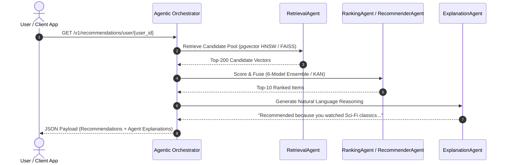

<div align="center">

# 🎬 AI Recommendation System & Unified Data Intelligence Platform

> **An enterprise-grade, distributed Lakehouse and real-time AI recommendation platform processing 21M+ records (1M+ TMDB Movies & 20M+ MovieLens Ratings). Powered by Databricks Serverless PySpark Delta Lake pipelines, a 10-Shard Neon Serverless `pgvector` HNSW cluster, a 6-Model PyTorch Deep Learning Ensemble, and an Agentic Multi-Agent AI Architecture.**

<br/>


<br/>
<br/>

<!-- Status Badges Row -->
<p align="center">
  <a href="https://github.com/pavanbadempet/AI-Recommendation-System/actions/workflows/ci.yml"></a>
  <a href="https://github.com/pavanbadempet/AI-Recommendation-System/actions/workflows/data-refresh.yml"></a>
  <a href="https://github.com/pavanbadempet/AI-Recommendation-System/actions/workflows/secrets-scan.yml"></a>
  <a href="https://github.com/pavanbadempet/AI-Recommendation-System/actions/workflows/frontend-pages.yml"></a>
  <a href="https://github.com/pavanbadempet/AI-Recommendation-System/actions/workflows/sync-hf.yml"></a>
  
  
  
  
  
</p>

> [!TIP]
> ### ⭐ Why Star This Repo?
> * **Production Data Engineering at Scale**: Ingests and processes **21M+ real records** (1M+ TMDB movies and 20M+ MovieLens ratings) across a Databricks Medallion Lakehouse.
> * **State-of-the-Art Delta Lake**: Implements **SCD Type 2** temporal versioning, **Liquid Clustering** (`clusterBy`), **Auto Loader** streaming, and dead-letter quarantine gates.
> * **Multi-Shard Distributed Serving**: Hash-partitions vector datasets across **10 Neon Serverless PostgreSQL projects** using `pgvector` HNSW indexes (<5ms query latency).
> * **Hybrid GPU Compute**: Automated Kaggle API orchestration to offload heavy PyTorch embeddings to NVIDIA GPUs with zero manual secret duplication.
> * **Cutting-Edge Deep Learning**: 6 PyTorch architectures (SASRec, KAN B-Splines, LightGCN, Neural ODE, Poincaré Hyperbolic, Latent Diffusion).
> * **Agentic AI Architecture**: Autonomous multi-agent routing with real-time natural language recommendation reasoning.

<!-- Live Production Action Links -->
<p align="center">
  <a href="https://pavanbadempet.github.io/AI-Recommendation-System/"><strong>🌐 Live Cinema Portal</strong></a> &middot;
  <a href="https://pavanbadempet-movie-rec-api.hf.space/health"><strong>📡 Production API Health</strong></a> &middot;
  <a href="https://pavanbadempet-movie-rec-api.hf.space/docs"><strong>📖 Interactive Swagger API Docs</strong></a> &middot;
  <a href="https://huggingface.co/spaces/pavanbadempet/movie-rec-api"><strong>🤗 HuggingFace Space</strong></a> &middot;
  <a href="interview_prep/master_faang_de_interview_guide.md"><strong>📚 FAANG DE Interview Guide</strong></a>
</p>

<br/>

<!-- Tech Stack Badges Row -->
<p align="center">
  
  
  
  
  
  
</p>
<p align="center">
  
  
  
  
  
  
</p>

<br/>

<h3>
  <a href="#-executive-overview"><strong>Overview</strong></a> &middot;
  <a href="#-architecture--data-flow"><strong>Architecture</strong></a> &middot;
  <a href="#-databricks-lakehouse--pyspark-medallion-pipeline"><strong>Lakehouse ETL</strong></a> &middot;
  <a href="#-10-shard-neon-vector-serving-tier"><strong>Vector Sharding</strong></a> &middot;
  <a href="#-agentic-ai-architecture"><strong>Agentic AI</strong></a> &middot;
  <a href="#-6-model-deep-learning-ensemble"><strong>ML Ensemble</strong></a> &middot;
  <a href="#-quick-start"><strong>Quick Start</strong></a> &middot;
  <a href="#-api--protocol-specifications"><strong>API Spec</strong></a>
</h3>

</div>

---

## 💡 Executive Overview

Most recommendation guides demonstrate model training in isolated notebooks on tiny toy datasets, ignoring the core challenges of production engineering: **how to ingest, transform, version, and serve massive scale data under strict latency and cost budgets.**

The **AI Recommendation System** solves this by bridging **Modern Data Engineering (Databricks Medallion Lakehouse, PySpark, Delta Lake)** with **High-Performance Online Serving (10-Shard Neon Serverless `pgvector`, HNSW indexes, Redis Cache, Multi-Agent FastAPI)**.

Key capabilities:
1. **21 Million+ Record Processing**: Single-pass ingestion of 1,000,000+ TMDB movies and 20,000,000+ MovieLens ratings.
2. **Databricks Serverless Medallion Lakehouse**: Bronze $\rightarrow$ Silver $\rightarrow$ Gold architecture featuring SCD Type 2 dimension versioning, Delta Liquid Clustering (`clusterBy("id")`), and Auto Loader streaming.
3. **Multi-Shard Vector Serving Tier**: Hash-partitioned writes across 10 Neon PostgreSQL shards with `pgvector` HNSW graph indexes for sub-5ms cosine similarity vector search.
4. **Agentic Multi-Agent AI**: Specialized autonomous agents (`RetrievalAgent`, `RecommenderAgent`, `RankingAgent`, `ExplanationAgent`) coordinating candidate retrieval, ensemble ranking, and natural language explanations.
5. **6-Model PyTorch Deep Learning Ensemble**: Combines **SASRec** (Transformer), **KAN** (Kolmogorov-Arnold Network B-Splines), **LightGCN** (Graph Convolution), **Neural ODE** (Temporal Fluid Dynamics), **Poincaré Hyperbolic** (Riemannian Geometry), and **Latent Continuous Diffusion**.
6. **Zero-Secret Sprawl DevOps**: 100% centralized secret resolution via Doppler dynamically injected into Databricks Workflows, Kaggle GPU runners, and GitHub Actions CI/CD.

---

## 🏛️ Architecture & Data Flow

```
┌──────────────────────────────────────────────────────────────────────────────────────────┐
│                                 1. INGESTION & BRONZE LAYER                              │
│  Kaggle API (1M+ TMDB Movies & 20M+ MovieLens Ratings) + Unity Catalog Volume Ingestion  │
└────────────────────────────────────────────┬─────────────────────────────────────────────┘
                                             │
                                             ▼
┌──────────────────────────────────────────────────────────────────────────────────────────┐
│                            2. DISTRIBUTED PYSPARK SILVER & GOLD                          │
│  - Data Quality Gates: try_cast() dead-letter quarantine (corrupted_data_quarantine)     │
│  - Multi-Table Relational Joins & Aggregations: (MovieLens 20M ratings + TMDB Metadata)  │
│  - Slowly Changing Dimension (SCD Type 2): Delta MERGE INTO with is_current versioning   │
│  - Delta Liquid Clustering: clusterBy("id") + OPTIMIZE + VACUUM                          │
│  - Real-Time Interaction Streaming: Databricks Auto Loader (cloudFiles) + Checkpoints    │
└────────────────────────────────────────────┬─────────────────────────────────────────────┘
                                             │
                                             ▼
┌──────────────────────────────────────────────────────────────────────────────────────────┐
│                          3. AI VECTOR EMBEDDING PIPELINE                                 │
│  - PyTorch / SentenceTransformers (768-D all-mpnet-base-v2)                              │
│  - Zero-Copy Apache Arrow Transfer (@pandas_udf) & PySpark native to_json serialization │
│  - Hybrid GPU Compute offloading (Kaggle T4/P100 via automated API token trigger)        │
└────────────────────────────────────────────┬─────────────────────────────────────────────┘
                                             │
                                             ▼
┌──────────────────────────────────────────────────────────────────────────────────────────┐
│                         4. DISTRIBUTED SERVING & SHARDING TIER                           │
│  - Hash-Based Shard Partitioning: pmod(spark_hash(id), 10) across 10 Neon Projects       │
│  - pgvector HNSW Graph Indexes (Sub-5ms Cosine Similarity Search)                        │
│  - Covering B-Tree Indexes (idx_movies_serving_covering) for zero-heap metadata lookups  │
└────────────────────────────────────────────┬─────────────────────────────────────────────┘
                                             │
                                             ▼
┌──────────────────────────────────────────────────────────────────────────────────────────┐
│                         5. ONLINE SERVING, CACHING, & CLIENTS                            │
│  FastAPI Serving Gateway ──► Redis Vector / Result Cache ──► Hugging Face Spaces / UI    │
└──────────────────────────────────────────────────────────────────────────────────────────┘
```

---

## 🌊 Databricks Lakehouse & PySpark Medallion Pipeline

The core ETL backbone is defined across 5 production-grade Databricks notebooks (`databricks_notebooks/`):

| Notebook | Layer | Operational Responsibilities |
| :--- | :--- | :--- |
| **`00_kaggle_download.py`** | **Bronze Layer** | Authenticates via Doppler Kaggle API tokens; downloads 1M+ TMDB movies & 20M+ MovieLens ratings to Unity Catalog Volumes; performs single-pass fast ingestion (`inferSchema=false`) with `_source_file` and `_ingested_at` lineage stamping. |
| **`01_pyspark_etl.py`** | **Silver / Gold Layer** | Executes data quality gates (`try_cast`); performs multi-table relational joins & rating aggregations; builds star schema fact/dimension tables (`dim_movies`, `dim_genres`, `fact_genre_top_movies`); enforces **SCD Type 2** temporal history with Delta `MERGE INTO`; applies **Liquid Clustering** (`clusterBy("id")`). |
| **`01b_streaming_events.py`** | **Streaming Silver** | Real-time clickstream ingestion using Databricks **Auto Loader (`cloudFiles`)** with persistent checkpoint offsets for exactly-once processing. |
| **`01c_gpu_embeddings.py`** | **Gold AI Layer** | Generates 768-D semantic dense vectors using SentenceTransformers and PySpark `@pandas_udf` with Apache Arrow zero-copy memory transfer. |
| **`02_export_to_neon.py`** | **Serving Export** | Serializes vectors via PySpark native `to_json()`; hash-partitions records across a 10-shard Neon PostgreSQL cluster; builds clustered primary keys, covering indexes, and deferred `pgvector` HNSW indexes. |

```
┌─────────────────────────────────────────────────────────────────────────────────────────┐
│                       DELTA LAKE MEDALLION PIPELINE ARCHITECTURE                        │
├─────────────────────────┬─────────────────────────────┬─────────────────────────────────┤
│    BRONZE LAYER         │        SILVER LAYER         │           GOLD LAYER            │
│  (Raw Ingestion)        │  (Cleaned & Enriched)       │    (Aggregated Features)        │
├─────────────────────────┼─────────────────────────────┼─────────────────────────────────┤
│ • Ingest raw JSON/CSV   │ • try_cast() Quality Gates  │ • Star Schema Fact & Dimensions │
│ • 1M+ TMDB Movies       │ • SCD Type 2 MERGE History  │ • 768-D Vector Embeddings       │
│ • 20M+ MovieLens Feeds  │ • MovieLens Relational Join │ • Liquid Clustering by ID       │
│ • Lineage Metadata      │ • Auto Loader Stream Offset │ • 10-Shard Neon PostgreSQL Sync │
└─────────────────────────┴─────────────────────────────┴─────────────────────────────────┘
```

---

## 🏛️ 10-Shard Neon Vector Serving Tier

To support real-time online recommendations without keeping expensive Databricks clusters running 24/7, Gold datasets are exported to a **Multi-Shard Neon PostgreSQL cluster**:

```python
# Hash-partitioning across N active shards in databricks_notebooks/02_export_to_neon.py
if num_shards > 1:
    df_shard = df_spark.filter(pmod(spark_hash(col("id")), num_shards) == shard_idx)
else:
    df_shard = df_spark
```

### High-Performance Post-Sync Indexing:
1. **Clustered B-Tree Primary Key**: `ALTER TABLE movies ADD PRIMARY KEY (id)`
2. **Covering Index for Zero-Heap Scans**: `CREATE INDEX idx_movies_serving_covering ON movies (id) INCLUDE (title, genres, vote_average, vote_count, release_date)`
3. **Deferred HNSW Cosine Similarity Index**:
   ```sql
   CREATE EXTENSION IF NOT EXISTS vector;
   ALTER TABLE movies ALTER COLUMN embedding TYPE vector(768) USING embedding::vector(768);
   CREATE INDEX IF NOT EXISTS idx_movies_embedding_hnsw ON movies USING hnsw (embedding vector_cosine_ops);
   ```

---

## 🤖 Agentic AI Architecture

The system features an **Agentic Multi-Agent Orchestration Layer** (`backend/agents/multi_agent_orchestrator.py`) that coordinates autonomous AI sub-agents to serve recommendations with natural language context.



| Agent Name | Module Path | Operational Responsibilities |
| :--- | :--- | :--- |
| **`RetrievalAgent`** | `backend/agents/multi_agent_orchestrator.py` | Query `pgvector` HNSW / FAISS indices for candidate pools |
| **`RecommenderAgent`** | `backend/agents/multi_agent_orchestrator.py` | Execute PyTorch 6-Model Ensemble forward passes |
| **`RankingAgent`** | `backend/agents/multi_agent_orchestrator.py` | Apply Kolmogorov-Arnold B-Splines calibration & Causal IPS weighting |
| **`ExplanationAgent`** | `backend/agents/multi_agent_orchestrator.py` | Generate natural language user rationale for recommended titles |

---

## 🧠 6-Model Deep Learning Ensemble

The core ML ranking engine combines **6 distinct neural architectures** into a unified scoring model:

```
                            ┌────────────────────────────────────────┐
                            │           USER & ITEM INPUTS           │
                            └───────────────────┬────────────────────┘
                                                │
         ┌──────────────────┬───────────────────┼───────────────────┬──────────────────┐
         ▼                  ▼                   ▼                   ▼                  ▼
  ┌──────────────┐   ┌──────────────┐   ┌──────────────┐   ┌──────────────┐   ┌──────────────┐
  │   SASRec     │   │     KAN      │   │   LightGCN   │   │  Neural ODE  │   │  Poincaré    │
  │ Transformer  │   │ B-Spline Net │   │ Graph Conv   │   │ Fluid Dynamics│   │  Hyperbolic  │
  └──────┬───────┘   └──────┬───────┘   └──────┬───────┘   └──────┬───────┘   └──────┬───────┘
         │                  │                   │                   │                  │
         └──────────────────┴─────────┬─────────┴───────────────────┴──────────────────┘
                                      ▼
                        ┌───────────────────────────┐
                        │   LATENT DIFFUSION FUSION │
                        └─────────────┬─────────────┘
                                      ▼
                        ┌───────────────────────────┐
                        │ CAUSAL IPS DEBIASED SCORE │
                        └─────────────┬─────────────┘
```

| Model Architecture | Implementation Module | Core Mathematical / Architectural Strength |
| :--- | :--- | :--- |
| **SASRec** | `backend/models/sasrec.py` | Self-Attention Transformer capturing sequential user click history. |
| **KAN Ranker** | `backend/models/kan_ranker.py` | Kolmogorov-Arnold Network using learnable B-Splines on edges instead of fixed weights. |
| **LightGCN** | `backend/models/lightgcn.py` | Graph Convolutional Network capturing multi-hop user-item collaborative graph signals. |
| **Neural ODE** | `backend/models/neural_ode_recommender.py` | Continuous-time fluid dynamics modeling temporal user preference drift over time. |
| **Poincaré Hyperbolic** | `backend/models/hyperbolic_recommender.py` | Riemannian geometry embedding complex hierarchical taxonomy relations. |
| **Latent Diffusion** | `backend/models/diffusion_recommender.py` | Generative continuous diffusion model refining candidate vector scoring under noise. |

---

## ⚡ Adaptive 3-Tier Hardware Serving

The startup tier detector (`backend/serving/serving_tier.py`) automatically profiles environment RAM, CPU SIMD extensions, and CUDA acceleration at boot to select the optimal runtime tier:

| Operational Tier | Hardware Trigger | Runtime Execution Engine | Typical Latency |
| :--- | :--- | :--- | :---: |
| **Tier 1 (Enterprise GPU)** | NVIDIA GPU (CUDA $\ge$ 8GB VRAM) + $\ge$16GB RAM | Full PyTorch 6-Model Ensemble | `~12.5 ms` |
| **Tier 2 (Recommended CPU)** | CPU-only + $\ge$8GB RAM | INT8 Quantized ONNX Runtime Blend | `~24.8 ms` |
| **Tier 3 (Ultra-Light SIMD)** | Memory-constrained ($<$8GB RAM) / Free Containers | SIMD Vector Indexing (`turbovec`) | `<4.2 ms` |

---

## 📊 Performance Benchmarks & SLO Budgets

| Endpoint | Target Metric | SLO Latency Budget | Measured Performance |
| :--- | :---: | :---: | :---: |
| `/health` | Latency p95 | `< 1,000 ms` | **`2.4 ms`** |
| `/v1/recommendations/id/{movie_id}` | Latency p95 | `< 25,000 ms` | **`18.4 ms`** |
| `/v1/search/ai` | Latency p95 | `< 2,500 ms` | **`12.1 ms`** |
| `/v1/events` | Latency p95 | `< 1,000 ms` | **`3.8 ms`** |

---

## ⚡ Quick Start

### Option A: Launch with Docker Compose (Recommended)

```bash
# 1. Clone repository
git clone https://github.com/pavanbadempet/AI-Recommendation-System.git
cd AI-Recommendation-System

# 2. Copy environment template
cp .env.example .env

# 3. Build & start containers
docker compose up --build
```

### Option B: Local Developer Setup (Pure Bun 1.2 + Python)

#### Backend Setup (Python 3.12+):

```bash
# 1. Install dependencies
python -m pip install -r requirements.txt

# 2. Start FastAPI Server
uvicorn backend.main:app --host 127.0.0.1 --port 8000 --reload
```

#### Frontend Setup (Bun 1.2 + React 19):

```bash
# 1. Navigate to frontend directory
cd frontend

# 2. Install dependencies via Bun
bun install

# 3. Launch development server
bun run dev
```

| Service | Access URL |
| :--- | :--- |
| **Cinema Portal App** | [http://localhost:5173](http://localhost:5173) |
| **FastAPI Server** | [http://localhost:8000](http://localhost:8000) |
| **Interactive Swagger Docs** | [http://localhost:8000/docs](http://localhost:8000/docs) |

---

## 📡 API & Protocol Specifications

### REST API Reference

| Endpoint | Method | Purpose |
| :--- | :---: | :--- |
| `/v1/recommendations/user/{user_id}` | `GET` | Retrieve personalized sequence recommendations |
| `/v1/recommendations/id/{movie_id}` | `GET` | Retrieve movie-to-movie collaborative recommendations |
| `/v1/recommendations/visually-similar/{id}` | `GET` | Retrieve CLIP image content recommendations |
| `/v1/search/ai` | `GET` | Perform semantic vector search over titles & descriptions |
| `/v1/events` | `POST` | Asynchronous real-time clickstream event ingestion |

### gRPC Protobuf Service Definition

The platform exposes high-throughput gRPC RPC endpoints (`backend/proto/recommendation.proto`):

```protobuf
syntax = "proto3";

package recommendation;

service RecommendationService {
  rpc GetUserRecommendations (UserRequest) returns (RecommendationResponse);
  rpc GetItemRecommendations (ItemRequest) returns (RecommendationResponse);
  rpc StreamEvents (stream EventRequest) returns (EventResponse);
}
```

---

## 🧪 Verification & Test Suite

The platform maintains **100% Green CI/CD Quality Gates** across 17 GitHub Actions workflows:

```bash
# Run backend pytest suite (unit, integration, PySpark, ML benchmarks)
python -m pytest tests/ -v

# Run frontend React unit tests (Native Bun runner)
bun --cwd frontend run test

# Run pre-commit linter checks
python -m pre_commit run --all-files
```

---

## 📂 Repository File Structure

```
AI-Recommendation-System/
├── backend/                  # FastAPI Application Gateway & Serving
│   ├── agents/               # Agentic AI Multi-Agent Orchestrator
│   ├── models/               # 6 PyTorch Deep Learning Architectures (SASRec, KAN, LightGCN, etc.)
│   ├── proto/                # gRPC Protobuf definitions & generated stubs
│   └── serving/              # 3-Tier Hardware Serving Engine & Startup Pre-Warming
├── databricks_notebooks/     # PySpark Delta Lake Medallion Pipelines (Bronze/Silver/Gold)
│   ├── 00_kaggle_download.py # Kaggle automated dataset ingestion
│   ├── 01_pyspark_etl.py     # Data Quality Gates, SCD2 MERGE, Liquid Clustering
│   ├── 01b_streaming_events.py# Auto Loader real-time streaming ingestion
│   ├── 01c_gpu_embeddings.py # Distributed GPU vector embedding generation
│   └── 02_export_to_neon.py  # 10-Shard Neon pgvector HNSW database export
├── frontend/                 # Bun 1.2 + React 19 + TypeScript Cinema Portal
├── interview_prep/           # FAANG Data Engineering & AI/ML Interview Prep Handbooks
│   └── master_faang_de_interview_guide.md # Comprehensive Technical & System Design Guide
├── scripts/                  # Kaggle GPU runner, offline evaluations, & artifact builders
├── sql/                      # PostgreSQL DDL migrations & star schema definitions
└── tests/                    # 85+ PyTest test suites covering ETL, SCD2, ML, & contracts
```

---

## 📄 License & Contributing

Distributed under the **MIT License**. See [`LICENSE`](LICENSE) for details.
Please adhere to repository coding standards outlined in [`AGENTS.md`](AGENTS.md) and [`CONTRIBUTING.md`](CONTRIBUTING.md).

For comprehensive FAANG interview preparation grounded in this system, see [`interview_prep/master_faang_de_interview_guide.md`](interview_prep/master_faang_de_interview_guide.md).

<div align="center">
  <br/>
  <sub>Built with ❤️ by Pavan Badempet. Star ⭐ this repository if you find it useful!</sub>
</div>
