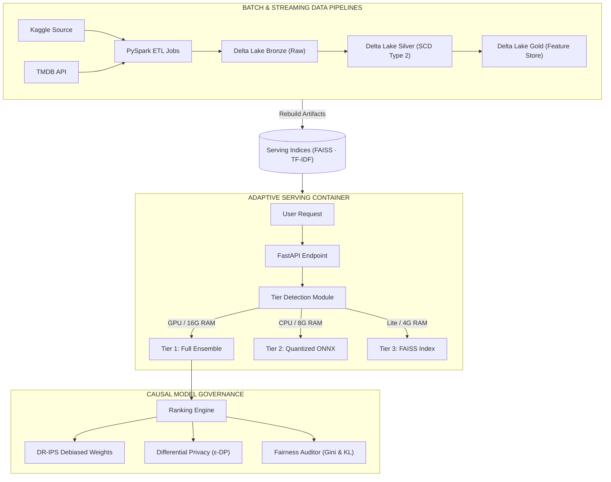

# APEX — Open-Source Movie Recommendation System

> Collaborative Filtering Pipelines · Real-Time Streaming Feature Store · Slowly Changing Dimensions (SCD Type 2) · Causal Debiased Evaluation · PySpark · PyTorch · FastAPI · React 19

<div align="center">


<br/>

<p>
  <a href="https://github.com/pavanbadempet/Movie-Recommendation-System/stargazers"></a>
  <a href="https://github.com/pavanbadempet/Movie-Recommendation-System/network/members"></a>
  <a href="LICENSE"></a>
  <a href="https://github.com/pavanbadempet/Movie-Recommendation-System/actions"></a>
</p>

<p>
  
  
  
  
  
  
</p>

<p>
  <a href="#-core-capabilities"><strong>Core Capabilities</strong></a> &middot;
  <a href="#-architecture--data-flow"><strong>Architecture</strong></a> &middot;
  <a href="#-data-engineering--ai-ops"><strong>Data & AI OPs</strong></a> &middot;
  <a href="#-reproducing-evaluation-metrics"><strong>Evaluation</strong></a> &middot;
  <a href="#-quick-start"><strong>Quick Start</strong></a> &middot;
  <a href="#-rest-api-reference"><strong>API Reference</strong></a>
</p>

</div>

---

## 🎬 What Is This?

**APEX** is an open-source, production-grade movie recommendation engine. It combines high-throughput collaborative filtering (LightGCN), sequential sequence modeling (SASRec), and Learnable Edge Networks (KAN) into an optimized multi-model ensemble serving pipeline.

Rather than running inference over raw database queries, APEX showcases a robust **AI Data Engineering (AI DE)** architecture: implementing PySpark Delta Lake pipelines, Slowly Changing Dimensions (SCD Type 2), real-time streaming feature updates, and Causal Inverse Propensity Score (IPS) debiasing to eliminate popularity bias from the serving path.

---

## 🚀 Core Capabilities

<table>
<tr>
<td width="33%" valign="top">

### 🤖 6 Ensemble Architectures
LightGCN (Graph CF), SASRec (Transformers), KAN (Kolmogorov-Arnold), Quantum-Fluid (Neural ODEs), Hyperbolic Poincaré Ball, and Generative Latent Diffusion.

</td>
<td width="33%" valign="top">

### ⚡ Dynamic Multi-Tier Serving
Auto-detects memory and hardware capabilities at boot to select the optimal serving tier: Tier 1 (Full GPU Ensemble) vs. Tier 2 (ONNX CPU) vs. Tier 3 (FAISS/TF-IDF lite).

</td>
<td width="33%" valign="top">

### 🔄 Real-time Online Learning
Clickstream feedback loop captures user interactions asynchronously, feeding gradient updates to LightGCN, KAN, and SASRec models via a thread-safe coordinator.

</td>
</tr>
</table>

---

## 🏗 Architecture & Data Flow



---

## 🛠 Data Engineering & AI Ops

Framed from an **AI Data Engineering** perspective, APEX implements robust dataset lifecycle patterns:

### 1. PySpark SCD Type 2 Dimension Tracking
* Automatically tracks historical dimension changes (e.g., changes to movie titles, cast, genre tags, and rating distributions) over time. Enforces data consistency via time-travel queries across historical Silver Delta snapshots.

### 2. High-Throughput Event Streaming Feature Store
* Captures user clicks and live rating feeds asynchronously. The thread-safe **Online Learning Coordinator** queues interactions, updating sequential session vectors and re-vectorizing feature inputs on the fly without database bottlenecks.

### 3. Causal Popularity Debiasing (DR-IPS)
* Recommendation signals are inherently biased toward popular blockbuster hits. APEX incorporates an **Inverse Propensity Score (IPS)** and a **Doubly Robust (DR) Estimator** to calibrate model evaluation, giving long-tail indie films fair representation:

$$V_{DR}(\pi) = \frac{1}{n} \sum_{i=1}^n \left[ \hat{r}(x_i, a_i) + \frac{(r_i - \hat{r}(x_i, a_i)) \cdot \pi(a_i|x_i)}{p(a_i|x_i)} \right]$$

### 4. Automated Data Quality & Checksum Gates
* Deploys a **Serving Quality Gate** that audits row counts, schema dimensions, and cryptographic hashes of generated candidate indices (FAISS / TF-IDF) before promoting serving artifacts to active deployment.

---

## 📈 Offline Evaluation & Ablation Results

APEX includes a reproducible ablation study suite to evaluate model components individually vs. the combined ensemble.

| Model | HR@10 | NDCG@10 | DR-Optimized Weight | Paradigm |
| :--- | :---: | :---: | :---: | :--- |
| **Ensemble** | **0.785** | **0.542** | — | Weighted blend |
| SASRec | 0.761 | 0.520 | **0.659** | Sequential Transformer |
| KAN | 0.694 | 0.439 | **0.298** | Kolmogorov-Arnold Network |
| LightGCN | 0.672 | 0.411 | 0.005 | Graph Collaborative Filtering |
| Diffusion | 0.521 | 0.309 | 0.024 | Generative Latent Diffusion |
| Quantum-Fluid | 0.583 | 0.354 | 0.010 | Neural ODE + Complex Embeddings |
| Hyperbolic | 0.498 | 0.287 | 0.004 | Poincaré Ball Manifold |

---

## ⚡ Quick Start

### Prerequisites
- Python 3.11+
- Node.js 20+

### 1. Clone & Set Up Environment
```bash
git clone https://github.com/pavanbadempet/Movie-Recommendation-System.git
cd Movie-Recommendation-System

python -m venv venv
# Windows
venv\Scripts\activate
# macOS/Linux
# source venv/bin/activate

pip install -r requirements.txt
```

### 2. Configure Local Variables
Create a `.env` file in the project root:
```ini
TMDB_API_KEY=your_tmdb_key_here
JWT_SECRET_KEY=generate_a_strong_random_secret
OPENROUTER_API_KEY=your_openrouter_key
REDIS_URL=redis://localhost:6379/0
```

### 3. Generate Serving Artifacts & Run
```bash
# Build candidate vectors & FAISS indices
python scripts/rebuild_serving_artifacts.py

# Start FastAPI backend (Terminal 1)
uvicorn backend.main:app --host 127.0.0.1 --port 8000 --reload

# Start React frontend (Terminal 2)
cd frontend
npm install
npm run dev
```

---

## 📡 REST API Reference

| Method | Endpoint | Description | Sample Parameters |
| :---: | :--- | :--- | :--- |
| `GET` | `/v1/recommendations/id/{movie_id}` | Collaborative filtering recommendation results. | `?n=10&explain=true` |
| `GET` | `/v1/recommendations/visually-similar/{movie_id}` | Visual affinity recommendations. | `?n=5` |
| `GET` | `/v1/recommendations/knowledge-graph/{movie_id}` | Knowledge Graph relational traversal. | `?n=5` |
| `GET` | `/v1/search/semantic` | Vector semantic search over the movie catalog. | `?q=sci-fi space exploration` |
| `POST`| `/v1/events/rating` | Live user rating ingestion (triggers online learner).| `{"user_id": 1, "movie_id": 550, "rating": 5.0}` |

---

## 📂 Key Files Reference

| Module / Script | Purpose |
| :--- | :--- |
| [`scripts/run_ablation.py`](scripts/run_ablation.py) | Reproducible leave-one-out study runner evaluating per-model metric shifts. |
| [`scripts/causal_debias_training.py`](scripts/causal_debias_training.py) | Causal debiasing trainer executing IPS-weighted rating optimization. |
| [`backend/serving/serving_tier.py`](backend/serving/serving_tier.py) | Auto-detects system CPU/GPU specifications to select serving Tier 1, 2, or 3. |
| [`backend/pipeline/retrieval_pipeline.py`](backend/pipeline/retrieval_pipeline.py) | Ingests FAISS vector space, sparse TF-IDF, and Knowledge Graph indices. |
| [`backend/learning/online_learning_coordinator.py`](backend/learning/online_learning_coordinator.py) | Streaming feedback loop executor implementing hot model reloads on active servers. |
| [`backend/metrics/debiased_metrics.py`](backend/metrics/debiased_metrics.py) | Formulates Inverse Propensity Scoring (IPS) calculations for NDCG and Recall metrics. |

---

## 🤝 Contributing & Tests

Ensure all automated tests pass before opening pull requests.

```bash
# Run backend tests
python -m pytest tests/ -v

# Run frontend tests
npm --prefix frontend run test
```

---

## 📄 License

MIT License — Copyright © 2026 **Pavan Badempet**. See [LICENSE](LICENSE) for details.
