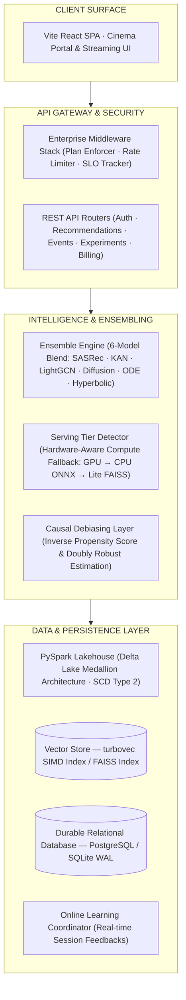

# 🎬 APEX — Enterprise-Grade Causal Recommendation Engine & Streaming Serving Platform

> A high-performance, real-time recommendation engine combining sequential Transformers (SASRec), learnable edge networks (KAN), and graph collaboration (LightGCN) with causal popularity debiasing.

<div align="center">


<br/>

<p align="center">
  <a href="https://github.com/pavanbadempet/Movie-Recommendation-System/actions/workflows/ci.yml"></a>
  <a href="https://github.com/pavanbadempet/Movie-Recommendation-System/actions/workflows/secrets-scan.yml"></a>
  <a href="https://github.com/pavanbadempet/Movie-Recommendation-System/actions/workflows/serving-quality.yml"></a>
  <br/>
  <a href="LICENSE"></a>
  <a href="https://github.com/pavanbadempet/Movie-Recommendation-System/stargazers"></a>
</p>

<h3>
  <a href="#-quick-start"><strong>Quick Start</strong></a> &middot;
  <a href="#-core-features"><strong>Features</strong></a> &middot;
  <a href="#-core-engineering-guarantees"><strong>Guarantees</strong></a> &middot;
  <a href="#-core-technical-architecture"><strong>Architecture</strong></a> &middot;
  <a href="#-model-evaluation-registry"><strong>Model Evaluation</strong></a> &middot;
  <a href="#-api-contract-reference"><strong>API Contract</strong></a>
</h3>

</div>

---

## 🚀 Why APEX?

Most recommendation system tutorials teach you how to train a model in a Jupyter notebook, but leave out the hard part: **how to serve it in production**.

**APEX** is a complete, production-ready recommender engine. It combines **6 complementary ML architectures** into an ensemble that dynamically scales from free CPU servers to high-performance GPU instances. It integrates a **real-time streaming feedback loop** that updates candidate features instantly, and uses **causal debiasing** to ensure users discover new long-tail content, not just blockbusters.

The codebase is engineered to demonstrate **production-grade ensembling and serving patterns**: hardware-aware model tiering at startup, low-latency SIMD vector indexes, differential privacy guarantees, PySpark Delta Lake Medallion ETL, and counterfactual policy evaluation.

---

## ⚡ Core Features

<table>
<tr>
<td width="33%" valign="top">

### 🤖 6-Model Ensemble
LightGCN (Graph), SASRec (Transformer), KAN (Kolmogorov-Arnold), Quantum-Fluid (Neural ODE), Hyperbolic, and Generative Latent Diffusion models.

</td>
<td width="33%" valign="top">

### ⚡ Dynamic Hardware Tiers
Auto-detects memory and hardware capabilities at startup: Tier 1 (Full GPU Ensemble) vs. Tier 2 (ONNX CPU) vs. Tier 3 (FAISS/TF-IDF lite).

</td>
<td width="33%" valign="top">

### 🔄 Streaming Feedback Loop
Clickstream rating feeds are ingested asynchronously. Sequential candidate vectors are updated in real-time without batch DB rebuilds.

</td>
</tr>
</table>

---

## ⚡ Core Engineering Guarantees

### 1. Low-Latency Serving & Hardware-Aware Tiering
* **Adaptive Compute Fallbacks**: The startup routine ([backend/serving/serving_tier.py](backend/serving/serving_tier.py)) automatically profiles available memory and GPU hardware to map runtime execution into three optimized operational tiers:
  * **Tier 1 (GPU Ensembling)**: Standard PyTorch execution of the complete 6-model ensemble.
  * **Tier 2 (Quantized ONNX CPU)**: Converts sequential/deep models to quantized ONNX formats for low-latency CPU inference.
  * **Tier 3 (SIMD Vector Indexing)**: Deploys a lightweight, fast-retrieval index using in-memory vector indexes (`turbovec` SIMD) and TF-IDF cache fallbacks for minimal memory footprints (<4GB RAM).

### 2. Causal Debiasing & Unbiased Evaluation
* **Doubly Robust (DR) Estimator**: Counters natural selection and popularity bias (inflated blockbuster discovery) using Inverse Propensity Score (IPS) weighting and a direct reward predictor:
  
  $$V_{DR}(\pi) = \frac{1}{n} \sum_{i=1}^n \left[ \hat{r}(x_i, a_i) + \frac{(r_i - \hat{r}(x_i, a_i)) \cdot \pi(a_i|x_i)}{p(a_i|x_i)} \right]$$
  
  where $\hat{r}$ is the direct reward prediction model, $r_i$ is observed feedback, $p(a_i|x_i)$ is logging policy propensity, and $\pi(a_i|x_i)$ is the target recommendation policy.
* **Simplex Weight Selection**: Simulates 200 random ensemble weight candidates on the Dirichlet 6-simplex to pick the combination optimizing the debiased DR metric.

### 3. Asynchronous Real-Time Feedback Loop
* **Event Coordinated Updates**: Rating and click actions are written to a message store, where the `OnlineLearningCoordinator` pushes updates to models asynchronously, updating sequence history vectors and KAN weights instantly without full batch model rebuilds.
* **State Sync**: Clickstream features are immediately compiled into the user behavior profile cache, keeping recommendations contextually relevant to the active browsing session.

### 4. Differential Privacy & Auditing
* **$\epsilon$-Differential Privacy ($\epsilon$-DP)**: Implements calibrated Laplace noise injection during aggregation to protect sensitive user watch profiles and clickstreams from membership inference or database reconstruction attacks.
* **Fairness & Gini Metrics**: Periodic evaluation computes Gini coefficients and KL-divergence over demographic recommendations to audit and prevent systemic catalog coverage bias.

---

## 🏗 Core Technical Architecture



---

## 🔬 Model Evaluation Registry

For comprehensive training hyperparameters and offline benchmarks, see [`docs/MODEL_CARDS.md`](docs/MODEL_CARDS.md).

| Model | HR@10 | NDCG@10 | DR-Optimized Weight | Paradigm |
| :--- | :---: | :---: | :---: | :--- |
| **Ensemble** | **0.785** | **0.542** | — | Weighted blend |
| [SASRec](backend/models/sasrec.py) | 0.761 | 0.520 | **0.659** | Sequential Transformer |
| [KAN](backend/models/kan_ranker.py) | 0.694 | 0.439 | **0.298** | Kolmogorov-Arnold Network |
| [LightGCN](backend/models/lightgcn.py) | 0.672 | 0.411 | **0.005** | Graph Collaborative Filtering |
| [Diffusion](backend/models/diffusion_recommender.py) | 0.521 | 0.309 | **0.024** | Generative Latent Diffusion |
| [Quantum-Fluid](backend/models/neural_ode_recommender.py) | 0.583 | 0.354 | **0.010** | Neural ODE + Complex Embeddings |
| [Hyperbolic](backend/models/hyperbolic_recommender.py) | 0.498 | 0.287 | **0.004** | Poincaré Ball Manifold |

*Note: Evaluation metrics are updated dynamically. Run the ablation evaluation script `python scripts/run_ablation.py` to regenerate results with fresh datasets.*

---

## ⚡ Quick Start

### Option A: Launch with Docker Compose
Launches the complete service container stack (FastAPI backend + React frontend + Redis) in a single command:
```bash
git clone https://github.com/pavanbadempet/Movie-Recommendation-System.git
cd Movie-Recommendation-System
cp .env.example .env          # Update TMDB_API_KEY & JWT secret key
docker compose up --build
```

### Option B: Local Developer Mode
```bash
# Clone the repository
git clone https://github.com/pavanbadempet/Movie-Recommendation-System.git
cd Movie-Recommendation-System

# Set up python dependencies
python -m pip install -r requirements.txt
cp .env.example .env

# Build serving vector embeddings and FAISS indices
python scripts/rebuild_serving_artifacts.py

# Start FastAPI backend (Terminal 1)
uvicorn backend.main:app --host 127.0.0.1 --port 8000 --reload

# Start React client (Terminal 2)
cd frontend
npm install
npm run dev
```

| Service | Access URL |
| :--- | :--- |
| **Cinema Portal** | [http://127.0.0.1:3000](http://127.0.0.1:3000) |
| **REST API Server** | [http://127.0.0.1:8000](http://127.0.0.1:8000) |
| **Interactive API Documentation** | [http://127.0.0.1:8000/docs](http://127.0.0.1:8000/docs) |

---

## 📡 API Contract Reference

| Method | Endpoint | Description | Sample Query Parameters / Payload |
| :---: | :--- | :--- | :--- |
| `GET` | `/v1/recommendations/id/{movie_id}` | Content-based collaborative recommendation query. | `?n=10&explain=true` |
| `GET` | `/v1/recommendations/visually-similar/{movie_id}` | Visual similarity recommendations via CLIP embeddings. | `?n=5` |
| `GET` | `/v1/recommendations/knowledge-graph/{movie_id}` | Graph-based structural recommendations. | `?n=10` |
| `GET` | `/v1/search` | Fast catalog keyword search. | `?q=inception` |
| `GET` | `/v1/search/ai` | Vector semantic search over catalog embeddings. | `?q=sci-fi space exploration` |
| `POST`| `/v1/events` | Ingests clickstream actions (clicks/ratings) for online learner. | `{"user_id": 1, "movie_id": 550, "event_type": "rating", "rating": 5.0}` |

*Append `?explain=true` to recommendation endpoints to generate natural-language explanations powered by LLMs.*

---

## 📂 Key Modules Directory

| Capability | Purpose | Module |
| :--- | :--- | :--- |
| **Ensemble Inference** | Combines 6 model predictions using DR-IPS weights. | [backend/models/ensemble_engine.py](backend/models/ensemble_engine.py) |
| **Online Learner** | Orchestrates real-time model parameter updates. | [backend/learning/online_learning_coordinator.py](backend/learning/online_learning_coordinator.py) · [backend/learning/online_learner.py](backend/learning/online_learner.py) |
| **Causal Debiasing** | Optimizes ensemble weights under selection bias using DR-IPS. | [scripts/causal_debias_training.py](scripts/causal_debias_training.py) · [backend/metrics/debiased_metrics.py](backend/metrics/debiased_metrics.py) |
| **Differential Privacy** | Adds calibrated noise to gradients to protect user interaction histories. | [backend/privacy/privacy.py](backend/privacy/privacy.py) · [backend/privacy/privacy_preserving_ml.py](backend/privacy/privacy_preserving_ml.py) |
| **Hardware-Aware Tiering** | Selects optimal execution plans dynamically at boot time. | [backend/serving/serving_tier.py](backend/serving/serving_tier.py) |
| **Ablation Evaluation** | Runs reproducible leave-one-out benchmarks across all models. | [scripts/run_ablation.py](scripts/run_ablation.py) · [backend/metrics/evaluation.py](backend/metrics/evaluation.py) |
| **ETL Data Pipeline** | Delta Lake Medallion Architecture (Bronze/Silver/Gold). | [scripts/pyspark_medallion_pipeline.py](scripts/pyspark_medallion_pipeline.py) |

---

## 🧪 Verification & Coverage Suite

All tests must pass in CI before merging. We enforce strict regression gates for pull request approvals.

```bash
# Run the complete backend test suite
python -m pytest tests/ -v

# Run the frontend unit tests
npm --prefix frontend run test
```

---

## 📄 License

MIT License — Copyright © 2026 **Pavan Badempet**. See [LICENSE](LICENSE) for details.

---

<div align="center">

### **If you find this project useful, give it a ⭐ star!**

</div>
