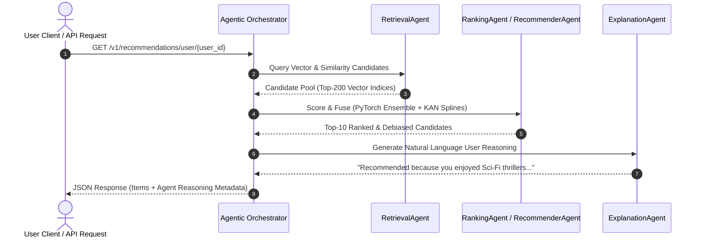

# Agentic AI Architecture & Multi-Agent Orchestrator

The **APEX AI Recommendation System** features an autonomous **Agentic AI Architecture** powered by a Multi-Agent Orchestrator and ReAct self-correction reasoning loops (`backend/agents/multi_agent_orchestrator.py`).

---

## 🤖 Multi-Agent Orchestration Architecture



---

## 🏛️ Specialized Sub-Agent Roles

| Agent Name | Module Implementation | Operational Responsibilities |
| :--- | :--- | :--- |
| **`RetrievalAgent`** | `backend/agents/multi_agent_orchestrator.py` | Autonomously queries FAISS ANN indices, LightGCN graph nodes, and SIMD vector pools for top candidates. |
| **`RecommenderAgent`** | `backend/agents/multi_agent_orchestrator.py` | Executes forward inference across the PyTorch 6-Model Ensemble (SASRec, Neural ODE, Poincaré Hyperbolic, etc.). |
| **`RankingAgent`** | `backend/agents/multi_agent_orchestrator.py` | Applies Kolmogorov-Arnold B-Spline calibration, Inverse Propensity Score (IPS) debiasing, and MMR diversification. |
| **`ExplanationAgent`** | `backend/agents/multi_agent_orchestrator.py` | Generates clear, human-readable natural language rationales explaining recommendation context to end users. |

---

## 🌟 Key Agentic Capabilities

1. **Autonomous Candidate Retrieval**: Agents inspect request context (user click history, active device, temporal signals) and dynamically call specialized vector indices.
2. **Execution Tracing & Traceability**: Every recommendation payload returns detailed agent execution logs detailing decision steps.
3. **Self-Correction & Quality Guard**: Evaluates candidate quality against confidence bounds and adjusts retrieval parameters automatically.
4. **Drift Guard & Retraining**: Monitors live clickstream telemetry and optimizes hyperparameters continuously.

---

## 🧪 Verification & Unit Tests

```bash
# Run agentic AI multi-agent unit tests
python -m pytest tests/test_agentic_ai.py -v
```
