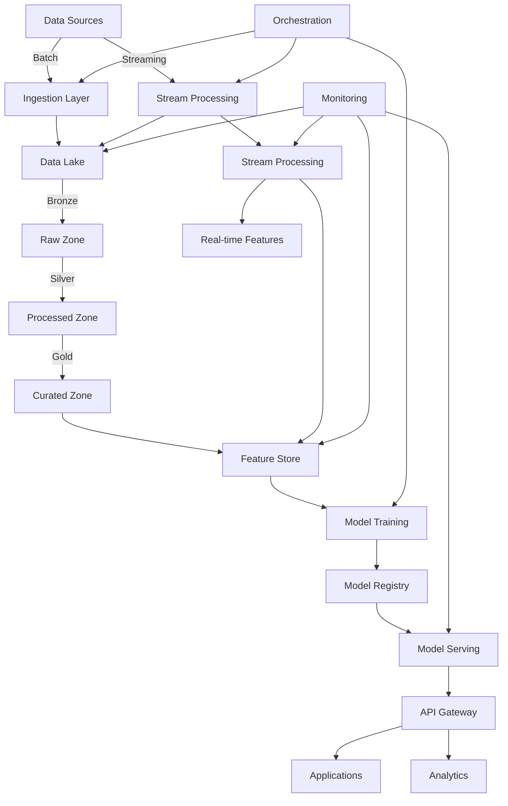

# AI Data Engineering Platform Architecture

## Overview

This document outlines the high-level architecture for a scalable AI Data Engineering Platform that builds upon the existing Movie-Recommendation-System while addressing enterprise-scale requirements for AI/ML workloads, real-time processing, and data governance.

## Architecture Diagram

## Core Components

### 1. Data Ingestion Layer

**Purpose**: Unified interface for batch and streaming data ingestion

**Components**:
- **Batch Ingestion**:
  - Airflow/Spark-based batch pipelines
  - Schema validation and evolution
  - Data quality checks
  - Partitioning and compression

- **Streaming Ingestion**:
  - Kafka cluster with multiple brokers
  - Schema registry for event schemas
  - Exactly-once processing guarantees
  - Dead-letter queues for failed events

**Enhancements from Current System**:
- Scalable Kafka cluster (current: 3 brokers)
- Schema registry integration
- Enhanced data quality monitoring
- Multi-source ingestion capabilities

### 2. Data Lake with Medallion Architecture

**Purpose**: Organized, scalable storage with ACID guarantees

**Layers**:
- **Bronze (Raw)**: Immutable raw data with full lineage
  - Format: Delta Lake/Parquet
  - Features: Time-travel, schema evolution, audit logs

- **Silver (Processed)**: Cleaned, validated, enriched data
  - Format: Delta Lake with Z-ordering
  - Features: Data quality metrics, business logic applied

- **Gold (Curated)**: Business-level datasets and features
  - Format: Delta Lake with optimized layouts
  - Features: Aggregations, ML-ready features, business metrics

**Enhancements from Current System**:
- Automated data quality scoring
- Lineage tracking across all layers
- Automated optimization (compaction, Z-ordering)
- Data governance and cataloging

### 3. Stream Processing Layer

**Purpose**: Real-time data processing and feature engineering

**Components**:
- **Kafka Streams/Flink**: Stateful stream processing
- **Real-time Feature Engineering**: Windowed aggregations, joins
- **Event Processing**: Complex event processing patterns
- **Streaming ETL**: Real-time transformations

**Enhancements from Current System**:
- Stateful processing capabilities
- Exactly-once processing guarantees
- Advanced windowing and sessionization
- Integration with feature store

### 4. Feature Store

**Purpose**: Centralized repository for ML features with consistency guarantees

**Components**:
- **Offline Store**: Batch-computed features (Delta Lake)
- **Online Store**: Low-latency feature serving (Redis/DynamoDB)
- **Feature Registry**: Metadata and lineage tracking
- **Feature Serving**: Consistent access for training and inference

**Key Features**:
- Point-in-time correctness
- Feature versioning
- Time travel capabilities
- Batch and real-time feature consistency

### 5. AI/ML Platform

**Purpose**: End-to-end ML lifecycle management

**Components**:
- **Model Training**:
  - Distributed training infrastructure
  - Hyperparameter optimization
  - Experiment tracking
  - Automated retraining pipelines

- **Model Registry**:
  - Model versioning
  - Metadata and lineage
  - Deployment status tracking
  - A/B testing capabilities

- **Model Serving**:
  - Real-time inference endpoints
  - Batch inference capabilities
  - Model monitoring
  - Canary deployments

- **Vector Database**:
  - Distributed vector search (Milvus/Pinecone)
  - Approximate nearest neighbor search
  - Hybrid search capabilities
  - Scalable indexing

**Enhancements from Current System**:
- Distributed vector search (current: single-node FAISS)
- Model versioning and registry
- Advanced model monitoring
- A/B testing framework

### 6. API Gateway and Serving Layer

**Purpose**: Unified interface for applications and services

**Components**:
- **API Gateway**:
  - Authentication and authorization
  - Rate limiting
  - Request/response transformation
  - Load balancing

- **Recommendation Service**:
  - Real-time recommendations
  - Personalization
  - Context-aware ranking
  - Fallback mechanisms

- **Feature Service**:
  - Low-latency feature access
  - Batch feature retrieval
  - Feature consistency guarantees

### 7. Orchestration and Workflow Management

**Purpose**: Coordination of complex data and ML workflows

**Components**:
- **Workflow Orchestration**:
  - Airflow/Dagster for complex workflows
  - Dependency management
  - Retry and backoff policies
  - Resource allocation

- **Event-Driven Orchestration**:
  - Kafka-based event triggers
  - Real-time workflow initiation
  - Dynamic task routing

**Enhancements from Current System**:
- Advanced resource management
- Dynamic workflow generation
- Cross-system orchestration

### 8. Monitoring and Observability

**Purpose**: End-to-end visibility into system health and performance

**Components**:
- **Data Quality Monitoring**:
  - Schema drift detection
  - Data freshness monitoring
  - Anomaly detection
  - Data completeness checks

- **ML Monitoring**:
  - Model performance drift
  - Feature drift detection
  - Prediction monitoring
  - Data quality for ML

- **System Monitoring**:
  - Infrastructure metrics
  - Pipeline performance
  - Resource utilization
  - Cost tracking

- **Alerting**:
  - Multi-channel notifications
  - Escalation policies
  - Incident management

**Enhancements from Current System**:
- Comprehensive data quality metrics
- Model performance monitoring
- End-to-end lineage tracking
- Automated anomaly detection

## Data Flow Patterns

### Batch Processing Flow
1. Data sources → Ingestion Layer → Bronze Zone
2. Bronze Zone → Processing → Silver Zone
3. Silver Zone → Feature Engineering → Gold Zone
4. Gold Zone → Feature Store (Offline)
5. Feature Store → Model Training → Model Registry
6. Model Registry → Model Serving → API Gateway

### Real-time Processing Flow
1. Data sources → Kafka → Stream Processing
2. Stream Processing → Real-time Features → Feature Store (Online)
3. Stream Processing → Real-time Aggregations → Applications
4. Feature Store (Online) → Model Serving → API Gateway

### Hybrid Processing Flow
1. Batch features (offline) + Real-time features (online) → Unified Feature View
2. Unified Feature View → Model Serving → Personalized Recommendations
3. User Feedback → Kafka → Stream Processing → Feature Updates

## Technology Stack Recommendations

| Component               | Recommended Technologies                          | Notes                                  |
|-------------------------|--------------------------------------------------|----------------------------------------|
| Data Lake               | Delta Lake, Iceberg, Hudi                        | ACID transactions, time travel         |
| Batch Processing        | Spark, Dask, Ray                                 | Distributed processing                 |
| Stream Processing       | Flink, Kafka Streams, Spark Streaming            | Stateful processing, exactly-once      |
| Feature Store           | Feast, Tecton, Hopsworks                         | Feature consistency                    |
| Vector Database         | Milvus, Pinecone, Weaviate                       | Distributed ANN search                 |
| Model Serving           | KServe, Seldon, Triton                           | Model deployment and scaling           |
| Orchestration           | Airflow, Dagster, Prefect                        | Workflow management                    |
| Monitoring              | Prometheus, Grafana, Great Expectations          | Observability and data quality         |
| API Gateway             | Kong, Apigee, AWS API Gateway                    | Unified interface                      |
| ML Platform             | MLflow, Kubeflow, Metaflow                       | Experiment tracking, model registry    |

## Scalability Considerations

### Horizontal Scaling
- **Stateless Components**: API services, web applications
- **Stateful Components**: Kafka brokers, database sharding
- **Processing**: Spark/Flink worker scaling
- **Storage**: Distributed file systems (S3, HDFS)

### Performance Optimization
- **Data Layout**: Partitioning, Z-ordering, clustering
- **Caching**: Redis for hot data, CDN for static assets
- **Query Optimization**: Materialized views, query planning
- **Vector Search**: Approximate nearest neighbor algorithms

### Cost Optimization
- **Storage**: Tiered storage (hot/warm/cold)
- **Compute**: Spot instances, auto-scaling
- **Data Processing**: Incremental processing, change data capture
- **Monitoring**: Cost allocation tags, budget alerts

## Security and Governance

### Security
- **Authentication**: OAuth2, JWT, service accounts
- **Authorization**: Role-based access control (RBAC)
- **Data Protection**: Encryption at rest and in transit
- **Network Security**: VPC, private subnets, network ACLs

### Governance
- **Data Catalog**: Metadata management, lineage tracking
- **Data Quality**: Automated quality scoring, SLA monitoring
- **Compliance**: GDPR, CCPA, industry-specific regulations
- **Audit Logging**: Comprehensive access logs

## Implementation Roadmap

### Phase 1: Foundation (0-3 months)
- [ ] Enhance data lake with proper governance
- [ ] Implement feature store foundation
- [ ] Upgrade streaming infrastructure
- [ ] Implement basic monitoring

### Phase 2: AI Platform (3-6 months)
- [ ] Implement model registry
- [ ] Deploy distributed vector database
- [ ] Build model serving infrastructure
- [ ] Implement A/B testing framework

### Phase 3: Advanced Capabilities (6-12 months)
- [ ] Implement real-time feature serving
- [ ] Build advanced monitoring and observability
- [ ] Implement automated retraining pipelines
- [ ] Develop comprehensive data governance

## Migration Strategy from Current System

1. **Data Layer**:
   - Migrate existing Delta Lake tables to governed data lake
   - Implement proper partitioning and optimization
   - Add data quality monitoring

2. **Processing Layer**:
   - Enhance existing PySpark pipelines with governance features
   - Implement incremental processing where possible
   - Add monitoring and alerting

3. **AI/ML Layer**:
   - Migrate FAISS index to distributed vector database
   - Implement model versioning and registry
   - Add model performance monitoring

4. **Serving Layer**:
   - Enhance existing FastAPI services with proper API management
   - Implement feature store integration
   - Add monitoring and observability

5. **Orchestration**:
   - Enhance existing Airflow workflows with better error handling
   - Implement cross-system dependencies
   - Add resource management

## Key Benefits

1. **Scalability**: Horizontal scaling for all components
2. **Reliability**: Fault tolerance and high availability
3. **Consistency**: Feature consistency across batch and real-time
4. **Observability**: End-to-end monitoring and alerting
5. **Governance**: Comprehensive data management and lineage
6. **Flexibility**: Support for diverse AI/ML workloads
7. **Cost Efficiency**: Optimized resource utilization
8. **Developer Productivity**: Standardized interfaces and tools