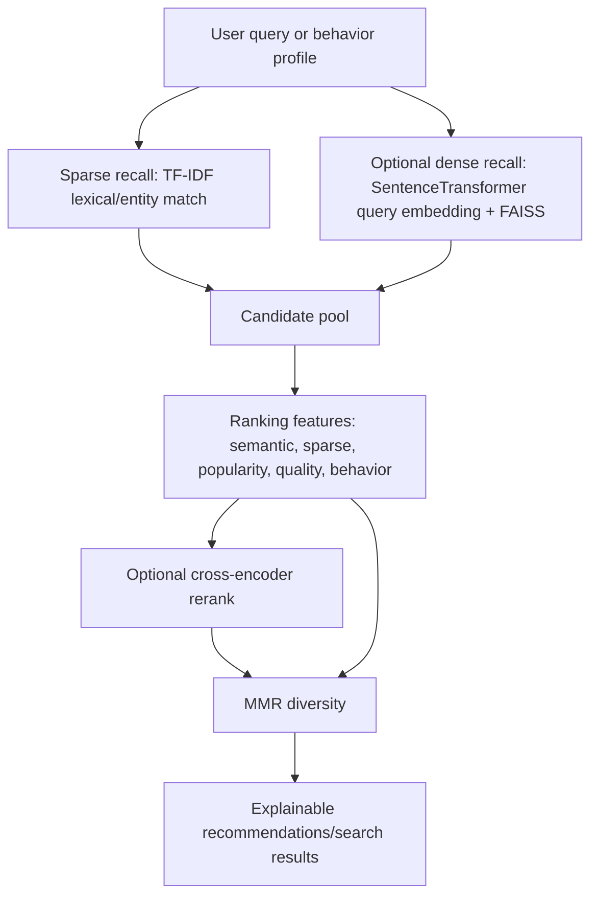

# Nova AI Recommendation Architecture

Nova should not depend on one magic model. The strongest free-tier AI pattern is a staged ranking system where every stage has a clear job and can be switched on or off based on hosting limits.

## Current Serving Stack



## Why This Is Stronger Than A Single Model

- Sparse retrieval catches exact titles, entities, names, and cold-start metadata.
- Dense retrieval catches meaning when the words differ.
- Cross-encoders are used only on a small candidate window because they are more expensive.
- MMR prevents ten near-duplicate recommendations.
- Behavior events turn the product from static content search into personalization.
- Feature weights are inspectable, so ranking can be debugged and sold to customers.

## Implemented Capabilities

- `/v1/search/ai` uses hybrid search with sparse recall, optional dense recall, ranking features, optional cross-encoder reranking, and MMR.
- `/v1/recommendations/user/{user_id}` builds a lightweight implicit-feedback profile from views, clicks, ratings, and impressions.
- `/v1/evaluation/recommendations` reports label-free quality checks for vectors, coverage, diversity, and genre consistency.
- `/v1/ranker/status` reports whether a learned ranker artifact is loaded.
- `scripts/train_ranker.py` trains a free-tier scikit-learn ranker from behavior events and catalog quality.

## Free-Tier Modes

Default mode is safe for Render/Streamlit free tiers:

```bash
NOVA_ENABLE_DENSE_QUERY=false
NOVA_ENABLE_CROSS_ENCODER=false
```

Power mode is useful on Kaggle, local GPU, or a warm Hugging Face Space:

```bash
NOVA_ENABLE_DENSE_QUERY=true
NOVA_QUERY_ENCODER_MODEL=all-mpnet-base-v2
NOVA_ENABLE_CROSS_ENCODER=true
NOVA_CROSS_ENCODER_MODEL=cross-encoder/ms-marco-MiniLM-L-6-v2
NOVA_RERANK_WINDOW=30
```

Learned ranker training:

```bash
python scripts/train_ranker.py \
  --events data/events/movie_events.jsonl \
  --output models/nova_ranker.joblib
```

The backend loads `models/nova_ranker.joblib` automatically when present. If no
artifact exists, serving falls back to the hybrid hand-built ranker.

## Research Basis

- FAISS supports efficient vector similarity search and compressed/approximate search designs.
- Retrieve-and-rerank uses a fast first-stage retriever and a slower but more precise reranker on a small candidate set.
- Hybrid retrieval combines sparse lexical matching and dense semantic matching, which is useful when queries mix exact entities and abstract intent.
- Maximal Marginal Relevance balances relevance and diversity.
- Sequential and collaborative recommenders such as BERT4Rec and Neural Collaborative Filtering become valuable after the product has enough user behavior.

## What Comes Next

The current learned ranker is the first feedback-learning layer:

- it turns implicit events into labels
- it trains a small ranking regressor
- it writes offline metrics such as Recall@K and NDCG@K
- it saves a `joblib` artifact for cheap serving
- it blends learned scores with existing hybrid scores

The next AI step is not “bigger LLM.” It is richer feedback learning:

- collect impressions, clicks, watches, ratings, and skips
- create training examples from implicit feedback
- evaluate with Recall@K, NDCG@K, diversity, novelty, and calibration
- train a small ranking model or factorization model on Kaggle
- compare static content ranking vs behavior-aware ranking
- only then consider BERT4Rec/SASRec-style sequential modeling

That path is realistic for zero capital and still aligns with serious recommender-system research.
