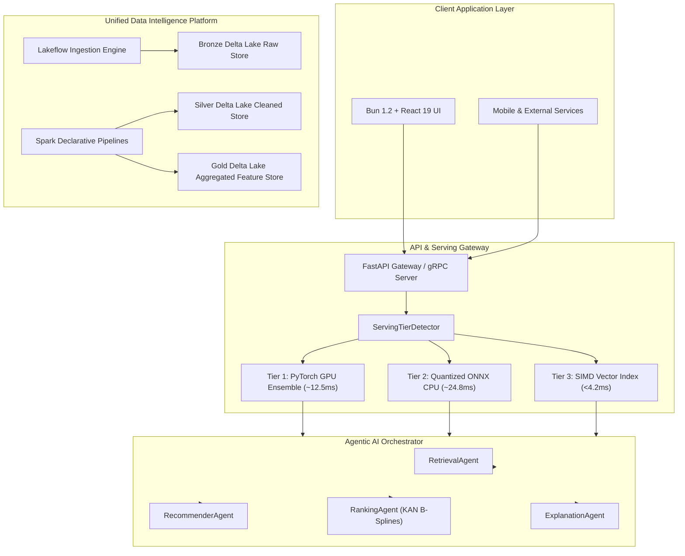

# Welcome to the APEX AI Recommendation Engine & Data Intelligence Wiki

  
  
  
  
  

This Wiki serves as the definitive engineering manual for the **APEX AI Recommendation System and Unified Data Intelligence Platform**. It provides deep architectural guides, API contracts, PySpark 4.2 declarative pipeline specifications, multi-agent AI flowcharts, and production deployment procedures.

> [!NOTE]
> **APEX Recommendation Engine** is an enterprise-grade platform combining a **6-Model PyTorch Deep Learning Ensemble**, a Databricks-compatible **PySpark 4.2 Delta Lake Data Intelligence Engine**, an **Agentic Multi-Agent AI System**, and an **Adaptive 3-Tier Hardware Serving Architecture**.

---

## 📂 Documentation Navigation Directory

Select a guide from the categorized directories below or use the sidebar menu:

### 🎬 User & Developer Onboarding
* **[Quick Start & Installation Guide](INSTALLATION.md)**: Comprehensive step-by-step setup for Docker Compose and local Bun 1.2 + Python environments.
* **[Developer Onboarding & Contribution Guide](CONTRIBUTING.md)**: Coding standards, pre-commit linter checks, and GitHub pull request procedures.
* **[Beginner Tutorial](BEGINNER_TUTORIAL.md)**: Step-by-step walkthrough for making your first API call and training a custom recommendation model.

### 🌊 Unified Data Intelligence Platform
* **[Unified Data Intelligence Architecture](UNIFIED_DATA_INTELLIGENCE_PLATFORM.md)**: Databricks 1-to-1 open platform mapping matrix, Delta Lake Medallion architecture (Bronze/Silver/Gold), and catalog lineage.
* **[Spark Declarative Pipelines (SDP)](SPARK_DECLARATIVE_PIPELINES.md)**: Declarative pipeline YAML specifications, Lakeflow ingestion, and DAG execution engine.
* **[Spark 4.2 Features Guide](SPARK_42_FEATURES.md)**: Technical breakdown of Spark 4.2 Variant data type, Python Data Source API v2, and vector acceleration.

### 🤖 Agentic AI & Multi-Agent Systems
* **[Agentic AI Architecture & Multi-Agent Orchestrator](AGENTIC_AI.md)**: Design specifications for `RetrievalAgent`, `RecommenderAgent`, `RankingAgent`, and `ExplanationAgent`.
* **[AI Safety & Causal Debiasing](MODERN_SYSTEM_ARCHITECTURE.md)**: Inverse Propensity Score (IPS) weighting, Doubly Robust (DR) estimators, and MMR matrix diversification.

### 🧠 Deep Learning ML Ensemble & Model Registry
* **[6-Model Deep Learning Ensemble](MODEL_CARDS.md)**: Mathematical foundations of SASRec, KAN B-Splines, LightGCN, Neural ODE, Poincaré Hyperbolic, and Latent Continuous Diffusion.
* **[Online Learning & Feedback Loop](ONLINE_LEARNING.md)**: Real-time clickstream ingestion, Redis session queues, and asynchronous mini-batch SGD state updates.

### ⚡ Adaptive Serving & Production Operations
* **[Adaptive 3-Tier Serving Engine](MODERN_SYSTEM_ARCHITECTURE.md)**: Hardware auto-profiling across Tier 1 GPU Ensembling (`~12.5ms`), Tier 2 ONNX INT8 CPU (`~24.8ms`), and Tier 3 SIMD Vector Indexing (`<4.2ms`).
* **[REST API Reference](API_REFERENCE.md)**: Complete endpoint documentation, parameter schemas, and response JSON formats.
* **[gRPC Protobuf Protocol Specification](API_REFERENCE.md)**: High-throughput RPC definitions for real-time recommendation streaming.

---

## 🏛️ High-Level System Architecture

