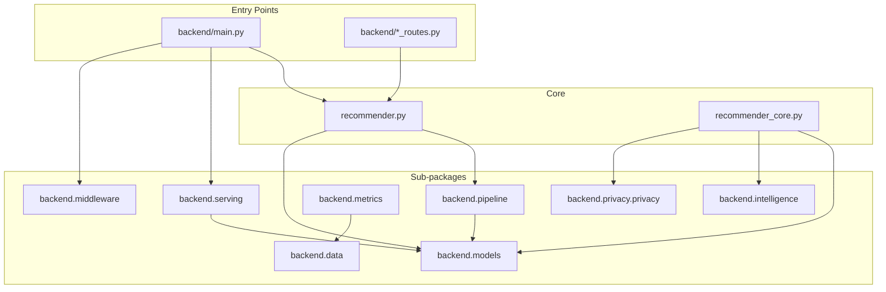

# APEX Backend Package Structure

## Overview

The APEX backend uses a **flat source layout with logical sub-package namespaces**.
All implementation modules live directly in `backend/` — a deliberate choice that
preserves backward compatibility with every existing import statement across the
codebase. Sub-packages sit alongside the flat modules and act as re-export surfaces:
each `__init__.py` imports from the flat `backend/` modules and publishes a curated
public API via `__all__`.

This means existing code using `from backend.models.lightgcn import LightGCN` continues
to work unchanged, while new callers can use the cleaner `from backend.models import LightGCN`.
Sub-packages are documentation anchors as much as import shortcuts — zero migration risk.

---

## Sub-Package Reference

| Sub-package | Key Source Modules | Design Rationale |
|---|---|---|
| `backend.models` | `lightgcn`, `sasrec`, `kan_ranker`, `neural_ode_recommender`, `hyperbolic_recommender`, `diffusion_recommender`, `two_tower`, `mmoe_ranker`, `rl_policy`, `ensemble_engine`, `neural_weight_optimizer`, `online_learner` | All 6 ensemble model implementations + retrieval/ranking models + ensemble engine |
| `backend.pipeline` | `pipeline_types`, `retrieval_pipeline`, `ranking_pipeline`, `reranking_pipeline`, `diversity_reranker`, `ranker` | 3-stage pipeline (retrieve → rank → rerank) with typed interfaces |
| `backend.serving` | `serving_tier`, `onnx_engine`, `online_learner`, `sasrec_online_learner`, `kan_online_learner`, `online_learning_coordinator`, `active_inference_engine`, `realtime_feature_updater`, `slo` | Hardware-adaptive tier selection + ONNX inference + online learning coordinator |
| `backend.privacy.privacy` | `privacy`, `privacy_preserving_ml` | GDPR/EU AI Act differential privacy (Laplace, Gaussian, k-anonymity, federated DP) |
| `backend.metrics` | `debiased_metrics`, `evaluation`, `uncertainty_estimator` | IPS-debiased evaluation metrics + uncertainty quantification |
| `backend.intelligence` | `knowledge_graph`, `cross_domain_kg`, `semantic_twin`, `content_understanding`, `query_understanding`, `llm_explanations`, `openrouter_client`, `multimodal_fusion`, `long_horizon_rl`, `temporal_preference`, `contextual_bandit`, `exploration_engine`, `attention_user_model` | Layer 4 cognitive stack — reasoning, personalization, long-horizon RL |
| `backend.data` | `events`, `recommendation_events`, `feature_store`, `realtime_feature_updater`, `experiments`, `usage`, `cache`, `slo` | Layer 1 data platform — event streaming, feature store, A/B experiments, SLO |
| `backend.middleware` | `rate_limiter`, `plan_enforcer` | HTTP middleware for B2B SaaS rate limiting and plan enforcement |

---

## Complete Module Map

Every flat `backend/` module and its logical home:

### backend.models
`lightgcn` · `sasrec` · `kan_ranker` · `neural_ode_recommender` · `hyperbolic_recommender`
`diffusion_recommender` · `two_tower` · `mmoe_ranker` · `rl_policy` · `rl_reward`
`ensemble_engine` · `neural_weight_optimizer` · `online_learner`
`sasrec_online_learner` · `kan_online_learner` · `online_learning_coordinator`
`attention_user_model` · `multi_objective_ranker`

### backend.pipeline
`pipeline_types` · `retrieval_pipeline` · `ranking_pipeline` · `reranking_pipeline`
`diversity_reranker` · `ranker` · `ranker_training`

### backend.serving
`serving_tier` · `onnx_engine` · `active_inference_engine` · `realtime_feature_updater`
`slo` · `model_loader` · `artifact_health` · `artifact_validator`

### backend.privacy.privacy
`privacy` · `privacy_preserving_ml`

### backend.metrics
`debiased_metrics` · `evaluation` · `uncertainty_estimator`
`recommendation_benchmark` · `search_benchmark` · `semantic_benchmark`
`benchmark_cache` · `debiased_metrics`

### backend.intelligence
`knowledge_graph` · `cross_domain_kg` · `semantic_twin` · `content_understanding`
`query_understanding` · `llm_explanations` · `openrouter_client`
`multimodal_fusion` · `vision_encoder` · `long_horizon_rl` · `temporal_preference`
`contextual_bandit` · `exploration_engine` · `attention_user_model`

### backend.data
`events` · `recommendation_events` · `feature_store` · `realtime_feature_updater`
`experiments` · `usage` · `cache` · `slo`

### API / routing (entry points — not imported by anything)
`main` · `recommendation_routes` · `admin_routes` · `auth_routes` · `billing_routes`
`browse_routes` · `catalog_routes` · `evaluation_routes` · `experiment_routes`
`artifact_routes` · `recommendation_events` · `platform_readiness`

### Infrastructure (shared utilities)
`auth` · `database` · `response_models` · `router_deps` · `app_info`
`remote_recommender` · `frontend_failover` · `chat` · `recommender_helpers`
`recommender` · `recommender_core` · `billing` · `catalogs`

---

## Import Graph



**Strict layering rules:**
1. `pipeline_types` has zero local imports — only dataclasses
2. Retrieval/ranking/reranking pipelines import from `pipeline_types` only
3. `recommender.py` orchestrates all three pipeline stages
4. `main.py` is the top-level entry point — nothing imports from it
5. Sub-packages never import from each other

---

## Adding a New Module

### Step 1 — Place the source file in `backend/`

```
backend/my_new_module.py
```

### Step 2 — Identify the right sub-package

| Module type | Sub-package |
|---|---|
| New recommendation model | `backend/models/__init__.py` |
| New pipeline stage / datatype | `backend/pipeline/__init__.py` |
| New serving infrastructure | `backend/serving/__init__.py` |
| New privacy/compliance mechanism | `backend/privacy/__init__.py` |
| New evaluation metric | `backend/metrics/__init__.py` |
| New cognitive/intelligence feature | `backend/intelligence/__init__.py` |
| New event/data platform feature | `backend/data/__init__.py` |
| New HTTP middleware | `backend/middleware/` directly |

### Step 3 — Update the sub-package `__init__.py`

```python
from backend.my_new_module import MyNewClass  # add import
__all__ = [..., "MyNewClass"]                 # add to __all__
```

### Step 4 — Verify

```bash
python -c "from backend.<subpackage> import MyNewClass; print('OK')"
```

### Step 5 — Update this document

Add the module filename to the relevant section in the **Complete Module Map** above.
