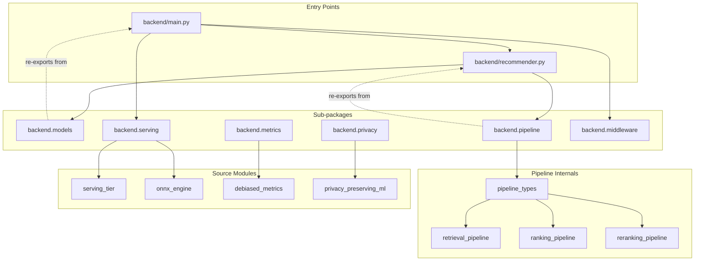

# APEX Backend Package Structure

## Overview

The APEX backend uses a **flat source layout with logical sub-package namespaces**. All implementation modules live directly in `backend/` — a deliberate choice that preserves backward compatibility with every existing import statement across the codebase. Sub-packages (`models`, `pipeline`, `serving`, `privacy`, `metrics`, `middleware`) sit alongside the flat modules and act purely as re-export surfaces: each sub-package `__init__.py` imports from the flat `backend/` modules and publishes a curated public API via `__all__`. No implementation code ever lives inside a sub-package directory.

This re-export pattern means that existing code referencing `from backend.lightgcn import LightGCN` continues to work without any changes, while new callers and documentation can use the cleaner namespaced form `from backend.models import LightGCN`. The sub-packages are documentation anchors as much as they are import shortcuts — each `__init__.py` docstring explains the sub-package's purpose and the modules it groups. Zero migration risk: no import path changes are needed anywhere in the existing codebase.

The result is the best of both worlds: a flat, easy-to-navigate source tree with no deeply nested package hierarchies, combined with a clean, discoverable API surface that groups related symbols under meaningful namespaces. Downstream consumers (API handlers, notebooks, tests) can import from either path; internal modules always use direct flat imports to keep the dependency graph simple and acyclic.

---

## Sub-Package Reference

| Sub-package | Source Modules | Public Exports | Design Rationale |
|---|---|---|---|
| `backend.models` | `lightgcn`, `sasrec`, `kan_ranker`, `neural_ode_recommender`, `hyperbolic_recommender`, `diffusion_recommender`, `two_tower`, `mmoe_ranker`, `rl_policy` | `LightGCN`, `SASRec`, `KANRanker`, `QuantumFluidRecommender`, `HyperbolicRecommender`, `LatentDiffusionRecommender`, `TwoTowerModel`, `MMoERanker`, `ActorCriticPolicy` | Groups all 6 ensemble model implementations + retrieval/ranking models under a single logical namespace |
| `backend.pipeline` | `pipeline_types`, `retrieval_pipeline`, `ranking_pipeline`, `reranking_pipeline` | `CandidateItem`, `RankedItem`, `FinalItem`, `RetrievalPipeline`, `RetrievalConfig`, `RankingPipeline`, `RankingConfig`, `RerankingPipeline`, `RerankingConfig` | The 3-stage pipeline (retrieve → rank → rerank) with typed interfaces between stages |
| `backend.serving` | `serving_tier`, `onnx_engine`, `online_learner`, `active_inference_engine`, `realtime_feature_updater` | `TierDetector`, `HardwareProfile`, `resolve_serving_tier` | Hardware-adaptive tier selection (Tier1/GPU, Tier2/ONNX, Tier3/FAISS) + runtime serving infrastructure |
| `backend.privacy` | `privacy`, `privacy_preserving_ml` | `add_laplace_noise`, `add_gaussian_noise`, `privatize_user_embedding`, `k_anonymize_profile`, `federated_average_gradients` | GDPR/EU AI Act differential privacy mechanisms (Laplace, Gaussian, k-anonymity, federated DP) |
| `backend.metrics` | `debiased_metrics`, `evaluation` | `compute_item_popularity`, `ips_ndcg_at_k`, `beyond_accuracy_metrics`, `calibration_score`, `evaluate_recommendation_quality` | IPS-debiased evaluation metrics correcting for popularity bias in offline evaluation |
| `backend.middleware` | `rate_limiter`, `plan_enforcer` | (used directly, not re-exported) | HTTP middleware for B2B SaaS rate limiting and plan enforcement; registered directly on the FastAPI `app` instance |

---

## Import Graph

The following diagram shows the dependency flow between sub-packages and key backend modules. All edges are one-directional — there are no circular imports.



**Strict layering rules:**
1. `pipeline_types` has no local imports — it only defines dataclasses
2. `retrieval_pipeline`, `ranking_pipeline`, `reranking_pipeline` import from `pipeline_types` only
3. `recommender.py` orchestrates all three pipeline stages
4. `main.py` is the top-level entry point — nothing imports from it except tests
5. Sub-packages (`models`, `pipeline`, etc.) never import from each other

---

## Adding a New Module

### Step 1 — Place the source file

Add your implementation file to the flat `backend/` directory:

```
backend/
  my_new_module.py    ← your implementation here
```

This keeps the source layout consistent and avoids introducing nested package imports.

### Step 2 — Determine which sub-package it belongs to

| Your module type | Sub-package to update |
|---|---|
| New recommendation model | `backend/models/__init__.py` |
| New pipeline stage or datatype | `backend/pipeline/__init__.py` |
| New serving infrastructure component | `backend/serving/__init__.py` |
| New privacy/compliance mechanism | `backend/privacy/__init__.py` |
| New evaluation metric | `backend/metrics/__init__.py` |
| New HTTP middleware | `backend/middleware/` (add directly, no `__init__.py` re-export) |

### Step 3 — Update the sub-package `__init__.py`

Add an import and update `__all__`:

```python
# In backend/models/__init__.py (example)
from backend.my_new_module import MyNewModel  # add import

__all__ = [
    ...,
    "MyNewModel",  # add to __all__
]
```

Update the module docstring to document the new export.

### Step 4 — Update this document and verify

Add a row to the [Sub-Package Reference](#sub-package-reference) table above with the module filename, all newly exported public symbols, and a one-sentence design rationale. Then verify the import chain to confirm no circular imports were introduced:

```bash
python -c "from backend.models import MyNewModel; print('OK')"
python -c "from backend.<subpackage> import <Symbol>; print('OK')"
```

If you see `ImportError: cannot import name` or a circular import error, check that your module does not import from `backend/recommender.py` or `backend/main.py` — those are top-level entry points and must remain leaf consumers, not dependencies.
