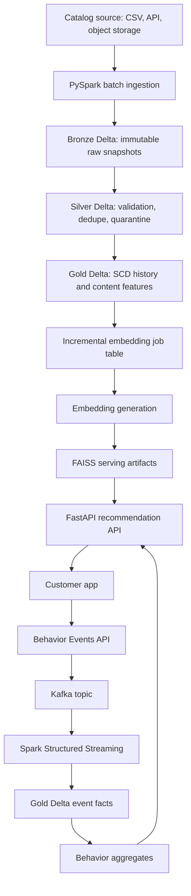

# APEX Product Data Platform Blueprint

## Product Thesis

APEX is a recommendation intelligence platform for companies with content catalogs. The product should be sold as infrastructure, not as an end-user streaming application.

The first version proves the vertical with movies. The durable product model is broader:

- customers are tenants
- tenants own catalogs
- catalogs contain content items
- content items produce semantic features
- customer applications emit behavior events
- behavior events become ranking and analytics features

## Customer-Facing Capability

APEX should eventually let a customer do four things:

1. Upload or sync a catalog.
2. Search the catalog semantically.
3. Request recommendations through an API.
4. Send behavior events back to improve ranking and analytics.

That is the smallest credible commercial surface.

The current free-tier onboarding path supports CSV upload preview, column
mapping, quality scoring, sample normalized records, and local raw upload
manifests. A future paid version can replace local manifests with object
storage and a warehouse catalog without changing the customer-facing flow.

## Free-Tier Product Strategy

APEX is designed to be credible before it has capital:

- GitHub Actions triggers orchestration.
- Kaggle handles heavier scheduled notebook execution.
- Hugging Face Hub stores model and search artifacts.
- Render or Hugging Face Spaces serves the FastAPI backend.
- Streamlit Community Cloud serves the APEX Console.
- JSONL usage and event logs keep the demo self-contained.
- API-key auth is environment-variable based until a paid auth/database layer is justified.

Databricks Free Edition can be used for a portfolio notebook showing Delta SQL, time travel, and table history, but it should not be the commercial backbone while it has free-tier restrictions and non-commercial limitations.

## Canonical Architecture

## Data Model

### Tenant And Catalog

`gold.tenant_catalog`

Purpose: customer/catalog registry.

Important columns:

- `tenant_id`
- `catalog_id`
- `catalog_name`
- `industry`
- `status`
- `created_at`
- `updated_at`

### Content Items

`silver.content_items`

Purpose: the generic product contract for any recommendable item.

Important columns:

- `tenant_id`
- `catalog_id`
- `content_id`
- `source_system`
- `source_content_id`
- `title`
- `description`
- `content_type`
- `genres`
- `people`
- `language`
- `release_date`
- `rating`
- `popularity`
- `tags`
- `run_date`
- `run_id`

### Content Features

`gold.content_features`

Purpose: serving-ready semantic/ranking features.

Important columns:

- `tenant_id`
- `catalog_id`
- `content_id`
- `source_content_id`
- `tags`
- `vector`
- `popularity_score`
- `quality_score`
- `engagement_score`

### Catalog History

`gold.dim_content_scd`

Purpose: track customer catalog changes over time.

Use SCD Type 2 when customers need answers such as:

- What changed in yesterday's catalog sync?
- Which title or metadata value was active when a model was trained?
- Can we roll back features to a prior catalog version?

### Behavior Events

`gold.fact_content_event`

Purpose: store product behavior as a fact table.

Valid event examples:

- `view`
- `click`
- `search`
- `rating`
- `recommendation_impression`

The event table is tenant-aware so one deployment can safely support multiple customers.

## Batch Processing Standard

Batch refresh must be deterministic and auditable:

- assign every run a `run_id`
- write raw source data to Bronze
- validate and quarantine bad rows
- write Silver with run-scoped partition replacement
- update Gold features
- merge catalog dimensions with SCD Type 2 semantics
- write `gold.pipeline_run`
- write `gold.data_quality_observation`
- generate serving artifacts only from Gold data

## Streaming Standard

Streaming is only used for live product behavior.

APEX should not pretend the Kaggle/TMDB catalog is streaming data. That is a batch source. Kafka belongs behind the product event API, where events arrive continuously from real users.

The streaming path is:

1. API/customer app emits behavior event.
2. Event is written to Kafka.
3. Spark Structured Streaming reads Kafka.
4. Parsed events are written to `gold.fact_content_event`.
5. Daily or near-real-time aggregates update `gold.content_behavior_daily`.
6. Recommendation API uses behavior aggregates as a bounded ranking signal.

## Delta Lake Usage

Delta is used where it gives real product value:

- ACID writes for customer data
- `MERGE` for SCD dimensions
- time travel for reproducibility and rollback
- Change Data Feed for incremental downstream processing
- `replaceWhere` for idempotent run-scoped batch writes
- `VACUUM` only after a retention period that preserves the required audit window

Raw serving artifacts can remain Parquet, NumPy, and FAISS because they are portable and cheap to host.

## Tradeoffs

### FAISS Now, Vector Database Later

FAISS is the right current choice because the hosted demo is small enough to keep serving simple and cheap. A managed vector database becomes valuable when multi-tenant scale, metadata filtering, distributed indexing, online updates, or operational SLAs outgrow single-node artifacts.

### GitHub Actions/Kaggle Now, Airflow Later

GitHub Actions plus Kaggle is useful for a lean hosted demo with GPU execution. Airflow becomes the production orchestrator when customer-specific schedules, retries, backfills, dependency graphs, and SLA reporting matter.

### SQL And NoSQL

SQL/lakehouse tables are the system of record for catalog history, quality, and analytics. A NoSQL or cache layer can be added for low-latency online features, tenant API keys, request counters, or session state. It should not replace the analytical lakehouse.

### Batch And Streaming

Batch is correct for catalog refresh because source metadata changes on a schedule. Streaming is correct for behavior because user actions arrive continuously and affect ranking freshness.

## What Makes This Product-Grade

- tenant-aware model
- content-generic contract
- optional API-key tenant isolation
- APEX Console for product operations
- CSV catalog onboarding with column mapping and quality gates
- AI quality checks for vectors and recommendations
- hybrid sparse/dense AI search with optional cross-encoder reranking
- implicit-feedback personalization from behavior events
- Delta history and time travel
- SCD Type 2 dimensions
- row-level quarantine
- run-level audit
- behavior event facts
- incremental embeddings
- bounded behavior ranking
- clear serving boundary
- documented tradeoffs

This is the difference between a recommendation demo and a data platform that can become a startup prototype.
